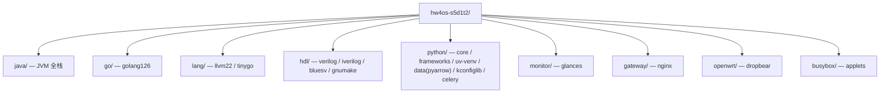

# hw4os-s5d1t2 — 方案二 StarryOS Linux-app 适配交付仓库

**OS Camp Stage 5 / Direction 1 / Task 2** 的交付仓库。它把 [方案二](https://github.com/rcore-os/tgoskits/issues/764)（在 StarryOS 这个 Linux 兼容宏内核上引导真实 Linux 应用）所需要的**软件包 + 测试用例 + 维护者操作手册**集中暂存在一处，避免一次性把大量内容塞进上游 `rcore-os/tgoskits`。维护者按需把其中的用例 / 镜像 / 包逐步合入 tgoskits 的 `test-suit/`。

> 跟踪 issue：[`rcore-os/tgoskits#764`](https://github.com/rcore-os/tgoskits/issues/764) —「linux app 引导 starry」。
> 本仓库的内容是**交付物 + 资料**，不是 tgoskits 仓库本身。所有用例最终落到 tgoskits 的 `test-suit/starryos/stress/<case>/`。

---

## 这是什么

每一类语言/运行时一个顶层目录（java / go / lang / hdl / python / monitor / gateway / openwrt / busybox …）。每个目录下放三类东西：

1. **软件包 + 来源说明** —— 适配所需的二进制/源码包**随各 app 目录 co-located**（apk/wheel/jar/二进制），经 **Git LFS** 跟踪（见 `.gitattributes`，`git lfs pull` 后取得实体）。每个包都在同目录的 `SOURCES.md` 里记录了来源（下载 URL / 镜像 / 版本 / sha256）。prep 脚本通过 `TGOSKITS_ROOT` 环境变量 + 脚本相对路径定位一切，**不含任何本机绝对路径，离线可复现**（共享的大文件如 JDK、python apk 闭包按相对路径引用一份、不重复）。
2. **测试用例** —— StarryOS qemu 压力测试用例：每个用例一组 `qemu-<arch>.toml`（4 架构）+ `build-<target>.toml`（4 架构）+ `prep-<app>-rootfs.sh`（用 `debugfs -w` 把包注入 ext4 rootfs 镜像、不 mount/sync、WSL2 安全）+ 待测程序源码。
3. **操作手册（逐级 README）** —— 顶层 / 每个子目录都有自己的 `README.md`，说明本级是什么、下面有什么、怎么用、怎么手动在 qemu 里运行验证。

---

## 环境要求（维护者直接照做，无需 source 任何 env）

> 本仓库面向 **tgoskits 维护者**，命令是给你直接敲的。下面所有 `qemu-system-*` / `cargo xtask` 命令假设你在一台装好 QEMU **v10 及以上** 的 Linux 机器上。

* **QEMU ≥ v10**（**硬性要求**）。StarryOS 在 loongarch64（RAM > 1 GB）等场景依赖 QEMU 10 的修复，旧版会启动失败或行为异常。检查：

  ```
  qemu-system-x86_64 --version      # 需要 10.x 或更高
  ```

  若系统自带的是 qemu-8，可路径隔离装一份 qemu-10（例如把 `/opt/qemu-10.2.1/bin` 前置到 PATH，源码 tar 自 QEMU 官方下载 `<本机下载缓存目录>/qemu-10.2.1.tar.xz`）。

* **Git LFS**：clone 后需 `git lfs install && git lfs pull` 才能拿到仓库内随附的大文件（本仓库内的自建 / 难复现二进制：consul 的 riscv64/loongarch64 交叉编译产物、HDL testbin、SystemC 静态库、JNI `.so`、测例 demo jar 等），否则只是指针文件。

* **资源获取（重要）**：为控制仓库体积，**可重新下载的上游资源不随仓库提交**（各版本 JDK / server 压缩包、Alpine `.apk`、PyPI `.whl`、官方发布的二进制如 minio / node_exporter、上游 `.jar` 等）。每个 app 目录提供 `fetch-resources.sh`，按其 `SOURCES.md` 记录的来源与 sha256 把这些资源重新拉回 `prep-*.sh` 期望的确切路径（带校验、断点续跑、已存在即跳过）；个别需从源码构建的产物（如 riscv64/loongarch64 native-musl 源码编译 JDK）由对应 `setup-*.sh` + `.patch` 重建。**因此构建某 app 前先运行其 `fetch-resources.sh`（需联网），再运行 `prep-*.sh`。**

* **构建 rootfs / 跑用例**用 tgoskits 自带的 `cargo xtask`（见下）。本仓库**只提供资料和注入脚本**，不重新实现构建系统。

---

## 怎么用（维护者视角的两条路径）

### 路径 A：把一个用例合入 tgoskits 并跑

每个用例的子目录 README 都给了「集成到 tgoskits」的步骤。通用形态：

```
test-suit/starryos/stress/<case>-0/
    build-<target>.toml            # 4 个，各架构 target/env/features
    <case>-0/
        qemu-<arch>.toml           # 4 个，qemu 启动参数 + shell_init_cmd 断言脚本 + success_regex
        programs/...               # （如有）待测源码
```

步骤（以某个 `<app>` 用例为例）：

1. 把本仓库该 app 下的 `qemu-<arch>.toml` + `build-*.toml`（+ 源码）拷进 tgoskits 对应 `test-suit/starryos/stress/<app>-0/`。
2. 用本仓库提供的 `prep-<app>-rootfs.sh` 构建该用例的 rootfs 镜像。`prep-*.sh` 从该 app 目录下的 `packages/`、`apks/`、`bins/` 等读取软件包。为控制体积，这些可重新下载的资源不随仓库提交，需先运行同目录的 `fetch-resources.sh`（联网、按 `SOURCES.md` 的 sha256 校验）把它们拉回；自建二进制（consul rv/loong、HDL testbin、JNI `.so`、demo jar 等）已随仓库（Git LFS）提供。脚本对 tgoskits checkout 的唯一外部依赖通过环境变量 `TGOSKITS_ROOT` 指定：

   ```
   export TGOSKITS_ROOT=$HOME/tgoskits            # 你的 tgoskits checkout（rootfs 镜像写到其 tmp/axbuild/rootfs/）
   bash <本仓库>/<path>/fetch-resources.sh        # 先联网拉回该 app 被精简的可重下载资源（sha256 校验）
   cd <tgoskits>
   cargo xtask starry rootfs --arch x86_64        # 先准备基础 rootfs rootfs-<arch>-alpine.img（一次, 4 架构各一次）
   # 再构建本用例 rootfs（脚本用 debugfs 直写 ext4, 不 mount/sync; 4 架构各跑一次）
   for a in x86_64 aarch64 riscv64 loongarch64; do bash <本仓库>/<path>/prep-<app>-rootfs.sh $a; done
   ```

   > 链式依赖：部分 app 基于中间 rootfs（如 glances/htop 基于 `rootfs-<arch>-python.img`，需先跑 `python/core/prep-python-rootfs.sh`）；各用例 README 注明其 base。少数早期脚本用 `sudo mount`（需 root + 真 Linux 主机，WSL2 上 `sync` 可能 D-state 死锁），其余均 `debugfs -w` 直写（无需 mount）。
3. 跑（QEMU v10，4 架构）：

   ```
   cargo xtask starry test qemu --arch x86_64      -g stress -c <app>-0
   cargo xtask starry test qemu --arch aarch64     -g stress -c <app>-0
   cargo xtask starry test qemu --arch riscv64     -g stress -c <app>-0
   cargo xtask starry test qemu --arch loongarch64 -g stress -c <app>-0
   ```

   每个用例的 `success_regex`（如 `^PYARROW_OK=1`）命中即通过（xtask `rc=0` + 日志 `SUCCESS PATTERN MATCHED` 为权威判据）。

### 路径 B：在 qemu 里手动验证单个程序

不想跑整套 harness、只想手动确认某个程序在 StarryOS 上能跑时，每个用例 README 都给了「手动跑」段：怎么用 busybox 在 guest 里现写测试代码、确切的运行命令、以及期望看到的 `XXX_OK=1` 输出。

---

## 目录结构



纯文本版（同上）：

```
hw4os-s5d1t2/
├── README.md / .gitattributes(Git LFS 规则) / LICENSE
├── java/        ← OpenJDK 17/21/23/25 + maven/gradle/kotlin + 框架 demo + java-tail + bigapps
├── go/          ← golang 1.26 综合测试（goroutine/channel/反射/泛型/标准库/GC）
├── lang/        ← llvm22(clang-22 C++23 codegen) · tinygo 0.40
├── hdl/         ← verilog(verilator) · iverilog · bluesv(Bluespec SV → SystemC 2.3.4) · gnumake
├── python/      ← core/frameworks/uv-venv（django/fastapi/uv）· data/pyarrow · kconfiglib · dod-frameworks/celery
├── monitor/     ← glances（系统监控，依赖 procfs 修）
├── gateway/     ← nginx
├── openwrt/     ← dropbear（SSH）
└── busybox/     ← applets 兼容套件（313 applet）
```

---

## 当前进度（#764 单核四架构）

判据：qemu-10 单核四架构（x86_64 / aarch64 / riscv64 / loongarch64）运行，xtask `rc=0` + 日志 `SUCCESS PATTERN MATCHED` 为真绿；据实交付，难点据实留痕不强勾。

* **已绿并交付（真 4/4）**：java 全栈（javac/kotlinc/maven/gradle/kotlin + jetty/spring/netty/undertow/hibernate/mybatis/exposed/lombok/r2dbc/ktor/wildfly/quarkus/trino + JSE 套件 + jdk-multi/sdkman）、nodejs 运行时、python（core/frameworks/uv/**pyarrow**/**kconfiglib**/**celery**）、golang 1.26、verilog / bluesv(含 SystemC) / iverilog / gnumake、llvm22、glances / nginx / dropbear、iceberg / paimon。
* **3/4 通过（loong 待复测）**：busybox applets（x86_64 / aarch64 / riscv64 = PASS 313 / FAIL 0；loongarch TCG 超时待加大 timeout 复测）、tinygo（x86_64 + aarch64）。
* **未交付项据实留痕**：automl（flaml.automl 硬依赖 xgboost，xgboost 无 musl 分发）、picker/toffee（xspcomm native C++ 无 musl + verilator < 5.020）、prometheus aa/rv/loong（重型 Go server TCG 慢）、loopback-client 族（etcd/consul/grafana/...）、npm/astro（V8 深层 mmap）。

---

## 内核配套修复（让 starry 逼近 Linux）

部分用例依赖对 StarryOS 内核的根因修复（在 fork `Lfan-ke/tgoskits` 的修复分支 / `target` 分支汇集，作为 PR 合入前的复现与留存参考）：x86 XCR0/AVX 启用（pyarrow）、栈 GROWSDOWN 按需分页（V8/Go）、SO_BINDTODEVICE、netlink MSG_PEEK/TRUNC/DONTWAIT、procfs status/statm（glances）、pseudofs statfs 真实容量、x86 signal ucontext ABI、loongarch LSX 向量信号保存等。各用例 README 注明其依赖的内核修。

---

## 许可 / 来源声明

本仓库聚合的第三方软件包均来自其官方渠道（Alpine CDN、Maven Central、各 JDK 发行方、GitHub release、Apache 镜像、PyPI 等），仅作适配测试用途；逐包来源与校验和见各目录 `SOURCES.md`。仓库自身代码遵循 `LICENSE`。

Homework for OS Camp Stage5 Direction 1 Task 2. All software packages compatible with StarryOS + test cases + user manuals.
