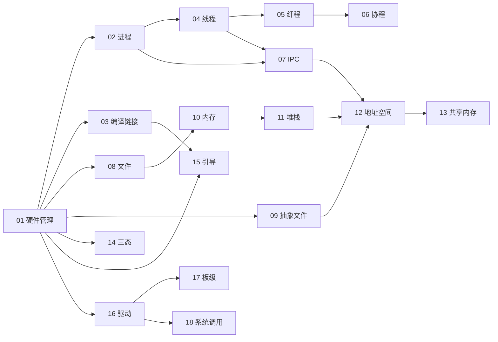

<!-- 本文由实验梳理反填充；与 DESIGN.md（课程设想原稿）配套。请勿在此处放置临时内容。 -->
# DESIGN-E · AI4OSE OSLAB 细化设计

> 本文是 `DESIGN.md`（课程设想）的**细化 / 落地版**，把每个实验梳理成可被 harness 实现的设计。
> 配套基建（labctl runner + 判题/计分/TUI）见 [`docs/superpowers/specs/2026-06-27-hw4os-harness-design.md`](superpowers/specs/2026-06-27-hw4os-harness-design.md)。
> 状态图例：✅ 已实现 · 🚧 设计完成待实现 · 💬 待与课程设计者商议。

## 一、课程理念

对标 **rustlings** 的逐题递进体验：每题给好脚手架与测试，学生只填 `// TODO` 的核心逻辑，`labctl watch` 边改边自动判定。**三条赛道**，互补的三种教学视角，学习顺序 **不正经 → 正经 → 形态**：

- **不正经赛道（improper）· 心智模型**：用最小、可亲手玩的软件/硬件模型，对 OS 各基础功能建立**感性心智模型**（「没吃过猪肉但见过猪跑」的粗略印象）；核心母题「软件能做的硬件也能做，硬件能做的通用处理器也能模拟」。
- **正经赛道（proper）· 工程落地**：在 rcore 基础上，从引导起步，在 **qemu-virt 真内核**上一步步搭出一个「相对完整」的 OS（boot→trap→多任务→分页→进程→文件→网络→多核→虚拟化→微内核）。
- **形态赛道（forms）· 入门科普**：五大内核形态（宏/微/外/库/框）+ 混合的架构权衡，引 xv6/seL4/jos/unikraft/asterinas 真实例。

设计原则：**简化的是学生负担，不是功能完整性**；**最小依赖 + 留白 TODO + 复杂处给定 + 可扩展引申**（每题只实现当下用得到的，如 S8 仅 sys_write/exit 而非 360 syscall，像 rcore ch1-8；完整版作引申，学生可凭兴趣自行扩成完整 OS）。ISA 基准 **RV64GC**。

> 答案目录约定：题面在 `exercises/<track>/<id>/`（含 `// TODO`），配套参考答案统一放根目录 **`ans/<track>/<id>/`**（labctl `--solutions` 验证 + 学生卡住时参考）。

## 一·B、实际建成 v1 · 61 实验三轨全景

> 本节为反填充：记录课程**实际建成**的最终形态（与下方原始细化设计互为映照；部分实验 id 在落地时微调/新增）。全部经 `labctl verify --solutions` 必修通过。

### 不正经 · 心智模型（26）
`01` 硬件管理 VLAN · `02` 进程调度 · `03` 编译链接 · `04` 线程 · `05` 纤程(有栈协程) · `06` 无栈协程 · `07` IPC 原子锁 · `08` 文件系统(块设备→inode) · `09` 设备文件(一切皆文件) · **`09b` VFS(多 FS 统一接口+挂载)** · `10` 内存(分层/swap) · `11` 堆与栈 · `12` 地址空间(软件 MMU) · `13` 共享内存 · `14` 特权级 · `15` 引导握手 · `16` 驱动(MMIO/设备树) · `17` BSP 板级 · `18` 系统调用 · **`19` ISA 模拟器(NEMU 式解释器+DiffTest)** · **`20` signal 异步事件** · **`21` TCP 状态机** · **`22` namespace+cgroup 容器隔离** · **`23` epoll I/O 多路复用** · **`24` 迷你发行版/rootfs(FHS+busybox+init+cpio)** · **`25` 组件化内核(arceos 式可组装)**

### 正经 · 工程落地（29，qemu-virt 真内核）
`S1` SBI 引导 · **`S1b` 裸机最小标准库(core+alloc/newlib)** · `S2` trap+时钟 · `S3` 内核形态 · `S4` 异步运行时 · `S5` 协作调度 · **`S5b` 内核堆(free-list)** · **`S5c` SV39 真分页** · **`S5d` 阻塞同步(mutex/sem/condvar)** · **`S5e` fork+CoW+exec+wait** · `S6` 驱动(NS16550+dtb) · **`S6b` AM 式 HAL(TRM/IOE/CTE)** · **`S6c` PLIC 外部中断** · `S7` 文件系统(RAM 盘) · **`S7b` 内核 VFS(vtable/vnode)** · `S8` 用户态+syscall · **`S8b` mmap+按需调页** · `S9` 迷你 libc · `S10` 用户程序(排序/模板/TUI) · **`S10b` cpio initramfs→/init** · `S11` 网络(ARP/IP/UDP) · `S12` GUI(framebuffer+html/css) · `S13` 多核启动 · `S14` IPC(管道/消息/共享) · `S15` SMP(自旋/读写锁) · `S16` AMP 大小核 · `S17` 虚拟化(H 扩展软件模型) · `S18` mini-TCG · `S19` 微 vs 宏内核

### 形态 · 入门科普（6）
`F1` 宏内核 · `F2` 微内核 · `F3` 外核 · `F4` 库内核/unikernel · `F5` 框内核(framekernel/Asterinas) · `F6` 混合内核

> **粗体 = 超出原始 DESIGN-E 计划的新增/细分**：覆盖了 rcore ch4(内存/分页)、ch5(进程/fork)、ch8(同步) 的工程缺口，并按「每主题三视角(入门科普/心智模型/工程落地)」补全了 VFS、rootfs、TCP、signal、namespace、epoll、mmap、PLIC、HAL、ISA 模拟器、组件化内核等角度。

### 参考来源（取长补短，皆本地只读）
- **rcore**（`~/tgln/stage1/2026s-tg-rcore-Lfan-ke`）：ch1-8 教学 OS，正经赛道主线节奏。
- **arceos**（`~/tgln/stage2/2026s-tg-arceos-Lfan-ke`）：组件化/可组装内核 → `improper/25-component-os`。
- **YSYX**（`~/ysyx`）：NEMU 解释器+DiffTest → `improper/19`；AM(TRM/IOE/CTE/VME/MPE) HAL → `proper/S6b`。
- **material**（`~/tgln/stage2/material`）：覆盖 RISC-V 全栈的真实系统源码 + 88 篇演化笔记，gap 分析与各实验取材的资源库（索引 `notes/00-01`）。
- **oscamp-base-experiment**（atomic/async/coroutine Rust 参考）、**DatenLord**（BSV 语法）、**xv6/seL4/jos/unikraft/Asterinas**（material/core，形态赛道真实例）。

## 二、每节模板说明

| 字段 | 含义 |
| :-- | :-- |
| **意境** | 为什么学、要建立什么心智模型 |
| **核心概念** | 联系 rcore/xv6/真实系统的对应物 |
| **子实验** | 逐题递进；每条标注：填什么(TODO/ELSE)、变体、环境、判据、require=N |
| **变体矩阵与计分** | 有哪些路径、require 默认、辅助分点 |
| **前置依赖** | 依赖哪些前序实验（用 id） |
| **简化取舍** | 相比真实系统简化了什么；完整版作为引申 |
| **DoD** | 完成标准 |
| **思考题** | 作为 essay 子题（答案文件非空/含关键字即过） |

## 三、harness 约定速查

- **变体两轴**：软件 `{c, rust}` × 硬件 `{verilog, bsv}`；外加 `essay`（思考题）。并非每题四变体齐全。
- **判题「M 选 N」**：`meta.toml` 的 `require=N`，通过变体数 ≥ N 即必修达成；超出每条算**辅助分**（独立账）。`require=1` = 任一过即过。
- **运行环境** `env`：`host`（纯逻辑最快）/ `qemu-user` / `qemu-virt`（带 MMIO 设备）/ 块设备类用 v/bsv 实现的 RAM 块设备模型。
- **引导**：`// TODO` 挖空、`// HINT` 行内提示、`// TODO[a] … // ELSE[b] …` 分支择一；`[[hint]]` 渐进提示。
- **判题靠输出子串**：`expect` 全中 + `forbid` 不中（约定打印 `XXX_PASS` / `ALL_PASS`，失败打印 `FAIL`）。
- **硬件 0-warning**（iverilog `-Wall` / verilator）；软件 C/Rust 任一过即过。

## 四、不正经赛道 · 实验序列与依赖

推荐顺序（拓扑序，基本沿用 DESIGN.md 原序，可调）：

`01 → 02 → 03 → 04 → 05 → 06 → 07 → 08 → 09 → 10 → 11 → 12 → 13 → 14 → 15 → 16 → 17 → 18`

关键依赖链（详见各节「前置依赖」）：执行流抽象 `02 进程 → 04 线程 → 05 纤程 → 06 协程`，并联 `07 IPC`；存储/内存 `08 文件 → 10 内存 → 11 堆栈 → 12 地址空间 → 13 共享内存`；设备 `16 驱动 → 17 板级`。`01` 是软硬同构与判题约定的共同前置。

## 五、不正经赛道 · 各实验细化

## 01. improper/01-hw-vlan · 硬件管理：VLAN Tag 的插入/剥离/过滤（软硬同构）
**意境**：OS 的起源之一——**软件能做的，硬件也能做**。用四种写法实现同一个 Tag 处理逻辑，亲手对比「软件 if-else」与「硬件组合逻辑」的差异与成本。
**核心概念**：VLAN Tag 的插入/剥离/过滤（Access/Trunk/Hybrid 三模式）；软件是硬件的配置文件；MMIO 配置寄存器。对应真实系统：交换机端口、网卡 VLAN offload、QEMU 设备模型、OpenCL。
**子实验**：
1. 实现 `process(mode,pvid,allow,untag,in)→out`（单题四变体同构）— 填 `process` 函数体 / `always` 块 / `vlan_process` · 变体[sw-rust, sw-c, hw-v, hw-bsv] · 环境[host(软) + iverilog/bsc(硬)] · 判据[依次 `ACCESS_PASS`/`TRUNK_PASS`/`HYBRID_PASS`/`ALL_PASS`，不出现 `FAIL`] · require=1。
**变体矩阵与计分**：四变体齐全；`require=1`（任一过即过）；其余每条通过 +1 辅助分（满分 +3）。
**前置依赖**：无（首课）。
**简化取舍**：真实以太网帧简化为 32-bit 定宽「包字」（`VALID|HAS_TAG|DROP|DIR|VID[6b]|PAYLOAD[16b]`），VID 6-bit 配 64-bit 位图；不做路由/MAC 学习/FIFO 流式。完整帧 + 12-bit VID + 变长 + 流式作为引申。
**DoD**：≥1 路径 `ALL_PASS`；硬件 0-warning；能说出软硬实现的成本差异。
**思考题（essay）**：① 给一个「软件成本更低」与一个「硬件成本更低」的场景；② 为何不把 Web 项目流片成 ASIC；③ 支持真实以太网帧，硬件与软件各需多付出什么。
**状态**：✅ 已实现（harness 试金石，四变体逐位同构跑通）。

## 02. improper/proc-sched · 进程管理：软件模拟进程调度（约束入队 → 优先队列）

**意境**：操作系统的"公平"与"偏心"都藏在一句话里——下一个该轮到谁上 CPU？本课不切真实寄存器、不碰时钟中断，只用一个就绪队列和一个 `pick_next()` 把"调度"这件事拆到最朴素：进程就是一张卡片（PCB），调度器是发牌人。你先做个老实的 FIFO 发牌人，再做个有"潜规则"的发牌人（某人永不上桌、某人必须等另一人之后），最后把发牌的 `Vec` 换成会自动冒出"最大牌"的优先队列。建立的心智模型：**调度 = 存储结构（谁在）+ 选择策略（选谁）**，二者解耦。

**核心概念**：对应 rcore `processor.rs` 里的 `ready_queue: VecDeque<ProcId>`（`push_back`/`pop_front`），本课的 `Vec`/优先队列就是它的简化替身；PCB ≈ rcore `ProcControlBlock` / xv6 `struct proc`；调度循环 ≈ rcore `run_tasks` / xv6 `scheduler()`；"特殊标识永不启动"≈ `TaskStatus::Blocked`/`Zombie` 不入就绪队列（或保留 pid）；优先队列调度 ≈ 优先级调度 / Linux CFS 的红黑树取最左；硬件取最高优先级 ≈ RISC-V PLIC 中断优先级仲裁。本课**只换"选择结构"，不动"执行语义"**，正是要让学生看清"存储/调度双结构"的搭配。

**子实验（逐题递进）**：同一份代码里逐段挖空，每段一个 PASS 门，`watch` 下增量点亮。

1. **FIFO 暖身**：把进程装进就绪队列，跑最老实的轮转。
   - ① 填 `pick_next()`：从就绪结构取队首；填 PCB 最小字段（`pid`/`done`）。给定的测试驱动负责喂进程、收集执行序、打印结果。
   - ② 变体 [sw-rust, sw-c]
   - ③ 环境 [host]（纯逻辑、std，免 qemu，最快出成果）
   - ④ 判据思路：驱动按输入顺序喂 pid，断言执行序 == 入队序 → 打印 `FIFO_PASS`；出现 `FAIL` 即失败。
   - ⑤ require=1（C/Rust 任一过即过）

2. **约束调度（DESIGN exp1：永不启动 / 恒排在后 / 其余随机）**：给发牌人加三条潜规则。
   - ① 填三段逻辑：(a) 跳过 `tag == GHOST` 的进程，永不入就绪/永不被选；(b) 让 `B` 恒排在 `A` 之后——`// TODO[a]` 依赖门控（`A.done` 前不把 `B` 放进就绪）`// ELSE[b]` 选择时跳过（选到 `B` 但 `A` 未完则跳过），择一实现；(c) 其余进程顺序无所谓（用固定种子的伪随机洗牌，保证可复现）。
   - ② 变体 [sw-rust, sw-c]
   - ③ 环境 [host]
   - ④ 判据思路：驱动喂入含 1 个 `GHOST`、一对有序 `(A,B)`、若干自由进程的进程集，运行后校验**三不变量**而非精确序——`GHOST` 从不出现、`index(B) > index(A)`、其余每个 pid 恰好出现一次——全中打印 `SCHED_PASS`。只校验不变量，故"随机"不致判题抖动。
   - ⑤ require=1

3. **优先队列调度（DESIGN exp2：高优先级先出队）**：把就绪 `Vec` 换成优先队列。
   - ① 把就绪结构从 `Vec` 改成优先队列，`pick_next()` 返回**优先级最高**者，平级按 FIFO（到达/pid 稳定）兜底。`// TODO[a]` Rust 用 `BinaryHeap`（自定义 `Ord`）`// ELSE[b]` C 手写小二叉堆或 O(n) 扫最大，择一。
   - ② 变体 [sw-rust, sw-c]（+ 选做 [hw-v] 见下，作引申）
   - ③ 环境 [host]（硬件选做变体走 iverilog 仿真，仍在 host，无需 qemu）
   - ④ 判据思路：驱动喂混合优先级进程，断言输出序按优先级**单调不增**、平级处保持 FIFO → 打印 `PRIO_PASS`；三段全过再打印 `ALL_PASS`。
   - ⑤ require=1

4. **（选做引申）硬件优先编码器**：把"选最高优先级就绪任务"落到组合逻辑。
   - ① 填 `hw-v`/`hw-bsv` 的优先编码器：输入"就绪位图 + 各槽优先级"，一拍组合逻辑输出"应调度的槽号"，与软件 `pick_next()` 结果逐位一致。
   - ② 变体 [hw-v, hw-bsv]
   - ③ 环境 [host]（iverilog/bsc 仿真，0 warning）
   - ④ 判据思路：共享 tb 喂同一组就绪/优先级向量，DUT 选槽号与参考一致 → `HWPICK_PASS`；warn_gate 生效。
   - ⑤ require=1（**纯辅助分**：不通过不影响本题完成）

5. **思考题（essay）**：见下"思考题"，写进 `THINKING.md` 即过。
   - ② 变体 [essay] ③ 环境 [host] ④ 判据：答案文件非空且含关键字 ⑤ require=1

**变体矩阵与计分**：核心路径 = `sw-rust` / `sw-c`（二者任一通过 `FIFO_PASS`+`SCHED_PASS`+`PRIO_PASS`+`ALL_PASS` 即必修达成，`require=1`，`weight=1`）。辅助分点：① 软件另一语言也全过 +1；② 选做硬件优先编码器 `hw-v`/`hw-bsv` 每过一条 +1（独立账，不影响"是否完成"）；③ essay 思考题计入辅助账。`env="host"`，缺 `bsc`/`iverilog` 的学生其硬件变体记 `Unavailable`，不受惩罚。

**前置依赖**：`improper/01-hw-vlan`（仅为熟悉 `labctl run/watch/hint`、`*_PASS`/`forbid` 判题约定与 `// TODO[a]/// ELSE[b]` 引导语法；**代码层无依赖**，可独立完成）。本题的 PCB + 就绪队列 + 调度循环模型是后续 `improper/线程管理（PCB→TCB）` 的前置基础。

**简化取舍**（简化的是学生负担，不是功能性）：
- **不切真实上下文**："run 一个进程"= 把它的 pid 追加进执行序并打印，不保存/恢复寄存器与栈——真实 trap 上下文切换留给"线程管理"与 proper 赛道。
- **协作式、无时间片抢占**：每个进程一次跑完，不引入时钟中断——时间片轮转 + 抢占作完整版引申。
- **PCB 极简**：只含 `pid/priority/tag/done` 等最小字段，无地址空间/fd 表。
- **"随机"可复现**：用固定种子，且判题只校验不变量，避免抖动。
- **优先级单调 + FIFO 兜底**：不做老化（aging）/多级反馈队列——MLFQ、CFS 红黑树留作引申思考。

**DoD**：
- [ ] `FIFO_PASS`：朴素 FIFO 调度执行序 == 入队序。
- [ ] `SCHED_PASS`：约束调度满足三不变量（GHOST 不跑 / B 恒在 A 后 / 其余各一次）。
- [ ] `PRIO_PASS` + `ALL_PASS`：优先队列调度高优先级先出队、平级 FIFO 兜底。
- [ ] C/Rust 任一条软件路径四个 PASS 全亮（必修）；另一条或硬件选做路径再过计辅助分。
- [ ] 能说清"存储结构（谁在就绪）/ 选择策略（选谁）"为何要解耦（思考题）。

**思考题**（essay，`THINKING.md` 作答）：
1. 你的"B 恒在 A 之后"用了**入队门控**还是**选择跳过**？若 A 永远不结束，两种实现下 B 的命运有何不同？这对应真实 OS 里的什么（依赖/管道/`wait`/D 状态）？
2. 优先级调度会让低优先级进程"饿死（starvation）"。给一个必然饿死的输入序列，并说明真实系统用什么缓解（优先级老化 aging / 时间片 / MLFQ）。
3. 把"选最高优先级就绪任务"从软件优先队列换成硬件优先编码器（priority encoder），硬件省了什么、又被什么限制（位宽 / 可表达的优先级数 / 就绪槽位上限）？联系 RISC-V PLIC 的中断优先级仲裁。

## 03. improper/compile-link · 编译链接：手写链接脚本、段布局与 A→B→C 串接执行

**意境**：编译器只管把每个 `.c/.rs` 翻成「一堆带名字的碎片（section）」，真正决定「哪段代码/数据落在哪个地址、谁先谁后、要不要塞进同一颗镜像」的是**你手写的链接脚本**。这节课你当一回「内存的房产中介」：给 `.text/.rodata/.data/.bss` 划地块，把三个小程序 A、B、C 编进同一片区段，让机器跑完 A 自己接着跑 B、再跑 C——这正是 rcore ch2 批处理内核「把用户程序 `.incbin` 进内核、靠一张表顺序拉起」的最小内核。顺带搞清一个常被混淆的问题：**ELF 和纯二进制到底差在哪**。

**核心概念**：对应 rcore 的 `linker.ld`（`.text` 钉在 `0x80200000`，再依次 `.rodata/.data/.bss/.boot`）、`build.rs` 生成的 `app.asm`（`.section .data` + `.align` + `apps:` 表 + `.incbin` 把各 app 原始二进制嵌进内核 + `__app_i_start/_end` 边界符号），以及 `objcopy -O binary` 把 ELF 抠成纯字节流。对应 xv6 的 `kernel.ld`、`user/initcode`（手写入口被链接到固定地址）、`_entry`。真实系统里再往上就是 program header、LMA/VMA、重定位、动态链接器 `ld.so`——本课只取最底层那一层：**section 怎么摆、地址谁说了算、镜像怎么自描述**。

**子实验（逐题递进）**：

1. **段与符号边界（.text/.rodata/.data/.bss + linker-defined symbols）**
   ① 填空：在给好的 `linker.ld` 骨架里把 `*(.text*) / *(.rodata*) / *(.data*) / *(.bss*)` 各自收进对应输出段，并打出边界符号 `__bss_start/__bss_end`；`_start` 里 `// TODO` 用这两个 `extern` 符号把 `.bss` 清零。
   ② 变体：`sw-c` / `sw-rust`。
   ③ 环境：`qemu-user`（freestanding 静态 ELF，`-nostdlib -T linker.ld`，裸 `write/exit` syscall 打印）。
   ④ 判据：harness 校验地址递增 `text<rodata<data<bss`、`.bss` 读出全 0、放在 `.rodata` 的常量地址落在只读区——全中打印 `LAYOUT_PASS`。
   ⑤ require=1。

2. **手写 linker script：把指定数据编进指定段 / 指定地址**
   ① 填空：自己**新增**一个输出段 `.config`，把带 `__attribute__((section(".config")))`（C）/ `#[link_section=".config"]`（Rust）的结构体收进去，并 `PROVIDE(__config_start = .)`；可选 `// ELSE[b]`：给该段加 `AT(...)` 指定 LMA，体会 VMA≠LMA。
   ② 变体：`sw-c` / `sw-rust`。
   ③ 环境：`qemu-user`。
   ④ 判据：程序读 `__config_start` 处的魔数与字段逐项比对、段起始地址与 4K 对齐符合声明 → `SECTION_PASS`。
   ⑤ require=1。

3. **ELF 还是纯二进制（同一程序，两种产物）**
   ① 填空：(a) `// TODO` 读自身镜像头 64 字节，校验 magic `7F 45 4C 46`、取出 `e_entry/e_phoff`（buffer 由 harness 给）；(b) `// TODO` 把 linker `BASE` 改成与裸机加载地址一致（`0x80200000`），让 `objcopy -O binary` 出的 `.bin` 入口恰在偏移 0。
   ② 变体：`sw-c` / `sw-rust`。
   ③ 环境：ELF 侧 `qemu-user`；纯二进制侧 `qemu-virt`（裸机，`.bin` 由 `-device loader` 装到固定地址，串口打印）。
   ④ 判据：ELF 侧 magic/entry 对 → `ELF_PASS`；`.bin` 裸机能跑起来 → `BIN_PASS`；二者皆过 → `ALL_PASS`。同一语言内 ELF 段与 bin 段都要过。
   ⑤ require=1。

4. **执行完 A 直接执行 B…（app 表 / 串接执行，rcore ch2 最小核）**
   ① 填空：在 `linker.ld` 里定义 `.apps` 段，按 A→B→C 顺序 `KEEP` 各 app 入口、导出 `__apps_start/__apps_end`；runner 循环骨架给好，补「取下一个 app 起点 → 调用」。`// TODO[a]`：每个 app 是个函数，指针被收进 `.apps` 表（最简）；`// ELSE[b]`：每个 app 用 `objcopy` 成 `.bin` 再 `.incbin` 进段、runner 顺序跳转（贴近 rcore）。
   ② 变体：`sw-c` / `sw-rust`。
   ③ 环境：`qemu-user`（指针表版）；`ELSE[b]` 裸机版用 `qemu-virt`。
   ④ 判据：依次打印 `APP_A/APP_B/APP_C`，runner 校验「出现顺序 == 段内顺序」→ `CHAIN_PASS`，全过 `ALL_PASS`；乱序或缺一即 `FAIL`。
   ⑤ require=1。

5. **（essay）概念辨析**：把下面思考题写进 `THINKING.md`。
   ① 填空：作答即可（非空 + 命中关键字）。② 变体：`essay`。③ 环境：`host`（不编译）。④ 判据：含 `program header / LMA / VMA / 零填充 / 加载地址` 等关键字 → `ESSAY_PASS`。⑤ require=1。

**变体矩阵与计分**：纯软件题，每个子实验两条路径 `sw-c` / `sw-rust`，`require=1`（任一语言过即过）；同一子实验两门语言都过，多出的那条计 +1 辅助分（独立账）。本题**无硬件变体**（链接脚本是工具链/布局议题，硬件不对应，缺即不存在）。essay 子题独立判，不挤占软件路径计分。`forbid=["FAIL","panic","ERROR"]`，`expect` 为各子实验的 `*_PASS` 与最终 `ALL_PASS`。

**前置依赖**：`improper/01-hw-vlan`（复用其 `common/` harness：裸机 `_start`/panic→exit shim、`qemu-virt` 启动壳、`*_PASS` 判题与 MMIO 串口约定）。本题是 `improper/地址空间`、`improper/内存管理`、`improper/引导入门` 的地基（它们都要先会摆段、定基址）。

**简化取舍**（简化的是学生负担，不是功能完整性）：
- 全程**静态、无重定位、无动态链接**（不碰 PLT/GOT/`ld.so`），基址手工固定——把「地址由谁定」这一根筋讲透。
- ELF 只**读头部几个字段**，不做完整 program header 解析 + 段拷贝加载；真·loader（按 phdr 把各段搬到 LMA→VMA）留作引申。
- A→B→C 串接默认用**函数指针表**顺序调用，不涉特权切换/陷入/地址空间隔离（那是正经赛道 rcore ch2+ 的 `Trap`/批处理切换）；`ELSE[b]` 的 `.incbin` 原始二进制版作为「更像真内核」的进阶。
- 栈与 `.bss` 清零由 boot shim 半给；多 app 错位基址（`base + i*step`，NoMMU 下并存）作为引申，不强制。
- 完整版引申：program header 真加载、重定位类型、`base+i*step` 多 app 并存、ELF 段→可加载映像映射。

**DoD**：
- 至少一门语言通过 E1–E4 的全部 `*_PASS` 且最终 `ALL_PASS`。
- 能独立手写一份**能跑起来**的 `linker.ld`，让自定义段 `.config` 落在约定地址并对齐。
- 能用 `ELF_PASS`/`BIN_PASS` 证明同一程序两种产物都能运行，并说清「谁决定段落地址」的差异。
- A→B→C 的执行顺序由 `.apps` 段内顺序决定且实测一致（`CHAIN_PASS`）。
- essay 思考题作答通过（`ESSAY_PASS`）。

**思考题**：
1. ELF 与纯二进制，加载时「**谁决定每个段落在哪个地址**」？为什么纯二进制必须「link 地址 == load 地址」，而 ELF 可以不必（program header 帮了什么忙）？
2. `.bss` 为什么不占文件体积（零填充），它的「该清多大」这条信息存在镜像的哪里？这样省了什么、又把什么责任甩给了加载器/启动代码？
3. A→B→C 的执行顺序到底由什么决定？**不重新编译任何 app**、只改 linker script / app 表，能否让 B 先于 A 跑？把它和真实的 `bootrom → bootloader → kernel` 串接链做个类比。

## 04. improper/thread · 线程管理：进程是线程的资源容器

**意境**：进程其实不干活——干活的是线程。进程更像一家「皮包公司」：它租好办公室（地址空间）、办好门禁卡（fd 表）、备好公章（信号量），但真正坐下来敲代码的是它雇的那群线程。本课要你亲手把一个「又当老板又当员工」的进程模型，拆成「老板（PCB＝资源容器）＋员工（TCB＝一把寄存器）」，并顺手揭开超线程的省钱魔术：给同一个舞台（执行单元）多发一套戏服（寄存器），就凭空多出一个「核」。

**核心概念**：对标 rcore ch7→ch8 的那次关键重构——ch7 的 `Process` 既是资源容器又是执行单元；ch8 拆成 `Process`（`address_space` / `fd_table` / `semaphore_list` / `mutex_list` / `condvar_list`，全线程共享）＋ `Thread`（仅 `tid` ＋ `context: ForeignContext{ LocalContext, satp }`）。这正是本课的 PCB→TCB。对照物：xv6 的 `struct proc` 是单线程进程，其「执行流身份」＝`trapframe`（陷入时的全部寄存器）＋`swtch.S` 保存的 callee-saved 上下文（`ra/sp/s0-s11`）；rcore 的 `__switch`/`TaskContext` 把「上下文＝一组寄存器」讲得最直白。真实系统：Linux 的 `task_struct` 本质是线程，同 `thread_group` 共享 `mm_struct`/fd；pthread 共享地址空间；RISC-V 里「CSR＋GPRs」就是一个上下文；硬件超线程（Intel HT / SMT）＝复制 architectural state、共享 execution backend。

**子实验（逐题递进）**：

1. **04-1 `thread/ctx` · 一个上下文 = CSR + GPRs**
   ① 学生填：定义 `Context{ gprs[31], sepc, sstatus, sp }`（一把寄存器就是一个执行身份），实现 `ctx_save(cur)` / `ctx_restore(next)` 与协作式 `switch(cur,next)`——把「当前虚拟 CPU」的寄存器整存进 `cur`、再从 `next` 整载回来。`// TODO[a]` 用具名字段写、`// ELSE[b]` 用 `regs[32]` 数组写，择一。
   ② 变体：`sw-rust`、`sw-c`；附 `hw-v` / `hw-bsv` 选做（一个寄存器文件＋影子寄存器组：一拍之内整组切换＝换一套上下文，直接预演「少量额外寄存器＝多一个硬件线程」）。
   ③ 环境：`host`（软件纯逻辑最快；硬件选做也跑 host 上的 iverilog/bsc tb，无需 MMIO）。
   ④ 判据：切换后从 `next` 恢复的寄存器值正确、`sepc` 指向新执行流 → 打印 `CTX_SWAP_PASS`，最终 `ALL_PASS`；不得出现 `FAIL/panic/ERROR`。
   ⑤ require=1。

2. **04-2 `thread/tcb` · 把进程调度模型改造成线程调度模型**
   ① 学生填：给定 04 前置的可运行进程调度器（PCB 里既塞上下文又塞资源）。`// TODO` 抽出共享资源结构 `SharedRes{ mem, fd_table, sem_list }`（对应内存/fd 表/信号量）；`// TODO` 把 PCB 收缩成 `Tcb{ ctx: Context, proc: Rc/Arc<Process> }`（只留上下文 ＋ 指向 PCB 的指针）；`// TODO` 让就绪队列改为调度 TCB；`// TODO` 让同进程的两个线程共享同一 `Process`，一个线程写 `fd[3]`/写共享 `mem`，另一个线程读到同一份。`// TODO[a]` 用 `Rc<RefCell<_>>`、`// ELSE[b]` 用 `Arc<Mutex<_>>`，择一。
   ② 变体：`sw-rust`、`sw-c`。
   ③ 环境：`host`（软件简易模拟调度，免 qemu）。
   ④ 判据：同进程两线程共享可见 → `SHARE_PASS`；调度器轮流 `switch` 多个 TCB、各自上下文独立、交错执行序正确 → `SCHED_PASS`；最终 `ALL_PASS`。
   ⑤ require=1。

3. **04-3 `thread/ht` · 超线程与共享资源（思考题）**
   ① 学生填：在 `THINKING.md` 作答，硬件物理线程与软件进程/线程两问分开答（见下「思考题」）。
   ② 变体：`essay`。
   ③ 环境：`host`。
   ④ 判据：答案非空且命中关键字（如 `寄存器`/`CSR`/`TLB`/`缓存`/`上下文切换`/`地址空间`/`访存延迟`），即过；按 essay 口径判，无 `expect` 状态机。
   ⑤ require=1。

**变体矩阵与计分**：

| 子实验 | sw-rust | sw-c | hw-v | hw-bsv | essay | require | 环境 |
| :-- | :-: | :-: | :-: | :-: | :-: | :-: | :-- |
| 04-1 ctx | ✓ | ✓ | ○辅助 | ○辅助 | — | 1 | host |
| 04-2 tcb | ✓ | ✓ | — | — | — | 1 | host |
| 04-3 ht | — | — | — | — | ✓ | 1 | host |

默认 require=1（任一软件路径过即必修达成）。辅助分点：04-1 多过的另一语言路径 +1；04-1 的 `hw-v`/`hw-bsv` 寄存器文件双上下文各 +1（且与软件输出一致），软硬都过额外坐实「超线程＝多一套寄存器」的心智模型；04-2 C/Rust 两条都过 +1。硬件变体 `warn_gate=true`，0 warning 才计。

**前置依赖**：`improper/process`（进程管理：可运行的进程调度模型——优先队列/Vec 就绪队列＋ PCB 切换，是 04-2 直接改造的底座）。概念上轻度衔接 `improper/地址空间`（SharedRes 里的「内存」用一块共享 buffer 占位即可，真实页表隔离不在本课范围）。04-1 基本自洽，可独立做。

**简化取舍**（简化的是学生负担，非功能完整性）：
- 用单线程「虚拟 CPU」＋协作式 `switch()` 模拟上下文切换，不真正跑裸机、不触发 trap；真实的 `__switch.S` 保存/恢复 `ra/sp/s0-s11`＋`sstatus/sepc`、以及时钟中断驱动的抢占式调度，留作引申。
- TCB 只存上下文＋指针，资源用 `Rc/Arc` 共享；不实现真正的地址空间隔离与页表，「内存」用共享数组占位、fd 表用 `Vec<Option<_>>` 占位、信号量用计数器占位（其完整语义分别在文件管理/进程通信章节展开）。
- 「并发」靠顺序 `switch` 的交错体现，不引入多核真并行（呼应纤程章节「无阻塞/无让出则退化为顺序执行」）。完整版（抢占、SMP 上的真并行、每线程独立内核栈）作为引申思考。

**DoD**：
- [ ] 04-1：≥1 条软件变体打印 `CTX_SWAP_PASS`＋`ALL_PASS`——能整存整取一个 `Context`（GPRs＋少量 CSR），切换后执行流与全部寄存器随上下文整体迁移。
- [ ] 04-2：≥1 条软件变体打印 `SHARE_PASS`＋`SCHED_PASS`＋`ALL_PASS`——同进程两线程共享同一 fd/内存可见，调度器轮流切换多个 TCB 且各自上下文独立。
- [ ] 重构后 TCB 仅含「上下文 ＋ 指向 Process 的指针」，进程资源（内存/fd/信号量）抽到独立共享结构，无重复存储。
- [ ] （辅助）`hw-v`/`hw-bsv` 双上下文寄存器文件 0 warning 通过，输出与软件一致。
- [ ] 思考题能分别说清「硬件线程共享什么、软件线程共享什么」及各自省下的开销。

**思考题**（essay 子题）：
1. **硬件物理线程（超线程）**：一个物理核要同时跑 2 个硬件线程，必须**每线程各复制一套**的是什么（PC/GPRs/CSR 等 architectural state、部分流水线寄存器）？被两线程**共享**的又是什么（取指译码后端、ALU/FPU 执行单元、L1/L2 缓存、TLB、分支预测器）？为什么共享能加速（一个线程因访存 stall 空出执行单元时，让另一线程顶上，掩盖访存延迟、抬高吞吐），省下了哪些开销（不必复制整套昂贵的执行后端，仅以极小的寄存器面积/功耗换来近一倍的并发身份）？
2. **软件进程/线程**：同进程的多线程共享地址空间/fd/堆，独占栈与寄存器上下文。为什么「切线程」远比「切进程」便宜（省去切换 `satp` 等 CSR、避免 TLB flush、共享数据免拷贝/免 IPC）？再给一个「共享反而成负担」的场景（数据竞争要加锁、缓存行伪共享拖慢）。
3. **（可选）对照两套「共享」**：OS 软件线程共享 fd，对应硬件线程共享的是什么（TLB/cache/执行单元）？为什么两者都遵循同一条省钱原则——「复制最少的执行身份，共享最贵的资源」？

## 05. improper/fiber · 纤程（有栈协程）：绿色线程与用户态上下文切换

**意境**：操作系统切线程要"上朝面圣"——陷入内核、存满一柜子寄存器、重载 TLS，开销不小。纤程则是"民间私了"：两个执行流在用户态互相递接力棒（yield），只把对方真正在乎的几个寄存器换一下就跑。学完你会明白绿色线程"绿"在哪、为什么便宜，以及一个反直觉的事实——**一堆"永不让出"的异步任务在单线程上其实就是批处理：做完一个才做下一个，毫无并行**。

**核心概念**：上下文 = 寄存器快照（承接线程管理 lab 的"上下文 = GPRs(+CSR)"）；协作式切换只需保存 RISC-V **callee-saved 子集**（ra/sp/s0–s11），因为 caller-saved 早被编译器在 call 处替你溢出了——这正对应 rcore 里 `__switch` 保存 `ra+sp+s0~s11` 的 `TaskContext`。yield/scheduler 对应 rcore 的 `suspend_current_and_run_next` 与就绪队列；独立栈对应每个任务自己的 kernel stack；"不穿内核、不重载 TLS"对应用户态线程库（pthread 之上的 N:1 绿色线程，如 Go goroutine、Rust `may`）。

**子实验（逐题递进）**：

1. **05.1 手写上下文切换 `switch_ctx`**（id: `05-fiber-1-switch`）
   ① 学生填：`Ctx` 结构体字段顺序（ra、sp、s0–s11 共 14×u64）+ `switch_ctx(old, new)` 的 RV64 汇编体（把这几个寄存器 `sd` 到 `*old`、从 `*new` `ld` 回、`ret`）。`// TODO[a]` 用 `global_asm!`/独立 `.S`；`// ELSE[b]` 用 `#[naked]` + `asm!` 内联。ping-pong harness 给好。
   ② 变体：sw-rust、sw-c　③ 环境：qemu-user（必须真 RV64GC 汇编）　④ 判据：两纤程交替打印固定次数 `PING`/`PONG`，末行 `CTXSW_PASS`；forbid `FAIL`/`panic`。　⑤ require=1
2. **05.2 极简纤程运行时（spawn + yield + 调度器）**（id: `05-fiber-2-sched`）
   ① 学生填：就绪队列出/入队 + `yield_now()` 里"挑下一个就绪纤程并 `switch_ctx`"的逻辑 + 新纤程首次被调度的跳板（设 `sp` 指向新栈顶、`ra` 指向 `fiber_entry`，使首次 `ret` 落进任务体）。`Fiber` 结构与栈分配给好，复用 05.1 的 `switch_ctx`。
   ② 变体：sw-rust、sw-c　③ 环境：qemu-user　④ 判据：3 个纤程 round-robin 协作，输出顺序固定（`A1 B1 C1 A2 B2 C2 …`），末行 `SCHED_PASS`。　⑤ require=1
3. **05.3 没有让出就退化为顺序执行（批处理顿悟）**（id: `05-fiber-3-batch`）
   ① 学生填：两组任务体——"纯计算无 yield"组 vs "带让出点（`yield_now()` 模拟阻塞）"组；并补一句断言探针。`// TODO[a]` 任务体内不放 yield；`// ELSE[b]` 在 I/O 处插 yield 让出。计时/序号探针给好。
   ② 变体：sw-rust、sw-c、essay（解释为何退化）　③ 环境：qemu-user（复用 05.2 运行时；若改用库则可 host）　④ 判据：无让出场景输出严格 `task0_done → task1_done → …` 顺序串 → `SEQ_PASS`；插入 yield 后输出交错 → `INTERLEAVE_PASS`；两者皆中且无 `FAIL`。　⑤ require=1
4. **05.4 体验常用类库用法**（id: `05-fiber-4-lib`）
   ① 学生填：用现成**有栈**协程库改写 05.2 的小例子，只填库的 spawn/resume/yield 调用点并收集结果。`// TODO[a]` Rust `corosensei`；`// ELSE[b]` Rust `generator`；C 路径用 `ucontext`（`makecontext`/`swapcontext`，glibc 自带）或 `libco`。
   ② 变体：sw-rust、sw-c　③ 环境：host（库在主机直接可用，最快出成果）　④ 判据：库驱动的协程产出与手写版**同序列**，末行 `LIB_PASS`。　⑤ require=1
5. **05.5 切换成本与"绿色"何在（思考 + 选做测量）**（id: `05-fiber-5-cost`，essay）
   ① 学生填：`THINKING.md` 作答；选做用 `rdcycle` 量一次 `switch_ctx` 周期数，与一次 `getpid`（穿内核）对比，把数字填进答案。
   ② 变体：essay（选做 sw-rust/sw-c 测量计辅助分）　③ 环境：essay 不运行 / 选做 qemu-user　④ 判据：答案非空且命中关键字（如 `callee-saved`/被调用者保存、`TLS`、用户态、`yield`）。　⑤ require=1

**变体矩阵与计分**：主线是软件双语言（sw-rust/sw-c），每题**任一过即过**（require=1）；同题两种语言都过 = 每多一条 +1 辅助分（独立账）。05.3/05.5 含 essay 子题。本 lab **不设必修硬件变体**——纤程是纯用户态机制，不该逼学生交 Verilog；但提供一个引申方向作可选辅助/思考（见简化取舍），呼应线程管理 lab 的超线程"双寄存器组"。

**前置依赖**：`04-thread`（线程管理，确立"上下文 = GPRs(+CSR)"、TCB 只存上下文+栈指针）；`02-sched`（进程管理调度，确立就绪队列与调度循环）；`03-link`（编译链接，了解栈/段布局，便于理解纤程独立栈）。本 lab 又是 `06-coro`（无栈协程 poll 对照）的前置。

**简化取舍**（简化的是学生负担，不是机制完整性）：
- 只保存 callee-saved 子集（14 个寄存器），**不存全部 32 GPRs、不碰 CSR、不存浮点/向量上下文**——少写汇编，而非阉割机制；完整版（f/v 寄存器、信号栈、栈 guard page、TLS 指针切换）作引申。
- 只做**协作式**（仅在显式 yield 切换），不做抢占式（无时钟中断陷入）——正因如此才无需保存 caller-saved，这恰是"用户态切换便宜"的来源。
- 固定大小栈、无栈增长/回收，调度器用最朴素 round-robin。
- env 取 qemu-user 直接跑 RV64GC 用户态，免裸机/MMIO 负担；纯概念题（05.3）与库题（05.4）可落到 host 求快。
- 引申（可选硬件加分）：把"上下文切换"做成一个在两套寄存器组之间 mux 的微型数据通路（hw-v/hw-bsv），直观看到"切换 = 换一组线"，与超线程一脉相承——但属选做，非必修。

**DoD**：
- [ ] 05.1：两纤程 ping-pong 通过，`CTXSW_PASS`，且确认只保存了 callee-saved 子集。
- [ ] 05.2：运行时能 spawn 多个纤程并 round-robin 协作调度，`SCHED_PASS`。
- [ ] 05.3：能演示并解释"无让出 → 顺序/批处理"，插入 yield 后交错，`SEQ_PASS` + `INTERLEAVE_PASS`。
- [ ] 05.4：用一个现成有栈协程库复现同一行为，`LIB_PASS`。
- [ ] 05.5：能说清"绿色线程为何便宜"（callee-saved 子集、不穿内核、不重载 TLS）。

**思考题**（essay）：
1. 为什么协作式纤程切换只需保存 callee-saved 寄存器而非全部 GPRs？编译器在每个 `call` 处替你做了什么？（联系 RISC-V 调用约定与 caller-saved 溢出）
2. 把内核线程换成纤程，省掉了哪些内核态开销？（特权级穿越、TLS/线程局部存储重载、内核栈切换、调度器陷入……）反过来，哪些场景纤程**不划算**（如某任务长时间不让出会饿死同线程其他纤程；阻塞式系统调用会卡住整条载体线程）？
3. 单线程上跑一堆"永不让出/不阻塞"的异步任务，为什么等价于顺序批处理？要让它们真正交错，最少需要引入什么（yield 或阻塞让出点）？这与下一课"无栈协程的 `poll`"在让出方式上有何异同？

## 06. improper/coroutine · 无栈协程：被 poll 出来的"状态机"绿色线程

**意境**：上一课的纤程靠"每人发一根栈、换人就换栈指针"实现暂停/恢复；这一课我们把栈也省了。一个无栈协程其实就是一台**被反复 poll 的状态机**——你 `poll` 它一下，它跑到下一个让出点就停住、把"现在停在第几步"记在自己结构体里，再 `poll` 又接着跑。学生要亲手把一段顺序代码"掰成"一个 enum 状态机，然后发现：这正是 Rust `async/await`、C++20 协程、C 的 protothreads 在背后偷偷做的事，也正是第 01 课那个"软件能做、硬件也能做"的 FSM。一句话钩子：**有栈协程换的是栈指针，无栈协程换的是状态号**。

**核心概念**：
- 对应 rcore/xv6：纤程/线程切换 = rCore `__switch` / xv6 `swtch`（保存恢复 `sp`+callee-saved，每任务一根独立内核栈）——那是"有栈"。无栈协程 = `Future::poll`，**没有每任务独立栈**，所有"跨让出点存活的局部"被塞进一个状态结构体里，由执行器轮询推进；这正是 embassy / tokio / async-std 这类异步运行时的内核。
- 真实系统对应物：Rust `Future`+`Waker`+`Executor`、C++20 `co_await`（也是无栈）、Python `generator`/`async`、C 的 protothreads（Contiki/嵌入式）、nginx 的事件循环（手写的"回调地狱"其实就是手搓无栈协程）。对照组：Go goroutine、Lua coroutine 是**有栈**的。
- 一句话主线：**顺序代码 → 状态机 → 谁来生成这台状态机**（你手写 / C 预处理器宏 / Rust 编译器 / 一块硬件 FSM）。

**子实验（逐题递进）**：

1. **手写"暂停—恢复"状态机（poll 的本质）**
   ① 填 `poll(&mut self) -> Poll<u32>`（Rust）/ `int co_poll(co_t*, uint32_t* out)`（C）的状态转移：一个会让出 N 次的协程 = N+1 个状态。**关键约束**：凡是"跨让出点还要活着"的局部变量，必须放进协程的 struct（而不是函数栈上）——这就是"无栈"的肉身体验。分支择一：`// TODO[a]` 显式 `enum`/`int` 状态字 + `switch`；`// ELSE[b]` protothread 宏（Duff's device，用 `__LINE__` 自动生成 case，体验"宏即编译器")。可选硬件：填 `co_fsm` 的 4 态 `always`/rule，**一个时钟沿 = 一次 poll**，`valid` 吐让出值、`done` = `Ready`。
   ② 变体 [sw-rust, sw-c, hw-v, hw-bsv]
   ③ 环境 [host]（软件纯逻辑）；硬件走 iverilog/bsc 仿真（共享 `common/hw` tb）
   ④ 判据：逐次 poll 吐出的序列与期望逐位相等 → 打印 `YIELD_PASS` 与 `STATEMACHINE_PASS`；硬件 tb 喂时钟、比对同一序列 → `FSM_PASS`；forbid `FAIL/panic/ERROR`，硬件 0 warning。
   ⑤ require=1

2. **极简协作执行器（用户态的合作式调度）**
   ① 填 `Executor::run`（Rust）/ `sched_run`（C）的轮询主循环：round-robin 依次 `poll` 每个未完成任务，`Pending` 留在队里、`Ready` 出队，直到队空。`// TODO[a]` 简单数组/Vec 轮询；`// ELSE[b]` 显式就绪队列。体会"任务的上下文"在这里只是个**几十字节的状态结构体**，不是一整根栈。
   ② 变体 [sw-rust, sw-c]
   ③ 环境 [host]
   ④ 判据：多协程交错输出的顺序与期望一致 → `EXEC_PASS`；再放一组"全程不让出"的任务，观察其退化为**顺序批处理**（每个跑完才轮到下一个，无交错）→ `BATCH_PASS`。
   ⑤ require=1

3. **就绪与唤醒（别空转 busy-poll）**
   ① 填一个玩具 reactor + waker：协程 `await` 一个"事件"时返回 `Pending` 并**登记自己**；事件触发后把它重新入队，执行器只重 poll 被唤醒者，而不是把所有 `Pending` 反复空转。`// TODO[a]` 极简 ready-flag 位图；`// ELSE[b]` 简化版 `Waker`（Rust 可真的挂到 std 的 `Context`/`Waker`）。
   ② 变体 [sw-rust, sw-c]
   ③ 环境 [host]
   ④ 判据：harness 统计总 poll 次数，要求 ≤ (唤醒次数 + 任务数)，证明没有忙等 → `WAKER_PASS`；超阈值则 harness 打印 `WAKER_FAIL`。
   ⑤ require=1

4. **让编译器替你写状态机（async/await + 体验类库）**
   ① 用 `async fn` / `.await` 把 06.1 的协程**重写一遍**，跑在你 06.2/06.3 的执行器上；再用 `futures` 的 `join!`/`select!` 并发跑两个任务。对照"编译器生成的 Future"和"你手写的 enum 状态机"——本质同构。C 侧没有 `async/await`（这正是要点），以 essay 说明"为什么 C 只能停在 protothread 宏这一层"。
   ② 变体 [sw-rust, essay]
   ③ 环境 [host]
   ④ 判据：async 版行为与 06.1 手写版逐位一致 → `ASYNC_PASS`、`JOIN_PASS`；essay 非空且命中关键字（如 `状态机`/`编译器生成`）即过。
   ⑤ require=1

5. **思考题（essay）** — 见下方"思考题"，在 `THINKING.md` 作答。
   ② 变体 [essay] ③ [host] ④ 非空 + 命中关键字即过 ⑤ require=1

**变体矩阵与计分**：
- 必修路径（每个子实验默认 require=1，任一过即过）：06.1 可走 sw-rust / sw-c / hw-v / hw-bsv 任一；06.2、06.3 走 sw-rust 或 sw-c 任一；06.4 走 sw-rust（essay 配套）；06.5 走 essay。
- 辅助分（独立账）：06.1 同时通过软件双语言（C+Rust）、或额外打通**硬件 FSM 变体**（"协程 = FSM = 硬件"的顿悟，强烈建议追求）、或在 `// ELSE[b]` 另写出 protothread 宏版；06.2/06.3 C 与 Rust 都过；每多一条通过路径 +1。
- 默认 `env=host`、`forbid=["FAIL","panic","ERROR"]`、硬件 `warn_gate=true`。

**前置依赖**：
- `improper/05-fiber`（有栈协程/纤程）——本课全程与它对照（换栈指针 vs 换状态号）。
- `improper/04-thread`（线程管理）——"上下文 = 寄存器组/SP"的认知，是理解"无栈到底省了哪根栈"的基础。
- 远祖 `improper/01-hw-vlan`——"软硬同构、软件能做硬件也能做"的 FSM 思想，在 06.1 的可选硬件变体里直接回收。

**简化取舍**（简化的是学生负担，非功能完整性；并就课程设计者标注的"纤程/协程两题还需详议"给出建议）：
- 建议把这对题**拆成并列两课、共享同一套"任务 + 多任务 demo" harness**：`05-fiber` 实现有栈切换（C 用 `ucontext`/手搓 `swtch`，Rust 用裸 `asm!` 存 SP+callee-saved），`06-coroutine` 实现无栈 poll；两课跑**同一个多任务交错场景**，让学生做严格的 A/B 对照——同样的合作式调度行为，一边靠栈、一边靠状态机。这是这对题最大的教学价值，强过各自孤立讲。
- `poll` 返回值简化成 `Poll<u32>`（单一 u32 让出值），不引入泛型/Pin/生命周期纠缠；`Waker` 简化为 ready-flag 位图或最小 `Waker`，不实现完整 `RawWakerVTable`（留作引申）。
- C 侧无栈协程**只用 switch-case / protothread 宏**，不碰汇编（汇编留给 05 的有栈版），把"无栈"这件事看得见摸得着：局部变量一旦想跨让出点存活，就必须显式塞进 struct。
- 硬件 FSM 变体只做 4 态定长序列，不做可配置深度；完整的"任意深度、可配置、带背压"的协程硬件流水线作为引申思考。
- **完整版引申**：真实 `Pin`/自引用 Future、`RawWaker` vtable、跨 `await` 借用规则、`select`/取消/超时、以及 embassy 式中断驱动 reactor，全部留作"想深挖再看"的拓展，不进必修。

**DoD**：
- [ ] 06.1 手写状态机在任一变体下吐出与期望**逐位一致**的让出序列，且"跨让出点的局部"正确存进了 struct（删掉占位返回值后 `STATEMACHINE_PASS`/`FSM_PASS`）。
- [ ] 06.2 执行器能让多个协程**交错**推进（`EXEC_PASS`），并能复现"无让出 → 退化为顺序批处理"（`BATCH_PASS`）。
- [ ] 06.3 唤醒机制下总 poll 次数受控、无忙等（`WAKER_PASS`）。
- [ ] 06.4（Rust）`async/await` 版与手写状态机行为一致（`ASYNC_PASS`、`JOIN_PASS`），并能说出二者同构。
- [ ] 能用自己的话讲清"无栈 vs 有栈"的省/付各在哪（思考题作答）。

**思考题**（essay 子题，写下理解即可）：
1. 为什么无栈协程也被叫"绿色线程"？相比陷入内核的线程切换，它在用户态省掉了哪些开销（特权级切换、内核栈、TLB/缓存抖动、调度器锁、TLS 切换）？又因为"无栈"额外省掉了什么（每任务一根独立栈的内存与预留）？
2. 无栈 vs 有栈对比：无栈协程为什么**不能从任意深的调用栈中间** yield（联系"函数染色 / red-blue function"问题，`async` 会沿调用链传染）？有栈协程为什么内存更大、却编程模型更自然？各举一个更合适的场景（海量轻量连接 / 需要在深层第三方库调用里挂起）。
3. "无栈协程 = 状态机 = 硬件 FSM"——把 06.1 你手写的 enum 状态机、06.4 编译器生成的 Future、以及（若做了）硬件 FSM 三者并排，它们本质是同一台机器吗？这与第 01 课"软件能做的硬件也能做"如何呼应？如果让一块芯片"流片成一个协程"，每个时钟沿就是一次 `poll`，那 `Pending`/`Ready` 对应硬件的什么信号？

(参考实现落点：`exercises/improper/06-coroutine/{sw/rust,sw/c,hw/v,hw/bsv}`，meta/view/README/THINKING 与 `01-hw-vlan` 同构；判题串 `YIELD_PASS/STATEMACHINE_PASS/EXEC_PASS/BATCH_PASS/WAKER_PASS/ASYNC_PASS/JOIN_PASS/FSM_PASS`，forbid `FAIL/panic/ERROR`。)

## 07. improper/ipc · 进程通信：原子操作、锁与「A 等 B 置位」的完成握手

**意境**：两个进程怎么"对话"？最朴素的方式不是发消息，而是共用一块小黑板——B 干完活在黑板上画个勾(置 `DONE` 位)，A 死盯着黑板，看见勾了才接着干。本课让你亲手发现：这块"黑板"如果不是原子地涂改，两个人就会打架(竞态)；而硬件里一个 `DONE` 位，不过就是一根 B 拉高、A 采样的线。你将用软/硬四种写法实现同一套"涂黑板"协议，建立"共享状态 + 原子位 = 进程通信地基"的心智模型。

**核心概念**（对应物）：
- 完成位 `DONE`／门铃 `START` ↔ xv6 的 `sleep/wakeup`、rcore `Condvar`；真实系统的 MMIO 中断状态寄存器、设备 done bit、virtio notify、父进程 `wait` 收割置为 `ZOMBIE` 的子进程。
- 原子 `test_and_set` ↔ RISC-V `amoswap`/`lr.sc`、x86 `xchg`、xv6 `acquire`、rcore 自旋锁。
- 计数信号量 `up/down` ↔ Dijkstra P/V、rcore `Semaphore{count, wait_queue}`。
- "单核关中断换原子" ↔ rcore `UPIntrFreeCell`；"SMP 必须真原子" ↔ LR/SC + 缓存一致性。
- 共享"控制字"(沿用 VLAN 的"包字"同构思路)，32-bit：`[31]BUSY [30]DONE [29]LOCK [28]START [15:0]RESULT`。软件是几行 `if-else`，硬件是同一字段的几个 always/组合块——逻辑逐位一致。

**子实验（逐题递进）**：

1. **完成位握手 `done-bit`（A 等 B）—— 地基**
   ① 填 `b_finish(result)->ctrl`(把 result 打进 `[15:0]`、置 `DONE`、清 `BUSY`)与 `a_poll(ctrl)->(ready,result)`(仅当 `DONE=1` 才 `ready`，并取 `[15:0]`)。两处 `// TODO`；`// TODO[a]` 一次性解包 / `// ELSE[b]` "先判 DONE 再取 RESULT"两步式择一。
   ② [sw-rust / sw-c / hw-v / hw-bsv]（hw 即一个 B 写、A 采样的状态寄存器）
   ③ host（纯逻辑，最快）
   ④ harness 喂"B 运行中(`DONE=0`+垃圾 RESULT) → B 完成(`DONE=1`,`RESULT=X`)"序列：A 在 `DONE=0` 时不得 `ready`、`DONE=1` 时取数正确 → 打印 `HANDSHAKE_PASS`；A 提前就绪 → `EARLY_FAIL`。
   ⑤ require=1

2. **原子 `test_and_set` 自旋锁 —— 为什么"涂黑板"必须原子**
   ① 填 `tas(lock)->(new,got)`(`new=1`,`got=(lock==0)`)与 `unlock()->0`，并用 `tas` 拼出 `try_lock`。`// TODO[a]` 基于 `tas` 自旋 / `// ELSE[b]` 基于 `cas(cur,exp,new)` 择一。
   ② [sw-rust / sw-c / hw-v / hw-bsv]（hw 即 1-bit 锁寄存器的"读旧值-写 1"组合原语，对应 `amoswap`）
   ③ host
   ④ harness 按给定交错调度跑两个 proc 抢锁/放锁，断言"同一时刻临界区内 ≤ 1"→ `TAS_PASS`+`MUTEX_PASS`；双进入 → `DOUBLE_ENTER_FAIL`。harness 另用"非原子读-改-写"对照跑出 `NAIVE_RACE`(给定，示范丢更新)，供学生对比。
   ⑤ require=1

3. **计数信号量 `up/down` —— 把"一个位"推广到"N 个资源"**
   ① 填 `down(count)->(count',ok)`(`count-1`; `ok=count'>=0`)与 `up(count)->count'`；`// TODO[a]` 阻塞式(记等待者计数) / `// ELSE[b]` 自旋式(`ok=false` 重试)择一。对应 rcore `Semaphore`。
   ② [sw-rust / sw-c]（hw-v/hw-bsv 作可选 bonus：饱和计数寄存器版）
   ③ host
   ④ harness 跑 `up/down` 交错序列，校验 `count` 不变式 + 空仓 `down` 返回 `ok=false`("阻塞") + `up` 后队首可继续 → `SEM_PASS`。
   ⑤ require=1

4. **编排 capstone：A 控制 B 全流程(门铃 → 运行 → 置位 → 后续)**
   ① 填两个转移函数 `a_step(ctrl,phase)`、`b_step(ctrl)`：A 置 `START`(门铃)→等 `DONE`→做后续(`post=result*2`)→清 `DONE` 进下一轮；B 见 `START`→清 `START`、置 `BUSY`、算 `RESULT`、置 `DONE`、清 `BUSY`。两处 `// TODO`；`// ELSE` 给"先用后清 DONE / 先清后用"两种时序择一(须过同一断言)。这正是原始意图"B 结束置位、A 检测到才动"的完整版。
   ② [sw-rust / sw-c / hw-v / hw-bsv]（两个共享一个寄存器的小 FSM）；附加可选 [sw-rust / sw-c @ qemu-virt]：共享字换成真 MMIO 门铃/状态寄存器，A 轮询 MMIO。
   ③ host(核心) / qemu-virt(可选 bonus，找"真设备"手感)
   ④ 跑 K 轮锁步协议：A 的每次后续操作必须发生在对应 B 完成之后且顺序正确 → `ORCH_PASS`+`ALL_PASS`；乱序/提前 → `FAIL`。
   ⑤ require=1

5. **（essay）竞态、内存序与自旋 vs 阻塞**
   ① 在 `THINKING.md` 作答下方三道思考题(写下理解即可)。
   ② [essay]
   ③ host(不编译)
   ④ 答案文件非空且命中关键字(如 内存序/可见性、自旋/阻塞、关中断/LR-SC)即过。
   ⑤ require=1

**变体矩阵与计分**：`improper/ipc` 为单一 exercise，`meta.expect` 累计 `HANDSHAKE_PASS`/`TAS_PASS`/`MUTEX_PASS`/`SEM_PASS`/`ORCH_PASS`/`ALL_PASS`，`forbid=[FAIL, EARLY_FAIL, DOUBLE_ENTER_FAIL, panic, ERROR]`，essay 子题独立按关键字判。变体级 **M 选 N，require=1**(任一条完整软/硬路径全 PASS 即完成)。**辅助分点**：每多通过一条变体 +1；跨轴奖励(软 + 硬都过)；07.3 的 hw 计数器 bonus 版；07.4 的 qemu-virt 真门铃版。`// TODO[a]`/`// ELSE[b]` 双分支默认不单独计分(spec §14 旋钮)。缺 `bsc`/`verilator` → 对应变体 `Unavailable`，不惩罚。

**前置依赖**：强依赖 `sched`(进程管理，PCB/调度——理解"两个执行流交错")；软依赖 `thread`(线程管理，共享资源容器——锁/信号量保护的正是这些共享资源)。与后续 `shm`(共享内存)互为铺垫，可视作其前置。沿用 `01-hw-vlan` 的"控制字 + 同构 process"骨架与 host 判题口径。

**简化取舍**（简化的是学生负担，非功能完整性）：
- **并发用确定性交错调度模拟**：harness 喂一条给定的 step 交错序列，而非真·抢占/SMP 竞争——把竞态/原子性的心智模型保留下来，却免去非确定性并发的调试地狱。完整版(引申)：qemu-virt SMP 上跑真并发线程。
- **原子操作建模为"一拍读旧-写新"纯函数**，不落到真 `lr.sc`/`amoswap` 指令与缓存一致性。引申：在 qemu-virt 上实现真 RISC-V 原子指令路径。
- **"阻塞"只是返回 `ok=false` + 等待者计数模型**，不真挂起/唤醒线程。引申：接入 `sched` 调度器做真阻塞/唤醒(对应 proper 赛道 rcore ch8)。
- **内存序用"先写 RESULT 再置 DONE"的协议 + 测试约束**表达，不引入弱内存模型。引申：弱内存 + `fence`/release-acquire。

**DoD**：
1. 至少一条变体跑出 `HANDSHAKE_PASS`/`TAS_PASS`/`MUTEX_PASS`/`SEM_PASS`/`ORCH_PASS`/`ALL_PASS`，无任何 `*_FAIL`(必修)。
2. 软/硬实现对同一向量逐步一致(同一 process 语义)；(选做/辅助分)其余路径也过。
3. 硬件路径 0 warning(`iverilog -Wall`/verilator)。
4. essay 子题答出"内存序、自旋 vs 阻塞、A 为何等 B"的要点。
5. 能口述 `DONE` 位 ↔ rcore `Condvar`/xv6 `wakeup`、`tas` ↔ `amoswap` 的对应关系。

**思考题**（essay 子题，`THINKING.md` 作答）：
1. 为什么 B 必须"先写 `RESULT` 再置 `DONE`"？若顺序反过来，A 可能读到什么垃圾值？(内存序/可见性，联系 `fence`、release-acquire)
2. 自旋锁(spin)与阻塞锁(block)各自浪费/节省了什么？临界区很短/很长、单核/多核分别该用哪个？(联系 rcore `MutexSpin` vs `MutexBlocking`)
3. 单核内核可以靠"关中断"得到原子性(rcore `UPIntrFreeCell`)，为什么到了 SMP 就必须用真正的 `lr.sc`/`amoswap`？硬件层面那一个 `DONE` 位的"原子置位"又是靠什么保证不被读到中间态的？

## 08. improper/filesystem · 文件管理：从裸指针到块设备上的简易文件系统
**意境**：磁盘在硬件眼里只是「一大片能按块寻址的格子」，所谓「文件」「目录」「分区」全是软件在这片格子上约定出来的故事。本课你将亲手把一块 v/bsv 写的 RAM 块设备，从「裸地址 + volatile 指针」一路喂养成「能 mkfs、能建目录、能被 Linux 挂载刷入」的小文件系统——体会「文件系统不是魔法，是一份大家都认的字节排布协议」。

**核心概念**：对应 rcore 的 easy-fs（`BlockDevice` trait / `SuperBlock` / `DiskInode` / `DirEntry` / bitmap）与 ch6 `virtio_block`；对应 xv6 的 `fs.c`/`mkfs.c` 与 superblock 布局；真实系统里对应 MMIO 块设备寄存器、MBR/GPT 分区表、`mkfs`/`mount`/`dd` 刷写流程。块设备抽象边界 = easy-fs 的「只依赖按块读写，不关心底层是 virtio 还是内存盘」。

**子实验（逐题递进）**：
1. **(a) 裸指针敲块设备**：① TODO 填软件驱动 `bd_write_block/bd_read_block`——把块号换算成 MMIO 窗口地址，用 `volatile` 裸指针按字搬运；硬件填 RAM 块设备的地址译码 + 读写一拍逻辑（v 的 `always`，bsv 的 `rule`）。`// TODO[a]` 整块 memcpy 风格 `// ELSE[b]` 按 4 字节循环，择一。② 变体 [sw-rust / sw-c / hw-v / hw-bsv]。③ 环境 [qemu-virt（带 MMIO RAM 块设备）/ block-dev；软件亦可 host 用共享 BFM 模拟]。④ 判据：写入特征图案再读回逐字节相等，软件打印 `MMIO_PASS`、硬件 tb 打印 `BDEV_PASS`；失败 `FAIL`。⑤ require=1。
2. **(b) 按 key 扫描 KV 记录**：① TODO 填 `find_by_key(buf, key)`——小端解析，校验 `EMM233` 头与 `EMM666` 尾，取头后 3 字节为 key（短文件名雏形），收集该 key 下全部数据段。`// TODO[a]` 线性扫描 `// ELSE[b]` 先建 key→offset 索引表。② 变体 [sw-rust / sw-c / essay]。③ 环境 [host（纯逻辑最快）或 block-dev（先从 (a) 块设备读出再解析）]。④ 判据：对给定 key 找全数据并打印记录数 + 校验和，命中 `KV_PASS`。⑤ require=1。
3. **(c) easyfs 风格 inode/目录/目录项**：① TODO 填 `mkfs`（块设备清零 + `SuperBlock.initialize` + bitmap 置位 + 建空根目录）、`DirEntry` 的打包/解包（`name[28]+inode_no`，32 字节对齐）、根目录 `create/ls/read_at/write_at`；inode 简化为仅 direct 块映射（间接块作为引申）。② 变体 [sw-rust / sw-c]。③ 环境 [block-dev / host]。④ 判据：mkfs→建 3 个文件→`ls` 命中全部文件名→写入内容读回一致，打印 `FS_PASS`。⑤ require=1。
4. **(d) 简易分区**：① TODO 填分区表（MBR 简化：第 0 块放 4 项 `{start_lba, count, type}`）与「分区视图」重定向——块号统一 `+start_lba` 落到物理块；在两个分区上各跑一份 (c) 的 fs。② 变体 [sw-rust / sw-c / essay]。③ 环境 [block-dev]。④ 判据：两分区各自 mkfs + 文件读写互不串扰（跨分区读旧数据应失败/读不到对方文件），打印 `PART_PASS`。⑤ require=1。
5. **(e) 刷入（mount/dd/mkfs）**：① 提供 `flash.sh` 骨架，TODO 在命令参数与顺序上挖空——造一个小于块设备的 `img`、`losetup`/loop 挂载、`cp` 指定目录文件进去、`umount`、`dd` 把 img 刷进块设备镜像；再填软件 reader 从块设备读出校验。`// TODO[a]` 用 Linux 原生 `mkfs.ext2`+`mount`+本课 reader 适配，`// ELSE[b]` 用本课 `mkfs`+本课 fs reader（自洽闭环），择一。② 变体 [sw-rust（reader）/ sw-c（reader）/ essay]。③ 环境 [host（跑 Linux 命令造/刷 img）+ block-dev（刷入后读取校验）]。④ 判据：刷入后从块设备读出的文件内容与原文件逐字节一致，打印 `FLASH_PASS`。⑤ require=1。
6. **(f) 综合大实验**：① TODO 串全链路——在 (d) 的分区化块设备上，指定分区 `mkfs`、建一棵小目录树、写入若干文件、再由「另一个程序/重新打开块设备」读出并校验；硬件侧继续复用 (a) 的 RAM 块设备模型作为后端。② 变体 [sw-rust / sw-c / hw-v / hw-bsv / essay]。③ 环境 [block-dev / qemu-virt]。④ 判据：依次打印 `BDEV_PASS`/`FS_PASS`/`PART_PASS` 并以 `ALL_PASS` 收尾，不出现 `FAIL`。⑤ require=2（鼓励一条软件全链路 + 块设备硬件模型同时过；任意两条变体通过即达成）。

**变体矩阵与计分**：路径以软件 `{sw-rust, sw-c}` 为主干（C/Rust 任一过即过），硬件 `{hw-v, hw-bsv}` 仅出现在与块设备模型强相关的 (a)、(f)；(b)(d)(e) 另设 essay 思考子题。除 (f) 默认 require=2 外，(a)–(e) 默认 require=1（任一过即过）。辅助分点：同子实验下软+硬都过、C 与 Rust 都过、(e) 同时打通「Linux 原生 mkfs 链路」与「本课自洽 mkfs 链路」两条 ELSE 分支、(f) 四变体齐过。缺 `bsc`/`verilator` 的变体记 `Unavailable`，不惩罚、不进辅助分分母。

**前置依赖**：`improper/01-hw-vlan`（MMIO 寄存器映射 + 软硬同构心智模型）；本题内部强线性递进 a→b→c→d→e→f，后一子实验复用前者的块设备/序列化产物（如 c 复用 a 的 `BlockDevice`，f 复用 d 的分区视图）。

**简化取舍**（简化的是学生负担而非功能完整性）：inode 只留 direct 块映射（一/二级间接块作引申）；目录只有单层根目录、无多级路径解析（树状目录与 `..`/`.` 作引申）；无 block cache / 无并发锁（rcore 的 `BlockCache`+`Mutex` 作引申）；分区表用 4 项极简结构而非完整 MBR/GPT；KV magic 头尾固定为 `EMM233`/`EMM666` 便于肉眼定位。完整版（间接块、多级目录、缓存淘汰、日志/掉电一致性、真实 GPT、ext2 全特性）一律以「引申思考」呈现，不计入必修。

**DoD**：
- [ ] (a) 至少一条路径让块设备「写进去再读出来逐字节相等」（必修）。
- [ ] (c) `mkfs`→`create`→`ls`→读写回路全绿，根目录能列出所有文件名。
- [ ] (e) 能用 Linux 命令把 img 造好/挂载/刷入，并从块设备正确读回（说得清 mkfs/mount/dd 各自在干什么）。
- [ ] (f) 全链路 `ALL_PASS`，硬件路径 0 warning。
- [ ] 能讲清「文件/目录/分区都是块设备上的字节约定」这一心智模型（思考题）。

**思考题**（essay 子题，写下理解即可）：
1. (b) 里把 key 当短文件名，(c) 里把名字塞进 `DirEntry`——「文件名」本质是什么？为什么真实文件系统要把「名字→inode」（目录项）和「inode→数据块」（inode 表）分成两层，而不是一个大哈希表？
2. (e) 中 `mkfs`、`mount`、`dd` 各自的职责边界在哪？「格式化一个 img」与「把 img 刷进块设备」为什么是两件独立的事？换成真实磁盘时，分区表、文件系统、引导扇区三者谁先谁后？
3. 我们的块设备是 RAM 模型（断电即失）。若要保证「掉电不丢已写入的文件」，软件（日志/写屏障）与硬件（块设备的持久化与写完成语义）分别要补上什么？这与 (a) 里「写完立即能读到」的内存语义差在哪？

## 09. improper/abstract-file · 设备文件：一切皆文件，文件即接口

**意境**：你已经在「文件管理」里把块设备当成一堆字节来排布。现在反过来问一句：如果一个「文件」读出来恒为 1、写进去石沉大海，它还存了字节吗？没有——它只是把 `read/write` 两个接口，安在了一段「硬件因果」上。本课让你亲手造两个「不存数据的文件」：一个恒定常量设备，一个有副作用的求和设备。建立心智模型：**设备文件 = 给硬件的副作用穿上 read/write 的外衣；Unix 说「一切皆文件」，本质是「一切皆 read/write 接口」。**

**核心概念**：
- rcore：`easy-fs`/`os` 里的 `File` trait（`read/write` 到 `UserBuffer`），`Stdin`/`Stdout`/`Pipe`/`Inode` 全都实现同一个 trait——这正是 `FileLike`。virtio-blk 通过 MMIO 寄存器读写，读某地址有副作用、不是普通内存。
- xv6：`struct devsw { int (*read)(); int (*write)(); }` 设备函数指针表，`FD_DEVICE` 类型的 `file` 走 `devsw[major]`；console 就是一个设备文件。
- 真实系统：Linux `struct file_operations`、字符设备、`/dev/zero`（read 恒 0）、`/dev/null`（write 吞掉返回成功）、`/dev/full`；`ioremap`+`readl/writel`（volatile MMIO）；环形缓冲 = `kfifo`/DMA descriptor ring。
- 把它和第 01 课串起来：第 01 课说「软件能做的硬件也能做」，本课说「软件给硬件的接口，长得和给文件的接口一模一样」。

**子实验（逐题递进）**：在 `sw/{rust,c}` 与 `hw/{v,bsv}` 里按顺序解锁 TODO，输出统一 PASS 串。

1. **FileLike：一切皆文件（read 恒 1 / write 恒 0）**
   - ① 学生填：定义/实现 `FileLike` 接口的两个方法——`read()` 恒返回 `1`、`write(x)` 恒返回 `0`（把数据吞掉，无存储）。`// TODO[a]` 拆成 `OneSource`/`NullSink` 两个对象；`// ELSE[b]` 合成一个 `ConstDev` 同时实现两面。
   - ② 变体：`sw-rust`、`sw-c`
   - ③ 环境：`host`（纯逻辑，最快）
   - ④ 判据：harness 对 `&dyn FileLike` 循环调用，`read` 三次全得 1、`write(任意)` 三次全得 0 → 打印 `FILELIKE_PASS`
   - ⑤ require=1（与子实验 3 并入总 require）

2. **RingSum：有副作用的文件（write 推入 / read 求和 / 233 复位）—— 软件模型**
   - ① 学生填：让 `RingSumDev` 也实现 `FileLike`。深度 2 的环形寄存器，`write(x)`：`x==233 → r0=r1=0`，否则把新值压入、挤掉最旧（移位：`r1<=r0; r0<=x`，或 head 指针二选一，`// TODO[a]`/`// ELSE[b]`）；`read()` 返回 `r0+r1`。
   - ② 变体：`sw-rust`、`sw-c`（与子实验 1 同一文件内递进解锁）
   - ③ 环境：`host`
   - ④ 判据：harness 灌入序列并逐步读：`666→666`、`111→777`、`222→333`、`233→0` → `RING_PASS`，末尾 `ALL_PASS`
   - ⑤ require=1

3. **把设备搬进硬件：常量设备（组合）+ RingSum 状态机（时序）**
   - ① 学生填：① 组合逻辑常量设备（读端口恒 `1`、写使能下不改状态）；② RingSum 时序状态机——`always @(posedge clk)`/BSV `rule`：复位清零，`we && wdata!=233` 时按移位/head 覆盖，`we && wdata==233` 清零；`rdata = r0 + r1`（组合）。`// TODO[a]` 移位寄存器写法 `// ELSE[b]` head 指针写法（两者读出和相同，judge 不关心走哪条）。
   - ② 变体：`hw-v`、`hw-bsv`
   - ③ 环境：`common/hw` 的 tb 仿真（iverilog `-g2012 -Wall` / bsc，0 warning）
   - ④ 判据：共享 tb 驱动同一序列，逐拍比对 `rdata` → `FILELIKE_PASS`、`RING_PASS`、`ALL_PASS`；含 warning 即 `Fail`
   - ⑤ require=1（hw-v 与 hw-bsv 任一过即过；软/硬输出须逐位一致）

4. **（引申/辅助分）真·驱动：volatile 裸指针读写 qemu-virt 上的 MMIO 设备**
   - ① 学生填：不再重实现设备语义，而是用 `volatile` 裸指针（复用「文件管理」章的 MMIO 读写）去驱动子实验 3 的硬件设备模型——`port_write(DATA, x)`、`sum = port_read(DATA)`，把硬件设备当文件 `open` 后 `read/write`。
   - ② 变体：`sw-rust`、`sw-c`（独立目录，如 `sw/rust-mmio`）
   - ③ 环境：`qemu-virt`（带 MMIO 设备模型）/ `block-dev`
   - ④ 判据：同一 `RING_PASS`/`ALL_PASS` 串；走真总线证明「设备就是文件」
   - ⑤ 计辅助分（不计入必修 require）

5. **essay：稳定物理因果能否当 0/1 造计算机**
   - ① 学生填：`THINKING.md` 写下你的理解（见下方思考题）
   - ② 变体：`essay`
   - ③ 环境：`host`
   - ④ 判据：答案文件非空且命中关键字（如「因果 / causality / 时钟 / 存储」之一）即过
   - ⑤ require=1（必答，记入独立「思考账本」）

**变体矩阵与计分**：
- 功能路径四条：`sw-rust`、`sw-c`、`hw-v`、`hw-bsv`，每条都实现「FileLike 常量设备 + RingSum 设备」，统一打印 `FILELIKE_PASS`、`RING_PASS`、`ALL_PASS`；`forbid=["FAIL","panic","ERROR"]`。
- `require = 1`（默认，任一过即过），`weight = 1`。多过的每条计辅助分；软轴 + 硬轴都过额外体现「软硬同构」。
- 引申路径 `sw/*-mmio @ qemu-virt`：辅助分（缺 qemu 则 `Unavailable`，不惩罚）。
- `essay` 变体：必答，非空/关键字即过，记独立思考账，不参与功能 M 选 N。
- 缺 `bsc`/`verilator` → 对应硬件变体 `Unavailable`，不影响必修达成、不进辅助分分母。

**前置依赖**：
- `01-hw-vlan`（建立「软硬同构 + 统一 expect/forbid 判题 + 0-warning 门」的心智模型与 tb/MMIO BFM 套路）。
- 文件管理章 · 裸指针/块设备实验（`08-fs-blockdev`，提供 `volatile` MMIO 读写原语，供子实验 4 复用）。子实验 1–3 不依赖它，子实验 4 才需要。

**简化取舍**（简化的是学生负担，不是功能完整性）：
- 真实设备文件涉及 VFS、inode、fd 表分配、路径解析、`open/close/ioctl`、阻塞/`poll`、并发与引用计数；本课只留 `read/write` 两个方法 + 两个设备对象，去掉 VFS 与 fd 管理。**完整版**：把 `FileLike` 接到一张 `devsw` 表 + `open()` 分配 fd 作引申。
- RingSum 固定深度 2、读=求和（而非出队）、`233` 当 magic 复位；真实环形缓冲是深度可配的 FIFO（head/tail、满/空判定、背压 ready/valid、中断、DMA 描述符环）。**完整版**：深度 N 的 valid/ready 流式 FIFO 作引申。
- 寄存器宽度简化为 16-bit（够放 666/777/233），真实 32/64-bit + 字节寻址 + 端序作引申。
- 软件默认 `host` 重实现设备语义（最快出成果），把「真用 volatile 驱 qemu-virt MMIO」降级为辅助路径，避免逼学生先装好 qemu 才能起步。

**DoD**：
- [ ] 至少一条功能变体打印 `FILELIKE_PASS` + `RING_PASS` + `ALL_PASS`，无 `FAIL`（必修）。
- [ ] RingSum 对 `666/111/222/233` 序列依次读出 `666/777/333/0`（覆盖最旧 + magic 复位语义正确）。
- [ ] 硬件路径 0 warning；软/硬任选两条对照，输出逐位一致。
- [ ] 能一句话说清「设备文件 = 把 read/write 接口安到硬件副作用上」，并完成 essay（思考账本达成）。

**思考题（essay 子题，写进 `THINKING.md`）**：
1. **刘慈欣《三体》人列计算机**：三千万士兵举黑白旗组成与/或/非门跑冯诺依曼程序。从「稳定可复现的因果 A→B 当作 0/1」角度，论证它和你写的硬件设备本质相同在哪、不同在哪？单兵看错旗 = 什么硬件故障？传令延迟 = 什么？谁来当「石英晶振」打拍子？
2. **红石与晶振**：Minecraft 红石中继器/比较器/活塞提供「稳定因果」，石英晶振靠压电效应的固有频率给 CPU 打拍。问：一台「计算机」最少需要哪几类稳定物理因果（开关、放大、存储、时钟）？水力、气压、电力、人力、磁力、铜线/光纤——各举一种，说它能充当上面哪一类。
3. **一切皆文件**：你写的 read 恒 1 / write 恒 0 的 FileLike，分别对应 `/dev/zero`、`/dev/null`、`/dev/full` 的哪一个？为什么「一切皆文件」是强抽象？把它和本课的 MMIO 设备、以及第 01 课「软件能做的硬件也能做」串起来谈一段。

## 10. improper/memory · 内存管理：分层、Swap 与统一地址空间

**意境**：你有两块"硬盘"——一块小而快、一块大而慢却断电不丢。把它们当内存还是当存储？答案不是非黑即白，而是看你"想要什么"。本课让你亲手把同样的两块设备，按三种"想要"拼出三种内存系统：要速度（快的当内存、慢的当仓库）、要容量又要持久（小内存 + 大设备做 swap，缺页就换页）、只要够大（两块直接焊成一条平坦大内存）。你会摸到 swap 的本质：内存只是一层会"骗人"的缓存，慢设备才是真身。

**核心概念**：存储层级（hierarchy）与"内存即缓存"。对应 rcore 的 `frame_allocator`/`PageTable`/`MapArea` 与 `sys_mmap`、xv6 的 `kalloc`/`walk`/`uvmalloc`；swap 对应 Linux 的 swap 分区/文件、`kswapd`/`vmscan` 的换页与脏页回写（write-back）、`msync`/`fsync` 的同步语义；"两块都当内存"对应 JBOD/分层内存/CXL 远端内存与 NUMA 近/远访存。本课用"软件 MMU 垫片"在 NoMMU 机器上手写 `translate()`，呼应 DESIGN「地址空间」一节的虚拟 MMU 思想，但聚焦换入换出而非多级页表。

**子实验（逐题递进）**：

1. **设备抽象与分层认知**（建立"两块设备 = 一快一慢一持久"的手感）
   - ① 填 `blk_read(dev, blk, buf)` / `blk_write(dev, blk, buf)`：把两块 RAM 块设备（`FAST`/`SLOW`）的 MMIO 读写封装成统一接口，并读出各自块数与"访问代价计数器"（慢设备每次访问 +K 拍）。
   - ② 变体 [sw-rust, sw-c]
   - ③ 环境 [qemu-virt（v/bsv 实现的 RAM 块设备 MMIO 模型）；纯逻辑部分可 host]
   - ④ 判据：打印 `DEV_PROBE_PASS`——容量读数正确、且 `cost(FAST) < cost(SLOW)`（分层成立）；失败打印 `FAIL`。
   - ⑤ require=1

2. **场景一 · 小内存 + 大存储（要速度）**：工作集放快设备，结果持久到慢设备。
   - ① 填 `stage_in`（慢→快搬入数据集）、在快设备上跑给定计算、`stage_out`（快→慢写回结果）；harness 会"重启"二次运行，只从慢设备读回校验持久化。
   - ② 变体 [sw-rust, sw-c]
   - ③ 环境 [qemu-virt（block-dev）]
   - ④ 判据：`SCENARIO_A_PASS`——计算结果正确，且二次运行慢设备里仍是上次的结果（数据没丢、且全程在快设备上算）。
   - ⑤ require=1

3. **场景二 · 建 Swap（一）：页表 + 驻留判定 + 换入**（缺页换入，帧充足）
   - ① 填缺页路径 `translate(vpn) -> frame`：命中（resident）直接返回；缺页则从 swap 槽（慢设备，槽号直接用 `vpn` 映射）把该页读入一个空闲帧、更新 PTE 的 `present/frame` 位。
   - ② 变体 [sw-rust, sw-c]
   - ③ 环境 [qemu-virt（block-dev）；host 可跑纯逻辑]
   - ④ 判据：`PAGEIN_PASS`——按访问序列读出的字节与参考值逐一相等（缺页被正确换入）。
   - ⑤ require=1

4. **场景二 · 建 Swap（二）：换出/回写 + 同步持久化**（帧不够，工作集 > 帧数）
   - ① 填换出逻辑：帧满时选 victim（`// TODO[a]` FIFO 队列 / `// ELSE[b]` Clock 二次机会，择一），若 victim 脏则回写其 swap 槽（page-out），再换入目标页；并填 `sync_all()`：退出前把所有脏页刷回慢设备，保证持久。
   - ② 变体 [sw-rust, sw-c]
   - ③ 环境 [qemu-virt（block-dev）]
   - ④ 判据：`SWAPOUT_PASS`（工作集远大于帧数仍读写正确）+ `SYNC_PASS`（二次运行从慢设备恢复，内容一致）。
   - ⑤ require=1

5. **场景三 · 两块都当内存：平坦大内存（不要速度/持久）**——软硬同构的地址译码。
   - ① 软件填 `addr_route(la) -> (dev, off)`：线性地址 `< fast_size` 落 `FAST`，其余落 `SLOW`，并用一个横跨两设备的大数组做读写自检；硬件填组合逻辑地址译码器 `mem_decode`：`la -> {cs_fast, cs_slow, local_off}`（与软件 `addr_route` 逐位等价）。
   - ② 变体 [sw-rust, sw-c, hw-v, hw-bsv]
   - ③ 环境 [sw: host 或 qemu-virt；hw: common/hw 的 tb 驱动地址、校验译码输出]
   - ④ 判据：软件 `UNIFIED_PASS`（跨设备大数组读写正确）/ 硬件 `DECODE_PASS`（tb 扫地址，片选与偏移全对）；末尾 `ALL_PASS`；硬件 0 warning。
   - ⑤ require=1（任一过即过；软/硬多过计辅助分）

6. **思考题（essay）**：见下「思考题」，答在 `THINKING.md`，非空且命中关键字即过。require=1。

**变体矩阵与计分**：纯软件路径（10.1–10.4）每题 `[sw-rust | sw-c]` 二选一，C/Rust 任一过即必修达成，另一条过计辅助分；10.5 四变体齐全 `[sw-rust, sw-c, hw-v, hw-bsv]`，`require=1`，跨软/硬轴多过各计辅助分（体现"同一地址映射，软件 if-else 与硬件译码器同构"）；10.1–10.4 不设硬件变体（换页是控制流密集、状态多的逻辑，软件更适合建模，硬件留作引申）。essay 子题（10.6）独立 `require=1`。全题默认 `require=1`、`weight=1`，缺 `bsc`/`verilator` 的变体记 `Unavailable`，不计失败也不进辅助分分母。

**前置依赖**：`improper/filesystem`（文件管理：v/bsv RAM 块设备模型与 `blk_read/blk_write` 块抽象的来源）；可选 `improper/devfile`（抽象文件：MMIO 裸指针读写手感）。题内链式依赖：10.2←10.1，10.3←10.2，10.4←10.3，10.5←10.1。与 `improper/address-space`（地址空间）为姊妹关系——本课的换页是**自包含的单级简化版**，不要求先学多级页表/SV39。

**简化取舍**（简化的是学生负担，不是功能性）：① 用"访问代价计数器"建模快/慢，不做真实时序，让"速度差异"可被打印验证；② 单级页表（数组式 PTE），无多级、无 TLB，`translate()` 由软件显式调用（NoMMU 软件垫片），把精力集中在换入/换出而非页表遍历；③ swap 槽 = `vpn` 直接映射，省去 swap 槽分配器/空闲链；④ 页极小（1 页 = 1 块）、帧数极少（如 4 帧），几次访问就触发换出，现象立刻可见；⑤ 淘汰只到 FIFO/Clock，单 dirty 位，无精确 LRU；⑥ 单"进程"、无并发，`sync` 不涉及锁与崩溃一致性窗口；⑦ 场景三只做两段拼接，不做交织/条带。**完整版作为引申思考**：多级页表 + TLB + 二次机会/老化、swap 槽分配与回收、mmap 文件回写与 page cache、`kswapd` 后台异步回写、掉电一致性（journaling/ordered write-back）、NUMA/CXL 的交织与迁移。

**DoD**：
- [ ] 10.1–10.4 各至少一条软件变体输出对应 `*_PASS`，10.5 任一变体过并出 `ALL_PASS`，全程无 `FAIL`。
- [ ] 场景二：工作集远大于帧数时读写仍正确（换入/换出/脏页回写无误），且二次运行从慢设备恢复一致（`SYNC_PASS`）。
- [ ] 场景一与场景三能分别证明"工作集在快设备上计算"与"两设备平坦寻址跨界正确"。
- [ ] 若实现 10.5 硬件变体：`iverilog -Wall`/verilator 0 warning，`make synth` 可看到地址译码器结构。
- [ ] 能用一句话说清三场景各自"换取了什么、放弃了什么"（思考题）。

**思考题**（essay 子题，写下理解即可）：
1. 工作集略大于帧数 vs 远大于帧数，性能差异为何是"断崖"？这就是 swap **thrashing**——联系真实 OS 的 `swappiness` 与 OOM，谈谈"内存只是慢设备的缓存"这一视角。
2. 为什么"持久"必须 `sync`/write-back，且回写存在**顺序**要求（脏数据页 vs 元数据）？若 `sync_all` 前掉电会发生什么？联系 `fsync`/ordered journaling。
3. 三场景分别对应真实系统的什么（快/慢 ≈ DRAM/SSD 或 NUMA 近/远；swap ≈ Linux swap 分区/文件；两者皆内存 ≈ 分层内存/CXL/JBOD）？既然如此，为什么不"全用快的"（容量/成本/持久性），也不"全用慢的"（速度）？顺带：软件 `translate()` 当"虚拟 MMU 垫片"，相比 10.5 的硬件地址译码器，各省/费了什么？

## 11. improper/heap-stack · 堆与栈：SP 是一根指针，allocator 是一个记账员
**意境**：你以为「new 一个对象」「函数调用压栈」是语言魔法，其实拆开看，栈指针 SP 只是一根会上下挪的指针，堆 allocator 只是个在一段内存上划地盘的记账员。这节课把内存的「神」请下神坛——你亲手把一块/两块裸内存切成堆和栈，亲手让它们对着生长却不打架，最后亲手把自己写的 allocator「注册」成全局的那一个，从此 `Box::new` / `malloc` 才开始有魔法。

**核心概念**：对应 rcore `os/src/mm/heap_allocator.rs` 的 `#[global_allocator] static HEAP_ALLOCATOR: LockedHeap` + `init_heap()`（把静态数组 `HEAP_SPACE` 的地址喂给 allocator），以及 `entry.asm` 里 `la sp, boot_stack_top` 这一句「SP 初始化」；对应 xv6 `kalloc.c` 的空闲链表分配器、用户栈向下生长 + guard page、`sbrk` 让堆向上生长。真实系统里就是 ELF 装载后的经典布局：`text/data/bss/heap↑ … ↓stack`，`brk`/`mmap` 抬堆、SP 落栈、二者朝中间逼近，靠 guard page / `RLIMIT_STACK` 兜底。本课把「两块设备当内存」和「一块设备劈堆栈」两种世界观都走一遍。

**子实验（逐题递进）**：
- **11.1 SP 是一根向下生长的指针（单设备单栈）**
  ① 学生填：`sp_init()` 把 SP 设到内存区顶端；`push(word)`/`pop()` 先减/后加 SP 并做边界检查（`// TODO`：减到 `base` 以下要报 `STACK_OVERFLOW`）。硬件变体 `// TODO` 填 RAM 块设备控制器里那个「写 TX 自动 `sp-=4`、读 RX 自动 `sp+=4`」的 SP 计数器寄存器。可选 `// ELSE[b]`：SP 改成「先写后减」的满栈/空栈两种约定择一实现。
  ② 变体[sw-rust, sw-c, hw-v, hw-bsv] ③ 环境[host；硬件用 block-dev 的 v/bsv RAM 块设备模型，由 common/hw 的 tb 经 MMIO 驱动] ④ 判据：LIFO 还原正确、越界被检出 → 打印 `STACK_PASS` ⑤ require=1（任一变体）。
- **11.2 两块设备，堆栈独立（各管各的地盘）**
  ① 学生填：选定「小而快的设备 A 作栈、大的设备 B 作堆」（`// TODO[a]` 选 A 作栈 / `// ELSE[b]` 选 B 作栈，言之成理即可），分别 `sp_init`(A 顶) 与 `heap_init`(B 底)；实现 B 上的 bump `alloc(size)`。要证明：把堆撑到 B 的物理上限、把栈压到 A 的上限，二者各自 OOM/overflow，但永不互相波及（不同设备 = 不同地址空间）。
  ② 变体[sw-rust, sw-c] ③ 环境[host] ④ 判据：交替大量 alloc/push，A、B 各自独立触顶且互不影响 → 打印 `HEAP_INDEP_PASS` ⑤ require=1。
- **11.3 一块设备，堆↑栈↓对向生长、手动防侵犯**
  ① 学生填（软件）：同一段内存里 `heap_base=0` 向上、`sp=top` 向下；`alloc(size)` 必须自查 `heap_top + size <= sp` 否则 `OOM`，`push` 必须自查 `sp - n >= heap_top` 否则 `STACK_OVERFLOW`——没有独立设备兜底，碰撞全靠你手算。学生填（硬件 `// TODO`）：在 RAM 块设备旁连一个 guard 比较器，当 `heap_top >= sp` 时拉高 `collide`（这正是 MMU/MPU guard page 的本质——「越界保护就是连了根比较器」）。
  ② 变体[sw-rust, sw-c, hw-v, hw-bsv] ③ 环境[host；硬件 block-dev] ④ 判据：交错 alloc/push 直到二者相遇，恰好在边界报错且无静默覆盖；硬件 `collide` 在正确那一拍拉高 → 打印 `COEXIST_PASS`（硬件另打 `GUARD_PASS`），forbid 命中 `COLLIDE_UNDETECTED` 判挂 ⑤ require=1。
- **11.4 把 allocator 注册到 global（rust 一行 vs C 手动）**
  ① 学生填（rust）：实现 `unsafe impl GlobalAlloc for Bump { alloc/dealloc }`，并补上 `#[global_allocator] static A: Bump = ...` 这一行——注册完，下方 harness 里的 `Box::new` / `Vec::push` 直接能用（`// ELSE[b]`：env 切 qemu-virt no_std，复刻 rcore 的 `init_heap()` 把静态 `HEAP_SPACE` 喂给 allocator）。学生填（C）：C 没有语言级钩子，框架给好 `static Allocator *g_alloc;` 全局指针与 `bump_alloc/bump_free`，学生 `// TODO` 必须显式 `g_alloc = &my_bump;` 完成「注册」，再让 `malloc/free` 经 `g_alloc` 派发——亲手补上 rust 编译器替你做的那件事。
  ② 变体[sw-rust, sw-c] ③ 环境[host（ELSE: qemu-virt）] ④ 判据：注册后高层容器分配的字节确实落在你的区域内（检查 bump 游标前进了对应字节数）→ 打印 `GLOBAL_PASS` ⑤ require=1。
- **11.5 思考题（essay）**：见下「思考题」，写进 `THINKING.md`。
  ② 变体[essay] ③ 环境[—] ④ 判据：答案文件非空且命中关键字（如 `guard`/`global_allocator`/`向下生长`）⑤ require=1。

**变体矩阵与计分**：路径 = {sw-rust(host)、sw-c(host)、hw-v(block-dev)、hw-bsv(block-dev)、essay}。统一 `[judge] expect = ["STACK_PASS","COEXIST_PASS","ALL_PASS"]`（每条路径都能产出的里程碑）、`forbid = ["FAIL","panic","ERROR","COLLIDE_UNDETECTED"]`；各变体把自己的 `ALL_PASS` 额外门控在本路径完整子套件上——软件路径的 `ALL_PASS` 需再过 `HEAP_INDEP_PASS`+`GLOBAL_PASS`，硬件路径的 `ALL_PASS` 需再过 `GUARD_PASS`。**require=1**（任一过即过）。辅助分：每多过一条 +1，独立账；尤其鼓励「软件一条 + 硬件一条」跨轴双过（软件证明完整 alloc/SP/global 链路，硬件证明同一对向生长 + 碰撞检测的物理实现）。缺 `bsc`/`verilator` 时对应硬件变体记 `Unavailable`，不惩罚、不进辅助分分母。

**前置依赖**：`mem-swap`（内存管理章，已引入「块设备当 RAM」与「一快一慢双设备」的世界观，本课直接复用其设备模型与「小而快/大而慢」框定）；`01-hw-vlan`（已熟悉 MMIO 读写、v/bsv RAM 块设备模型与 expect/forbid 判题口径、`// TODO`/`// HINT`/`// TODO[a]…ELSE[b]` 引导语法）。

**简化取舍**（简化的是学生负担，不是功能完整性）：块设备抽象成「平坦的字/字节数组 + MMIO 端口」，不掺扇区/块 I/O 的真实粒度；allocator 用 bump（只进不退，先不实现 free 合并），栈帧抽象成 push/pop 一个 word、不走真实 RV64GC 调用 ABI；单线程，去掉 rcore `LockedHeap` 的自旋锁；碰撞用显式比较器而非真 MMU 缺页——这恰好把「真·虚拟内存 + guard page」顺势抛给下一章「地址空间」。**完整版作为引申**：buddy/slab 分配器、对齐与 free+coalesce、`mmap`/`brk` 语义、MMU 硬件 guard page 与栈金丝雀、多核加锁——留作 proper 赛道与思考题。

**DoD**：
1. 至少一条路径输出 `STACK_PASS`、`COEXIST_PASS`、`ALL_PASS` 且不出现 `FAIL`/`panic`。
2. 单设备对向生长场景：堆栈相遇时**恰好在边界**报 `OOM`/`STACK_OVERFLOW`，无静默覆盖（不得出现 `COLLIDE_UNDETECTED`）。
3. rust 路径用 `#[global_allocator]` 注册后 `Box`/`Vec` 可用；C 路径显式把 allocator 接到 `g_alloc` 后 `malloc/free` 经其派发，分配的字节确实落在自管区域。
4. 硬件路径 0 warning，`collide` 在 `heap_top>=sp` 的那一拍精确拉高。
5. `THINKING.md` 三问作答。

**思考题**：
1. SP 只是一个能加减的寄存器/指针：为什么栈「向下生长」、堆「向上生长」是约定而非物理必然？把两者方向对调、或让 SP「先写后减」改「先减后写」，会改变什么、不会改变什么？（联系真实 layout 与调用 ABI）
2. rcore 里 `#[global_allocator]` + 一行 `LockedHeap` 注册完，`Box`/`Vec` 就能用；C 里没有这个语言钩子，你是怎么「手动注册」的？编译器替 rust 做了哪件你必须替 C 补的事？（「把 allocator 注册到 global」的本质）
3. 单设备里堆栈对向生长、靠一个比较器检测碰撞——它和硬件 MMU/MPU 的 guard page、栈溢出保护是什么关系？为什么换成两块独立设备就天然不会互相侵犯？这对「隔离 vs 共享同一地址空间」的取舍有什么启示？（承接下一章「地址空间」）

## 12. improper/address-space · 地址空间：软件 MMU 与「偷梁换柱」的稀疏映射
**意境**：用户程序眼里内存「无限大」，可以漫不经心地戳 `0x0`、`0x100000`、`0x100000000000`——可物理机连这点零头都摆不平。本课你亲手写一个「软件 MMU」当中间人：只把真正用到的几页 vpn 偷偷接到几块真实 ppn 上，对上层假装地址空间无边无际。这就是虚拟内存的「偷梁换柱」；在没有硬件 MMU 的机器上，OS 也能靠这层软件垫片「虚拟」出一个 MMU。

**核心概念**：虚拟页号→物理页号的转换（`translate`）、稀疏地址空间与按需分配（demand paging 的雏形）、直接映射段 vs 虚拟段、SMP 下的 per-hart 公共槽位、多级页表与 SV39。对应 rcore 的 `PageTable`/`MemorySet`/`map_area`/PTE/`satp`/SV39（`kernel-vm` 的 `space/mapper.rs`），xv6 的 `walk()`/`mappages()`/三级 SV39，真实系统的 MMU/TLB/缺页中断、内核直接映射段（trampoline/identity map）、percpu 区、以及 PowerPC/IA-64 的反置页表。

**子实验（逐题递进）**：
1. **E1 软件 MMU·稀疏映射**：① 填 `map(vpn,ppn)` 与 `translate(va)->pa`，并在 miss 时二选一：`// TODO[a]` 缺页即按需分配一帧 / `// ELSE[b]` 先报 fault 再由上层显式 `map`；page table 数据结构也可择一：扁平数组 vs `HashMap`。harness 给定访问序列（往 `0x0`/`0x100000`/`0x100000000000` 各写几个魔数再读回），用一块只有 N=8 帧的数组当「物理内存」。② 变体[sw-rust, sw-c]（+可选 hw-v/hw-bsv：一个 CAM/TLB 式联想查找模块做 `translate`）③ 环境[host]（硬件可选 iverilog/bsc）④ 判据：读回值全部一致 **且** 实际占用帧数 ≤ 3（证明 `0x100000000000` 这种巨址没被物理铺开），打印 `SPARSE_PASS` ⑤ require=1。
2. **E2 直接映射区·拍卖行**：① 填 `route(va)`：落在直接映射窗口 `[0x8000_0000,0x8000_1000)` 走 identity（`pa=va`），否则走 `translate`；为空间 A、B 各建页表，二者都把拍卖行窗口 identity 映到同一帧。A 往拍卖行 va 写出价、B 从同一 va 读到同值（共享）；而 A、B 各自私有 va 即使数值相同也互不可见（隔离）。② 变体[sw-rust, sw-c] ③ 环境[host] ④ 判据：跨空间读到一致出价 + 私有区互不串扰，打印 `DIRECT_PASS`、`EXCHANGE_PASS` ⑤ require=1。
3. **E3 多槽位·SMP 拍卖**：① 填 `slot_addr(hart)=AUCTION_BASE+hart*SLOT`，并二选一：`// TODO[a]` 每核写各自槽位、屏障后由 0 号核归约求和（无锁） / `// ELSE[b]` 全核对单一槽位做原子 `fetch_add`/CAS。② 变体[sw-rust, sw-c]（+可选 hw-v/hw-bsv：多写口的槽位寄存器堆/仲裁器）③ 环境[host]（多线程；fuller 版可 qemu-virt smp 多 hart）④ 判据：所有出价之和正确、无竞争丢失，打印 `SLOTS_PASS`、`SMP_PASS` ⑤ require=1。
4. **E4 两级地址映射入门**：① 填 `map2(va,pa)`（按需建二级表）与 `walk(va)`：`va=[l1(10b)|l2(10b)|off(12b)]`，`pde=PD[l1] → pt=pde.table → pte=pt[l2] → pa=pte.ppn<<12|off`，未命中走 `// TODO[a]` 建表 / `// ELSE[b]` 报 fault。映射几个稀疏 va 后读回，并断言二级页表只建了少量张（再次体现稀疏）。② 变体[sw-rust, sw-c]（+可选 hw-v/hw-bsv：一个 PTW 状态机 `READ_PDE→READ_PTE→DONE/FAULT`，从 v/bsv 的 RAM 块设备模型里取 PTE）③ 环境[host]（硬件可选 block-dev/qemu-virt MMIO）④ 判据：读回一致 + 中间表数量受界，打印 `WALK_PASS`、`TWOLEVEL_PASS` ⑤ require=1。
5. **E5 SV39 + 反置页表（思考为主）**：① 主线 essay 作答：反置页表的动机/结构/取舍、SV39 为何 39 位三级（9/9/9/12）。可选码：`// TODO` 把 E4 扩成 SV39 三级 walk + 解析 64-bit PTE 的 `V/R/W/X/U` 标志位（`// ELSE` 仅作答 essay 即可）。② 变体[essay]（+可选 sw-rust/sw-c：SV39 walk）③ 环境[host/essay] ④ 判据：essay 非空且含关键词（如「反置/inverted」「hash」「稀疏」），可选码打印 `SV39_PASS` ⑤ require=1。

**变体矩阵与计分**：本节在 `exercises/improper/12-address-space/` 下分 E1–E5 五个递进 stage（共享 `common/` 的「物理内存数组 + 访问拦截 BFM」），各自独立 `require=1`、独立判题。每 stage 软件双路（sw-rust/sw-c）任一过即过；E1/E3/E4 的硬件路（hw-v/hw-bsv）与 E5 的 SV39 码均为**辅助分**（每多过一条 +1，独立账本）。`forbid=["FAIL","panic","ERROR"]`。

**前置依赖**：`improper/09`（抽象文件·MMIO 裸指针，理解「按地址读写设备/内存」）、`improper/10`（内存管理·物理帧与 swap，提供「物理内存有限」的母题）、`improper/11`（堆栈相关·帧分配器，E1/E4 按需分配一帧复用其思路）、`improper/07`（进程通信·原子与锁，供 E3 的 SMP 原子路径）。

**简化取舍**：简化的是**学生负担**而非功能完整性——用一块软件数组冒充「物理内存」，用函数调用 `load/store(va)` 拦截访问来「软件模拟 MMU」，不碰真实 `satp`/`sfence.vma`/硬件 PTW/TLB/缺页 trap；va 当普通 64-bit 整数而非真触发硬件页错误；E1–E3 用扁平表，E4 才上两级，E5 才到 SV39 三级与真实 PTE 格式与标志位；暂不处理权限/脏位/访问位/TLB refill（仅 E5 essay 点到）。完整版（真实 `satp`+`sfence.vma`+硬件三级 PTW+TLB+缺页走 trap+权限/A/D 位）留到正经赛道引申。

**DoD**：
- E1 `SPARSE_PASS`：三个巨址读写一致且实占帧数 ≤ 3。
- E2 `EXCHANGE_PASS`：直接映射区跨空间共享、私有区互不串扰。
- E3 `SMP_PASS`：多槽无锁归约或单槽原子两路任一，求和无丢失。
- E4 `TWOLEVEL_PASS`：两级 `walk` + 按需建表，中间表数量受界。
- 每个 stage 至少一条软件路径通过；E5 essay 作答非空（硬件/SV39 路径 0-warning 计辅助分）。

**思考题**（essay 子题，写下理解即可）：
1. **反置页表 vs 多级页表**：在「va 巨大而稀疏、物理内存很小」时，两者的内存占用与查找成本各如何？反置页表为何用 `hash(pid,vpn)`、它牺牲了什么（共享/碰撞链）、真实系统里谁用过？
2. **为什么公共交换区要放直接映射段**（`va==pa`）而非各自的虚拟地址？联系跨地址空间/跨核达成「同一块物理内存」的共识、trampoline、E3 的 SMP 槽位（呼应正经赛道「多槽为何在直接映射区交换信息」）。
3. **「偷梁换柱」省了什么**：E1 若真按 `0x100000000000` 物理铺开需要多少帧？软件 MMU 只映用到的 vpn 省下了什么？为什么在 NoMMU 机器上仍能靠软件垫片「虚拟」出一个 MMU？（选答：SV39 为何 39 位/三级/每级 9 位，换 SV48 要改哪里？）

## 13. improper/shared-memory · 共享内存：一份物理字节的两个主人（进程↔进程 · 设备↔OS）
**意境**：上一课（地址空间）你学会把虚拟页映射到物理页；这一课的「啊哈」是——**让两个映射指向同一块物理字节**，一处写、另一处立刻看见。把这个「公共拍卖行」的心智模型推到极致：进程与进程能这样共享，CPU 上的 OS 与一个硬件设备也能这样共享（因为「OS 所在的 CPU 本身就是一台物理设备」），两者本质完全相同——**同一份物理字节 + 一套不踩脚的协调协议**。

**核心概念**：页表别名（两个 PTE 同一 PPN）= 共享内存的本质；`mmap` 的 `MAP_SHARED`（复用已注册的物理段）vs `MAP_PRIVATE`（各自匿名帧，rcore ch4 的 `mmap` 即匿名私有版）；共享区上的「标志位握手」（生产者写完置 ready、消费者轮询 ready）对应 IPC 的「B 结束后置某些位」；设备↔OS 的 MMIO 通信区（mailbox / ring buffer，head/tail 指针）= 硬件侧的共享内存。对应真实系统：POSIX `shm_open`/`mmap(MAP_SHARED)`、System V `shmget`、virtio 的 vring、网卡/DMA 描述符环、SMP 直接映射区的核间共享槽。

**子实验（逐题递进）**：
1. **页表别名（共享的最小内核）**：① 填 `map(pt, vpn, ppn)` 与「把 `vpn_a`、`vpn_b` 映射到同一 `ppn`」两行（`translate` 已给）；对照组再映射到不同 `ppn`。② 变体[sw-rust, sw-c]。③ 环境[host]（页表用扁平数组 `[PTE; N]` 建模，沿用地址空间课的模型）。④ 判据[经 `va_a` 写入魔数、经 `va_b` 读出相等 → `ALIAS_PASS`；对照组不同 PPN 互不可见 → `ISOLATED_PASS`]。⑤ require=1。
2. **mmap：共享 vs 私有**：① 填 `do_mmap(as, key, flags)` 的分支——`// TODO[a]` `MAP_SHARED`：在「命名段注册表」里查/插 `key→ppn` 并映射该 ppn；`// ELSE[b]` `MAP_PRIVATE`：`frame_alloc()` 一块新帧再映射。② 变体[sw-rust, sw-c]。③ 环境[host]（两个地址空间共用一个帧池 + 一张段注册表，模拟两个「进程」）。④ 判据[AS1 以 key=K 的 SHARED 写、AS2 以同 key 的 SHARED 读到 → `SHARED_PASS`；AS2 改用 PRIVATE 只见自己的零页 → `PRIVATE_PASS`]。⑤ require=1。
3. **共享区上的握手（协调协议）**：① 填生产者（先写 `buf`、**最后**置 `flag=READY`）与消费者（`while flag!=READY {}` 后再拷贝），载荷点是「写在前、置位在后」的次序。② 变体[sw-rust, sw-c]。③ 环境[host]（回合制驱动交替调用 `producer_step`/`consumer_step`，确定性、无真线程，避开不可复现的竞态）。④ 判据[消费者拿到的 payload 等于生产者写入，且 harness 探针确认其从未在置位前读到 → `MAILBOX_PASS`]。⑤ require=1。
4. **设备↔OS 的 MMIO 共享环（软硬同构的统一）**：① 填定长 ring mailbox 的 `push`/`pop`：`tail`（生产侧）、`head`（消费侧）的环绕与空/满区分（计数法或留一槽法），并导出 `avail` 标志。硬件侧：设备收到 doorbell 写入即入队、抬 `tail`，软件经 MMIO 读 `avail`/数据后写 `head`；软件侧：同一 ring 写成结构体，喂同一组测试向量。② 变体[sw-rust, sw-c, hw-v, hw-bsv]。③ 环境[host(软) + iverilog/bsc(硬)]；附加：`qemu-virt` 上让 sw 驱动去戳真正的 MMIO mailbox 设备（引申/辅助）。④ 判据[按入队顺序排空、无越界/覆盖 → 软 `RING_PASS` / 硬 `MMIO_SHM_PASS`；硬件 0-warning]。⑤ require=1。
5. **essay（思考题）**：① 在 `THINKING.md` 写下理解（非空/含关键字即过）。② 变体[essay]。③ 环境[host]。④ 判据[答案文件非空且命中关键字]。⑤ require=1。

**变体矩阵与计分**：子实验 1–3 为软件双变体（sw-rust/sw-c），`require=1`，C 与 Rust 都过各 +1 辅助分；子实验 4 四变体齐全，`require=1`，其余每条通过 +1（满分 +3），`qemu-virt` 真实驱动 demo 记额外辅助；子实验 5 essay，`require=1`，不计辅助。整节必修达成 = 子实验 1–4 各自达成 + essay 提交。缺 `bsc`/`verilator` 的硬件变体记 `Unavailable`，不惩罚。

**前置依赖**：强依赖 `address-space`（地址空间：vpn→ppn 映射、直接映射区「拍卖行」交换槽的心智）；建议在 `ipc`（进程通信：原子/标志位、「B 置某些位」）之后；与 `mem-mgmt`（帧分配 `frame_alloc`）的概念衔接。子实验 4 的硬件环可复用 `mem-mgmt`/`file-mgmt` 的 RAM 块设备/MMIO BFM 思路。

**简化取舍**（简化的是学生负担，非功能完整性）：页表用扁平数组建模，不做真 Sv39 多级 / `satp` / TLB（那是地址空间课的职责，这里只借其结论）；「进程」= host 上的一对（页表，帧视图），无真调度；子实验 3 用回合制驱动使竞态确定可复现，真原子/内存序/`fence` 与无锁队列作为引申；硬件 mailbox 是定深 RAM 环、轮询 `avail`，无中断、无真 DMA 与总线仲裁，中断驱动与缓存/DMA 一致性作为引申；MMIO 区即设备寄存器堆而非真实物理总线。完整版（POSIX `shm`/virtio vring/带中断的描述符环/多核缓存一致性）留作引申思考。

**DoD**：
- 至少一条路径让「一处写、另一处读到」(`ALIAS_PASS`) 跑通，并能区分 SHARED 可见 / PRIVATE 隔离。
- mailbox 握手下，消费者只在标志置位后读到完整 payload，无撕裂读 (`MAILBOX_PASS`)。
- 共享环的 head/tail 环绕与空/满判定正确，硬件路径 0-warning，且与软件实现行为逐条一致 (`RING_PASS`/`MMIO_SHM_PASS`)。
- 能用一句话说清「进程间共享」与「设备-OS 共享」是同一心智模型：同一份物理字节 + 协调协议。
- （辅助）软/硬多路径通过，输出一致。

**思考题**（essay 子题）：
1. 共享内存（零拷贝）vs 消息传递（拷贝）：各自的同步复杂度、失败模式与适用场景，各举一例说明谁更划算。
2. 论证「OS 所在的 CPU 也是一台物理设备」，从而进程↔进程共享与设备↔OS（MMIO）共享是同一模型；两种场景里的「协调方/仲裁者」分别是谁？
3. 当两个 CPU 核、或 CPU 与 DMA 设备共享同一物理内存时，cache 一致性与 DMA 一致性会出什么问题？为什么 SMP 多核的「拍卖行」槽位要放在直接映射区，而不是各自的虚拟地址空间里？（连接 address-space 小实验 3 与正经赛道「多槽多跳板」）

**状态**：🚧 设计完成待实现。

## 14. improper/privilege · 三态转换：特权级，不过是几根线

**意境**：你以为"内核态/用户态"是什么高深的护城河？把硬件扒开看——`cur_priv` 不过是两个触发器存的一个小数字，"有没有权限"就是一个比较器 `cur_priv >= 需要的等级` 拉出来的一根线，"切换特权"就是给那两个触发器写个新值，"开启某功能"就是再点亮一个使能位。本课让你亲手把这几根线连出来，从此对 M/S/U、`sret`、`sstatus.SPP` 不再有神秘感：操作系统的"权力"是物理的，是连线决定的。

**核心概念**：对标 RISC-V 的 M/S/U 三特权级（A=最高≈M，B≈S，C=最低≈U）。`cur_priv` ↔ 当前特权态；比较器 ↔ 取指/CSR 访问时的权限检查（非法即 illegal-instruction 陷入，正是 rcore `03priv_inst`/`04priv_csr` 里 U 态执行 `sret`/写 `stvec` 被杀的那条链路）；`saved_priv` ↔ `sstatus.SPP`/`mstatus.MPP`；`ECALL`/`XRET` ↔ `ecall` 陷入 + `sret`/`mret` 返回（rcore `kernel-context` 的 `build_sstatus` 置 SPP 位 + `sret`）；`feat_en` ↔ "置位即开功能"的 CSR 使能（如 `satp` 开 MMU、`mstatus.SUM`、扩展 enable）。

**抽象模型（与 01-hw-vlan 的"包字"同构，给好不用改）**：状态字 `csr = {saved_priv[1:0], feat_en, cur_priv[1:0]}`；操作字 `op = {kind[2:0], arg_priv[1:0], arg_en}`，`kind`：0=NORMAL 1=DROP 2=ECALL 3=XRET 4=SETFEAT 5=USEFEAT。你要实现的纯函数 `step(csr, op) → (csr', trap)`，真值表：

| kind | 语义 | 规则 | trap 条件 |
| :-- | :-- | :-- | :-- |
| NORMAL | 执行需 `arg_priv` 权限的普通指令 | 通过则 csr 不变 | `cur_priv < arg_priv` |
| DROP | 主动下放到 `arg_priv` | 置 `cur_priv=arg_priv` | `arg_priv > cur_priv`（不许直接提权）|
| ECALL | 陷入提权（合法陷入）| `saved_priv=cur_priv; cur_priv=A` | 无（合法）|
| XRET | 从处理程序返回 | `cur_priv=saved_priv` | `cur_priv != A`（非最高态不得 xret）|
| SETFEAT | 置/清功能使能位 | `feat_en=arg_en` | `cur_priv < B` |
| USEFEAT | 用被门控的功能 | 通过则不变 | `cur_priv < arg_priv` **或** `feat_en==0` |

**子实验（逐题递进）**：同一个 `step()`/`priv_gate`，每阶段补一段 TODO、点亮一个 PASS。

1. **特权比较器（"几根线"本体）** — ① 填 NORMAL 分支的权限判定：`trap = cur_priv < arg_priv`。`// TODO[a]` 一行比较器 `cur_priv >= arg_priv`；`// ELSE[b]` 把 3×3 等级关系展开成显式真值表 case（体会"比较器 vs 硬连译码"两种写法等价）。② 变体 sw-rust / sw-c / hw-v / hw-bsv。③ host（软件纯逻辑）+ iverilog/bsc 仿真。④ 打印 `CMP_PASS`。⑤ require=1（任一路径覆盖本阶段即可）。
2. **向下放权 = 写低位** — ① 填 DROP 分支：仅当 `arg_priv <= cur_priv` 才写 `cur_priv`，否则 `trap`。HINT：A→B→C 自由下行，C→A 直接上行非法。② sw-rust / sw-c / hw-v / hw-bsv。③ host + 仿真。④ `DROP_PASS`。⑤ require=1。
3. **陷入提权 + 返回（SPP/xret 同构）** — ① 填 ECALL（`saved_priv=cur_priv; cur_priv=A`）与 XRET（`cur_priv=saved_priv`，且 `cur_priv!=A` 时 `trap`）。`// TODO[a]` 用 2 位 `saved_priv` 存完整前态；`// ELSE[b]` 仿真实 `sstatus.SPP` 只用 1 位（只区分"是否来自最高态"）并讨论三态下信息为何不足——引申"两态 SPP vs 多态"。② 四变体齐全。③ host + 仿真。④ `TRAP_PASS`。⑤ require=1。
4. **开启功能也是置位** — ① 填 SETFEAT（`cur_priv<B` 则 `trap`，否则写 `feat_en`）与 USEFEAT（`cur_priv<arg_priv || feat_en==0` 则 `trap`）。点明：能力 = 特权够 **且** 使能位亮，缺一不可。② 四变体。③ host + 仿真。④ `FEAT_PASS`。⑤ require=1。
5. **三态贯通小程序（capstone）** — ① 不再填逻辑，只把前四段拼成一条轨迹喂给你的 `step`：A 启动 → DROP 到 B → SETFEAT 开功能 → DROP 到 C → C 态 USEFEAT/写 CSR 触发 `trap`（被"内核"接住）→ ECALL 提权处理 → XRET 返回；harness 给好向量，断言每步 `csr'`/`trap` 逐位匹配。② 四变体（输出须与软件逐位一致）。③ host + 仿真。④ `CAPSTONE_PASS` + `ALL_PASS`。⑤ require=1。
6. **（辅助/选做）真机一瞥** — ① 仿照 rcore：harness 给好陷入向量与"内核应当杀我"的对照串，你只写在 C 态执行 `sret`/`csrw stvec,zero` 的用户程序，验证真实硬件抛 illegal-instruction。② sw-rust / sw-c。③ qemu-virt。④ `REALTRAP_PASS`（仅计辅助分）。⑤ require=0（不计入必修）。
7. **（essay）三态思辨** — 见思考题，答 `THINKING.md`。② essay。③ —。④ 文件非空/含关键字即过。⑤ require=1（独立账）。

**变体矩阵与计分**：核心一题一逻辑、四条实现路径（sw-rust / sw-c / hw-v / hw-bsv）+ 一条 essay；`require=1`（任一变体把子实验 1–5 全跑出 `*_PASS` 即必修达成）。judge `expect = [CMP_PASS, DROP_PASS, TRAP_PASS, FEAT_PASS, CAPSTONE_PASS, ALL_PASS]`，`forbid = [FAIL, panic, ERROR]`，硬件变体 `warn_gate=true`（0 warning）。辅助分点：① 软/硬其余路径也过且逐位一致（每条 +1）；② 子实验 6 真机 `REALTRAP_PASS`；③ 用 `// ELSE[b]` 真值表/单 bit SPP 等价写法另交一份；④ `labctl diagram --check` 让 `priv_gate` netlist 与 view.toml 拓扑对得上。essay 记独立账本。

**前置依赖**：硬依赖 `improper/01-hw-vlan`（软硬同构心智模型 + 笨代码易读的组合逻辑读法 + `// TODO/ELSE` 与 PASS 判题约定，本题硬件直接沿用其 `vlan_proc` 同款写法）。软关联：共享内存/MMIO 一课（`feat_en`/`csr` 即一组被门控的配置寄存器）。向后承接：`引导入门`（启动时置位才放行功能）与 `系统调用`（`ECALL`/`XRET` 的真实展开）。

**简化取舍**（简化的是学生负担，不是功能完整性）：① 三态、2 位裸 `cur_priv`，不铺开完整 `mstatus/sstatus` 字段群；② 把取指/PC/`mtvec` 向量跳转/`mcause` 全抽象为 `ECALL`/`XRET` 两条指令 + 一根 `trap` 线，不做真正的控制流转移；③ `saved_priv` 只存一层，无嵌套陷入栈、无中断委托（`medeleg/mideleg`）、无优先级；④ `feat_en` 一位代表"一类被门控能力"，不实现功能本身。完整版（真实 CSR 位域、委托链、PMP/PMA、嵌套陷入、H 扩展的两级 VS/VU 特权）留作引申与正经赛道内核。

**DoD**：
- [ ] 至少一条变体把子实验 1–5 全打出 `*_PASS` 且收尾 `ALL_PASS`，无 `FAIL`（必修）。
- [ ] 硬件变体 0 warning，且其 `step`/`priv_gate` 输出与软件逐位一致。
- [ ] 能在波形/拓扑里指出哪根线 = 特权比较器、哪些触发器 = `cur_priv`/`saved_priv`/`feat_en`。
- [ ] 能口述"下放权=写低位（自由）、提权=必须经 ECALL 门（陷入）、开功能=置使能位"三句话。
- [ ]（选做）真机 `REALTRAP_PASS` 或其余路径辅助分到手。

**思考题**（`THINKING.md`，写下理解即可）：
1. 为什么"向下放权"硬件允许直接写寄存器，"向上提权"却必须经 `ECALL` 这道门？若允许 C 态直接把 `cur_priv` 写成 A 会发生什么？联系：为什么 `sret`/`mret` 只能"恢复"`SPP`/`MPP` 而不能"任意指定"目标特权。
2. 真实 `sstatus.SPP` 只有 1 位（只够区分 S/U 两态），可我们三态需要 2 位 `saved_priv`。由此推断：特权级数量与"保存前态所需位宽""陷入处理复杂度"之间是什么关系？H 扩展再加一层虚拟化特权时，硬件多付出了什么？
3. "开启功能 = 置一个使能位"——举一个真实例子（如 `satp` 开 MMU、`mstatus.SUM`、PMP 锁定位），说明为什么把"能力"做成"特权够 **且** 使能位亮"两道与门，比只看特权级更安全/更灵活。

## 15. improper/boot-init · 引导入门：启动握手——先置位，后开工（前置程序与链接顺序）

**意境**：一块芯片刚上电时不是"开箱即用"，而是"半睡半醒"——时钟没起、核心没使能、配置总线还锁着。你若不先做"晨间唤醒操作"就直接用它，读回来的全是 `0xBADB007` 这种胡话。本课让你亲手写那段"在 main 之前偷偷跑"的前置程序：往几个 MMIO 寄存器按顺序敲对几个位，把设备从"执行错乱"哄到"READY"。一句话心智模型：**软件是硬件的开机咒语，链接顺序决定谁先念咒。**

**核心概念**：对应 rcore/xv6 的 `entry.S → _start → rust_main` 启动链与 `linker.ld` 的 `ENTRY`/段顺序；对应 SBI/BootROM 在内核之前替你"置位"基础外设；对应真实 SoC 的 RCC 时钟使能位、PLL lock 轮询、看门狗/写保护的 magic-unlock、lock 寄存器；以及 ELF 的 `.init_array`/构造函数"先于 main 执行"机制。本质同 01-hw-vlan 一脉相承：**软件敲位 / 硬件解锁，是同一套握手协议的两面**。

**子实验（逐题递进）**：所有阶段共用一张寄存器图（`UNLOCK`/`CLKDIV`/`CTRL`/`STATUS`/`DATA`）和一套统一输出子串，软硬件对外行为一致。

1. **15.1 观察"坏掉的启动"**（建立动机）
   - ① 学生填什么：不写代码，跑给定的 `broken_boot`（直接用 `DATA`、跳过握手），把读回的 `STATUS` 错误码 + `0xBADB007` 现象与"缺了哪一位（未解锁/CLKDIV=0/未 EN/未 READY）"写进 `THINKING.md`。
   - ② 变体：`essay`
   - ③ 环境：`host`
   - ④ 判据思路：答案文件非空且命中关键字（如 `未初始化`/`READY`/`enable`/`CLKDIV`）即 `LOCK_PASS`。
   - ⑤ require=1

2. **15.2 写启动握手 `boot_init()`**（核心软件题）
   - ① 学生填什么：`boot_init()` 函数体 TODO——`UNLOCK=0xB007_C0DE` → `CLKDIV=合法值(1..15)` → `CTRL=EN|LE` → 轮询 `STATUS.READY`。`// TODO[a]`：忙等轮询 `READY`（PLL-lock 类比，推荐）；`// ELSE[b]`：按确定模型直接读一次 `STATUS` 断言。`// HINT`：取位用 `(status>>bit)&1`。
   - ② 变体：`sw-rust` / `sw-c`
   - ③ 环境：`host`（设备模型与总线 BFM 由 harness 给定、勿改）
   - ④ 判据思路：握手后 `STATUS.READY=1` 打 `BOOT_PASS`；写 `DATA` 读回变换值正确打 `USE_PASS`；全程无 `BOOT_FAULT`。
   - ⑤ require=1

3. **15.3 把前置程序"链接到 main 之前"**（链接顺序题）
   - ① 学生填什么：让 `boot_init` **先于** `app_main` 运行。`// TODO[a]`：用构造器登记——C 走 `__attribute__((constructor))`，Rust 走给定 `boot_init!{}` 宏（`#[link_section=".init_array"]` 函数指针），由给定 crt 在 `main` 前遍历调用；`// ELSE[b]`（进阶）：手改给定 `boot.ld` 片段 TODO，把 `.boot.text*`（`KEEP`）排到最前、定义 `__boot_start/__boot_end`，crt0 迭代后再进 `main`。
   - ② 变体：`sw-rust` / `sw-c`
   - ③ 环境：`host`（ELSE[b] 真链接脚本路径可选 `qemu-user` RV64GC freestanding）
   - ④ 判据思路：设备模型记录"首次 `DATA` 访问前是否已 `READY`"。若 `app_main` 抢跑则触发 `BOOT_FAULT`；顺序正确打 `ORDER_PASS`，末尾 `ALL_PASS`。
   - ⑤ require=1

4. **15.4 硬件那一侧：解锁门**（同构硬件，辅助）
   - ① 学生填什么：实现设备 RTL 的解锁/使能译码 + ready 状态机——未写 magic 时 `LOCKED`、用 `DATA` 即吐 `0xBADB007`；写对 magic+合法 CLKDIV+EN 后置 `READY`、`DATA` 给出正确变换。`// TODO` 在 `boot_gate` 的 always 块 / `mkBootGate` 规则里。
   - ② 变体：`hw-v` / `hw-bsv`
   - ③ 环境：硬件仿真（`common/hw` 给定 tb 驱动"先误用→再正确握手"的规范序列；非软件 env）
   - ④ 判据思路：tb 对学生 DUT 打同名子串——误用被正确拒打 `LOCK_PASS`、握手后 `BOOT_PASS`/`USE_PASS`、序列检查 `ORDER_PASS`、`ALL_PASS`；`warn_gate=true` 强制 0 warning。
   - ⑤ require=1（计入辅助分账）

5. **15.5 启动哲学**（思考题）
   - ① 学生填什么：在 `THINKING.md` 回答下方"思考题"。
   - ② 变体：`essay`
   - ③ 环境：`host`
   - ④ 判据思路：非空 + 命中关键字（`SBI`/`magic`/`链接`/`init_array`/`PLL`）即过。
   - ⑤ require=1

**变体矩阵与计分**：折叠为单一实验目录 `exercises/improper/15-boot-init/`，`meta.toml` 声明五变体 `sw-rust`/`sw-c`/`hw-v`/`hw-bsv`/`essay`，`require=1`（默认任一过即过；软件路径为主修）。统一 `expect=["LOCK_PASS","BOOT_PASS","USE_PASS","ORDER_PASS","ALL_PASS"]`、`forbid=["BOOT_FAULT","FAIL","panic","ERROR"]`，`env="host"`（hw 走 tb，链接脚本进阶路径可 `qemu-user`）。15.1–15.3 的阶段对应各软件变体内部的判题分组。辅助分点：通过的"主修之外"每条路径各 +1（C 与 Rust 都过、`hw-v`/`hw-bsv` 任一或都过、两篇 essay 各算独立辅助分），记在与必修分独立的账本；缺 `bsc`/`iverilog` 的变体记 `Unavailable`，不计入分母也不惩罚。

**前置依赖**：`improper/01-hw-vlan`（MMIO 寄存器图与"软硬同构、对外子串一致"的判题范式）；`improper/<编译链接>`（linker script、段、ELF vs 纯二进制——15.3 的 ELSE[b] 直接复用其 `.section`/`KEEP`/符号边界知识）；可选 `improper/<三态转换>`（"置某些位即开启某功能"的特权/使能心智）。

**简化取舍**：真实引导有 DDR training、时钟树、带超时的 PLL lock 轮询、电压域、secure-boot 验签、BootROM→固件→内核多级 handoff、cache/MMU 由关到开。这里**只简化学生负担、不阉割教学闭环**：把"必须先置位才能用"压缩成"magic 解锁 → 合法 CLKDIV → EN → 轮询 READY"四步握手，用"确定的几拍后置 READY、误用即吐 `0xBADB007`"来如实再现"未置位则执行错乱"，并用 `STATUS` 错误码给出可调试的反馈。完整版（SBI/BootROM 分层与 FID/EID、带超时与重试的真实 lock 轮询、lock 寄存器与写保护、DDR/时钟树初始化、纯二进制无 ELF 运行时下如何保证 boot 先跑）作为引申思考与"正经赛道·传统引导"的接口。

**DoD**：
- [ ] 任一软件变体跑出 `LOCK_PASS`/`BOOT_PASS`/`USE_PASS`/`ORDER_PASS` + `ALL_PASS`，全程无 `BOOT_FAULT`（必修）。
- [ ] `boot_init` 确实先于 `app_main` 执行（构造器或自定义 boot 段任一方式），先用后置位会被判 `BOOT_FAULT`。
- [ ] （辅助分）`hw-v`/`hw-bsv` 实现解锁门并 0 warning，对外子串与软件逐项一致。
- [ ] 能在 `THINKING.md` 说清"为何前置、为何 magic-unlock、CLKDIV=0 为何乱、为何链接到 main 之前"。

**思考题**（essay 子题，15.1/15.5）：
1. rcore 里 SBI/BootROM 先于内核运行、替内核"置了哪些位"？为什么这部分通常不放进内核自己做？（对应"链接到主程序之前"与固件分层）
2. 为什么真实硬件常要"magic 解锁 + lock 寄存器"这种看似多余的握手？给一个"没有锁就会被误写/毛刺误触发而出事"的场景（联系看门狗解锁、写保护、JTAG 解锁）。
3. `CLKDIV=0` 导致"执行错乱"对应真实硬件的什么现象（PLL 未锁定/时钟未起→取指乱掉）？轮询 `READY` 体现了"忙等 vs 中断/超时"的什么取舍？纯二进制（无 ELF 运行时）时，又该如何保证那段前置程序先跑？

## 16. improper/16-driver · 驱动入门：裸机 MMIO 手工艺 → 设备树匹配 → 可插拔驱动注册 → 平台总线

**意境**：上一课（引导入门）你已学会"先把某些寄存器位置好，设备才肯干活"。这一课你要正式当一回**驱动工匠**：先用裸手对着一个固定地址敲 MMIO，把一个设备从沉睡里唤醒；接着你会嫌"每换一块板子就回头改一遍硬编码地址"太苦，于是请出**设备树**这本"硬件名片夹"——硬件递上名片（`compatible` 字符串），OS 在**驱动表**里按名字认领，新硬件来了只要补一张名片、新驱动来了只要贴一个标注，OS 框架**一行不改**就能无缝接纳。要建立的心智模型：驱动是硬件与 OS 之间**可插拔的适配器**，设备树是把"硬件描述"从"内核源码"里**解耦**出来的配置文件，"加一个驱动 = 加一个标注"是现代内核可插拔性的本质。

**核心概念**：
- 裸机 MMIO 驱动 ↔ xv6 `kernel/uart.c`、`kernel/virtio_disk.c`；rcore 的 console/SBI 与 virtio-blk MMIO 驱动——`volatile` 读写、probe 探测、忙等握手。
- DTS→DTB 解析 ↔ rcore-tutorial 用 `fdt`/`device_tree` crate 从 QEMU 传入的 dtb 探测 virtio 设备基址；Linux `of_*`/libfdt；U-Boot/QEMU 向内核传 `a1=dtb` 指针。
- `compatible` 字符匹配 ↔ Linux `of_match_table`/`of_device_id`、`platform_match()`——"驱动表字符匹配启用对应驱动"就是它的最小核。
- driver derive / 注册段 ↔ Linux `module_platform_driver()`、`__initcall` 链接段、`MODULE_DEVICE_TABLE`；Rust 生态的 `inventory`/`linkme` 自发现注册。
- 平台总线 ↔ Linux `platform_bus_type`、`driver_register`/`device_register`、probe/bind 生命周期、`/dev` 字符设备；PCIe/USB 枚举的极简对照。

**子实验（逐题递进）**：

1. **裸机 MMIO 手工艺人**（`16.1`）——对固定地址手敲一个设备。给定一个最小 MMIO 设备寄存器契约：`ID`(读到 magic 才算探到)、`CTRL`(写使能位)、`STATUS`(就绪位)、`DATA`(读/写数据)。
   - ① 学生填：驱动的 `probe()`（`volatile` 读 `ID` 比对 magic）+ 初始化握手（置 `CTRL` 使能 → 轮询 `STATUS.ready` → 突发写/读 `DATA`）。分支择一：`// TODO[a]` 忙等轮询 `STATUS` 单字节握手 `// ELSE[b]` 读"可写计数"寄存器后一次性突发写。硬件变体里改填**设备侧**寄存器状态机（共享 tb 当参考驱动来回握手）。
   - ② 变体：`sw-rust` / `sw-c`（写驱动）+ `hw-v` / `hw-bsv`（写设备，两者是同一寄存器契约的两面）。
   - ③ 环境：软件 `qemu-virt`（驱动直接驱动 QEMU 的真实 NS16550A UART 作为"沉睡设备"，把 PASS 串经设备打印出来——证明你真把它驱动起来了）；硬件 `iverilog`/`bsc` 跑 `common/hw` 的 tb。
   - ④ 判据：探测成功打印 `PROBE_PASS`，握手收发正确打印 `IO_PASS`，全过 `MMIO_PASS`；硬件设备侧响应正确打印 `DEV_PASS`+`MMIO_PASS`。forbid `FAIL`/`panic`/`ERROR`。
   - ⑤ `require=1`。

2. **设备树：DTS 编写 → dtc 编译 dtb → 解析 → 驱动表匹配**（`16.2`）——调度的核心。
   - ① 学生填：(a) 在给定 `board.dts` 骨架里补全两个设备节点的 `compatible = "..."` 与 `reg = <base size>` 属性（`// TODO`）；(b) 解析器主循环：遍历 fdt 结构块取每个节点的 `compatible`，在驱动表里逐条 `strcmp`/字符相等匹配，命中即 `driver.probe(reg_base, reg_size)`，未知 `compatible` 走 fallback 跳过。分支择一：`// TODO[a]` 用 `fdt` crate / libfdt 解析 `// ELSE[b]` 手写最小 FDT（magic + `BEGIN_NODE`/`PROP`/`END` 大端遍历）。
   - ② 变体：`sw-rust` / `sw-c`。
   - ③ 环境：`host`（构建期 `dtc` 把学生的 `.dts` 编成 `.dtb` 嵌入；解析纯逻辑、最快）。
   - ④ 判据：解析出节点数正确、每个 `compatible` 匹配到正确驱动并按 `PROBE <name>@<addr>` 打印、未知项被跳过 → `DTB_PASS` + `MATCH_PASS`；**隐藏向量**：打乱节点顺序后匹配结果不变（证明按名片匹配而非位置）。
   - ⑤ `require=1`。

3. **driver derive：可插拔注册（样板自动化）**（`16.3`）——理解"可插拔 = 框架零改、插件自发现"。
   - ① 学生填：给两个驱动各加一行注册标注，并补全框架侧"遍历注册集合得到驱动表"的关键一行。分支择一：`// TODO[a]` Rust 用 `#[register_driver(compatible="acme,blink")]` 派生宏 / `inventory`·`linkme` 风格自发现 `// ELSE[b]` 手写 `const` 数组登记；C 用 `REGISTER_DRIVER(name,compat,probe)` 宏 + `__attribute__((section("drivers")))` 链接段收集 `// ELSE` 手写数组。
   - ② 变体：`sw-rust` / `sw-c`。
   - ③ 环境：`host`。
   - ④ 判据：框架代码不动、**仅新增一个带标注的第三驱动**，隐藏向量把原本"未知"的 `compatible` 喂进来即被自动发现并 probe → `DERIVE_PASS`/`PLUG_PASS`。
   - ⑤ `require=1`。

4. **平台总线（简化）+ 用户态访问**（`16.4`）——衍生到现代平台总线，并把驱动便捷暴露给用户态。
   - ① 学生填：总线枚举（吃 `16.2` 的 dtb 设备列表）→ `match` 驱动 → `bind`（调 probe 建设备实例）→ 把设备登记成 `/dev/<name>` 的 FileLike；用户态 `open("/dev/blink0")` 的 `read`/`write` 转发到 `driver.ops`（不直接碰 MMIO）。分支择一：`// TODO[a]` 同步直读转发 `// ELSE[b]` 注册回调式 ops 表。
   - ② 变体：`sw-rust` / `sw-c`（必修）；`hw-v` / `hw-bsv`（选做：把 `16.1` 的设备模型挂上总线，tb 当枚举+访问者）。
   - ③ 环境：`host`（总线枚举与用户态转发纯逻辑）；选做硬件路径走 tb。
   - ④ 判据：枚举→`BIND_PASS`→用户态 `open/read` 取到正确设备状态、`write` 改状态再读回一致 → `USER_PASS`，全过 `BUS_PASS`。
   - ⑤ `require=1`。

5. **思考题集**（`16.5`，essay）——见末尾，答案文件非空且命中关键字即过。

**变体矩阵与计分**：

| 子实验 | sw-rust | sw-c | hw-v | hw-bsv | essay | require |
| :-- | :-: | :-: | :-: | :-: | :-: | :-: |
| 16.1 裸机 MMIO | ✓ | ✓ | ✓(设备) | ✓(设备) | — | 1 |
| 16.2 DTS/匹配 | ✓ | ✓ | — | — | — | 1 |
| 16.3 derive 注册 | ✓ | ✓ | — | — | — | 1 |
| 16.4 平台总线+用户态 | ✓ | ✓ | △选做 | △选做 | — | 1 |
| 16.5 思考题 | — | — | — | — | ✓ | 1 |

- 每子实验 `require=1`（任一路径过即过），与样例 `01-hw-vlan` 同口径：`expect` 全中 + `forbid`(`FAIL`/`panic`/`ERROR`) 不中即 `Pass`。
- **辅助分点**（独立账本）：16.1 软/硬两轴四路径多过的每条 +1；16.2/16.3/16.4 软件双语言都过各 +1；16.4 选做硬件路径过 +1；16.1 同时实现 `// TODO[a]`/`// ELSE[b]` 两种握手不额外计分（开放解法，判题只看统一输出）。缺 `bsc`/`verilator` 的路径记 `Unavailable`，不进辅助分分母、不惩罚。

**前置依赖**（编号依最终 `info.toml`，括注为依赖点）：
- `improper/01-hw-vlan`——MMIO 读写、寄存器位域、软硬同构心智（16.1 基础）。
- `improper/15-boot`（引导入门）——"先置位寄存器设备才工作"的初始化序列（16.1 的 probe/使能直接复用其手感）。
- `improper/09-absfile`（抽象文件·FileLike）——"设备即文件"的读/写抽象（16.4 用户态 `/dev` 接口直接复用）。
- `improper/13-shmem`（共享内存·MMIO 通信区，软引用）——理解驱动与设备经 MMIO 共享区交换信息。

**简化取舍**（简化的是**学生负担**而非功能完整性；每条都留完整版作引申）：
- **FDT 只解最小子集**：magic + 结构块 `BEGIN_NODE`/`PROP`/`END_NODE` + 标准属性 `compatible`/`reg`（外加 `#address-cells`/`#size-cells` 固定为 1/1）；不做 phandle/中断控制器/`aliases`/overlay。→ 完整 libfdt 与中断树作引申。
- **匹配只做 `compatible` 精确字符串相等 + 线性驱动表**；不做多候选"从具体到通用"、版本/通配、优先级排序。→ Linux"最具体优先"匹配作引申（见思考题 2）。
- **设备无 DMA、无中断、轮询握手**；不接 PLIC、不做 IRQ 路由。→ 中断驱动 + PLIC + 上半部/下半部作引申。
- **derive/注册段只收集 `(compatible → probe)` 元组**；不做 init level/依赖排序/deferred probe。→ 内核 `initcall` 等级与 deferred probe 作引申。
- **平台总线为单总线、bind 即 probe、无热插拔/无 unbind/无 devres/无引用计数**。→ 热插拔、电源域、`devm_*` 资源生命周期作引申。
- **用户态访问只暴露 FileLike `read`/`write`（复用抽象文件 lab）**；无 `ioctl`/`mmap`/`poll`、无 sysfs。→ 字符设备 cdev + `ioctl` + sysfs 作引申。

**DoD**：
1. `16.1` 至少一条变体过：驱动正确 `probe`+握手并经设备打印 `*_PASS`（硬件路径 0 warning）。
2. `16.2` 自编 `.dts` 经 `dtc` 编出 `.dtb`，解析器按 `compatible` 字符匹配到正确驱动并 `probe`，乱序/未知向量均正确 → `MATCH_PASS`。
3. `16.3` 框架零改、仅新增一个带注册标注的驱动即被自动发现并参与匹配 → `DERIVE_PASS`。
4. `16.4` 平台总线枚举→`bind`→用户态 `open/read/write` 结果正确 → `BUS_PASS`+`USER_PASS`。
5. `16.5` 思考题作答能说清：地址硬编码 vs 设备树解耦的取舍、驱动表字符匹配的意义、可插拔注册如何免改框架。

**思考题**（essay 子题，写下理解即过）：
1. 为什么不把设备地址写死进驱动，而要绕一圈"`dts → dtc → dtb → 解析 → compatible 匹配"？当一款 OS 要适配 N 块开发板时，这层解耦省下了什么？（联系 xv6 把 UART/virtio 地址写死在 `memlayout.h` vs Linux 用设备树；以及下一课"板级入门"的 BSP——bootloader+设备树不变、OS 升级时驱动如何复用。）
2. "驱动表字符匹配"里：若两个驱动 `compatible` 同一字符串、或一个设备 `compatible` 列了多个候选（从具体到通用，如 `["acme,blink-v2","acme,blink","generic-gpio"]`），匹配该如何裁决？Linux 为什么按"最具体优先"？举一个会误匹配的例子。
3. driver derive / 链接段注册让"加一个驱动 = 加一个标注，框架一行不改"。这种"插件自发现"模式你还在哪里见过（`inventory`/`linkme`、内核 `initcall`、`insmod` 动态加载、Rust trait 对象注册）？相对"手写一张全局注册表"，它各自的成本与风险（链接顺序、初始化时机、调试可见性）是什么？

## 17. improper/bsp · 板级入门：BSP 与设备树——让同一个 OS 跑遍多块板子

**意境**：同一个店长（OS 内核）空降到不同门店（开发板），靠的不是背死每家店的电闸、收银台、后门各在哪面墙——那叫硬编码，换家店就抓瞎；而是进门先看墙上那张《门店平面图》（设备树 DTB）。BSP 就是把「这家店长这样、设备在哪、时钟多快」翻译给通用店长听的那层人。妙处在于：换个新店长（OS 升级）只要平面图没变，照样当天开门营业——这就是 firmware 与 OS 之间「设备树即稳定 ABI」的契约。

**核心概念**：
- **BSP（Board Support Package）** = rcore 里 `boards/` 模块与 `config.rs` 中那一堆 `UART_BASE=0x1000_0000 / CLINT=0x0200_4000 / VIRT_TEST=0x10_0000` 常量 + `board_init()`；对应 xv6 的 `kernel/memlayout.h`（UART0/PLIC/CLINT 基址）+ `start.c` 的板级初始化序列。本课就是把这些「散落的硬编码」收敛成一层可替换的板级胶水。
- **设备树（DTB/FDT）** = QEMU/OpenSBI 启动时放进 `a1` 寄存器、传给内核的那块 blob；Linux/rcore 用 `fdt`/`device_tree` crate 解析它，从此内核不写死地址。
- **驱动匹配** = Linux 的 `compatible` 字符串 + `of_match_table` + platform_bus probe；正是前一课「驱动入门」里 driver derive / 驱动表字符匹配 / 平台总线在板级的落地。
- **驱动与硬件解耦** = 加一个新设备 = DT 加一个节点 + 注册一个驱动，内核二进制一行不改。

**子实验（逐题递进）**：

1. **`bsp_probe`：硬编码的 BSP（板级配置表）** — 先尝到「同一个内核换块板就跑飞」的痛。
   - ① 填 `bsp_probe(board_id) -> BoardConfig{ uart_base, clk_hz }` 的 match 分支：board A → 地址 C，board B → 地址 D；通用 `kmain(cfg)` 用 `cfg.uart_base` 驱动模型 UART 打印 banner。`// TODO[a]` 用静态 match 表 / `// ELSE[b]` 用按 id 索引的数组，择一。
   - ② 变体：sw-rust / sw-c（必修核心）；hw-v / hw-bsv（板级地址译码模型，见②*）。
   - ②\* 硬件变体填的是「板子的地址译码器」：`sel = (addr>=BASE)&&(addr<BASE+SIZE)` 与 rdata mux，参数 `BASE` 综合成 board A=C 或 board B=D——这是「设备在哪」的硬件侧真身，与软件 `bsp_probe` 表互为镜像。
   - ③ 环境：sw=host（内存数组模拟 MMIO 总线，最快）；hw=hardware-tb（`common/hw` 的 tb_top + MMIO BFM）。realistic 升级路：sw 也可切 qemu-virt 跑真 MMIO 设备模型。
   - ④ 判据：sw 路依次打印 `PROBE_A_PASS`、`PROBE_B_PASS`（同一内核、两块板都点亮 UART）；hw 路 tb 打印 `DECODE_A_PASS`/`DECODE_B_PASS`（设备恰在 BASE 窗口应答、窗口外不应答）。
   - ⑤ require=1（任一 sw 语言过即达成本步）。

2. **`parse_dt`：用设备树替代硬编码** — 把第 1 步的 match 表删掉，改成「读平面图」。
   - ① 填 `parse_dt(blob) -> BoardConfig`：遍历 mini-DT 节点，找到 `compatible="vlab,uart"` 的节点，取其 `reg` 起始 → `uart_base`，取 `clock-frequency` → `clk_hz`。`// TODO[a]` 顺序扫描匹配 / `// ELSE[b]` 直接按已知偏移取，择一。**同一个 `kmain` + 同一个 `parse_dt`**，喂 `A.dtb`/`B.dtb` 两份不同 blob，零板级专有代码即可双双点亮。
   - ② 变体：sw-rust / sw-c。
   - ③ 环境：host（解析字节 blob，无需设备）。
   - ④ 判据：`DT_A_PASS`、`DT_B_PASS`（解析出的 base 与 A/D 一致并成功驱动）。
   - ⑤ require=1。

3. **`driver_bind`：compatible 字符串匹配，驱动与硬件解耦** — 板级初始化的心脏。
   - ① 填绑定循环：对 DT 每个节点 × 驱动注册表（`[{compatible, probe}]`，含 `vlab,uart` 与 `vlab,timer` 两条），`compatible` 字符串相等则调用 `drv.probe(node.reg, node.irq)`，统计绑定数。新增设备 = DT 加节点 + 注册表加一条，内核不改——亲手验证「解耦」。
   - ② 变体：sw-rust / sw-c。
   - ③ 环境：host。
   - ④ 判据：`BIND_uart_PASS`、`BIND_timer_PASS`、`BIND_PASS`（绑定计数 == 节点数，无未匹配节点）。
   - ⑤ require=1。

4. **`os_upgrade`：bootloader/DT 不变，OS 升级仍可启动** — 对应「硬件 A，OS 升级到 C，地址 C」组合。
   - ① 填**向后兼容**的 `parse_dt_v2`：`clock-frequency` 变为可选属性（缺失则默认 `10_000_000`），遇到 DT 里新增的、本版本不认识的属性**跳过而非报错**。用**老的 `A.dtb`（无新属性）**跑 v2 内核，必须照样绑定成功。`// TODO[a]` 缺省值兜底 / `// ELSE[b]` 显式 `Option` 处理，择一。
   - ② 变体：sw-rust / sw-c + essay（见思考题 1）。
   - ③ 环境：host。
   - ④ 判据：`UPGRADE_PASS`（v2 内核吃 v1 DT 仍打印 banner），最后全过打印 `ALL_PASS`。
   - ⑤ require=1。

**变体矩阵与计分**：
- 必修核心走**软件轴**（BSP/DT/绑定本质是软件）：`sw-rust`、`sw-c` 各自跑完第 1–4 步的完整流水线，统一 `expect = ["PROBE_A_PASS","PROBE_B_PASS","DT_A_PASS","DT_B_PASS","BIND_uart_PASS","BIND_timer_PASS","BIND_PASS","UPGRADE_PASS","ALL_PASS"]`，`forbid = ["FAIL","panic","ERROR"]`，**require=1**（C/Rust 任一过即必修达成）。
- **硬件轴 `hw-v`/`hw-bsv`** 实现第 1 步的「板级地址译码模型」，作为**辅助分**路径，按**变体级 `expect` 覆写**判 `DECODE_A_PASS`/`DECODE_B_PASS`（记在独立账本；硬件 bsv/v 任一过即得该辅助分；缺 `bsc`/`verilator` 记 Unavailable 不惩罚）。设计实现时若想严格遵循单一 `[judge]`，可把它落成兄弟微题 `improper/bsp-board`。
- 辅助分点：① 另一软件语言也过（+1）；② 硬件译码模型过（+1）；③ realistic 路：sw 在 `qemu-virt` 真 MMIO 下也过（+1，旋钮）。

**前置依赖**：
- `improper/driver`（驱动入门）：mini-DT/FDT 的格式与解析、`compatible` 字符串匹配、平台总线 probe——本课直接复用其 DT 数据结构与匹配原语。
- `improper/boot`（引导入门）：理解 bootloader 把控制权/`a1=dtb 指针`交给内核这一握手。
- `improper/vlan`（01-hw-vlan）：MMIO 读写与「软硬同构」心智模型。

**简化取舍**（简化的是学生负担，不是功能完整性，完整版作引申）：
- **mini-DT 用扁平 TLV/节点数组** 代替真实 FDT（大端、`magic=0xd00dfeed`、struct/strings 分块、4 字节对齐、phandle、中断控制器树）——省的是解析样板，概念全保留；真实 FDT 二进制解析作引申。
- **host 内存数组模拟 MMIO 总线** 代替真实 qemu-virt 设备模型，换取秒级反馈；`qemu-virt` realistic 路作可选升级。
- **板上只有 UART + timer 两个设备、注册表两条**；真实 BSP 的时钟树、pinmux、电源域、DDR 训练、reset 释放等作引申清单。
- **不碰重定位 / cache / MMU 初始化**（那是 boot/地址空间课的事），本课聚焦「设备在哪 + 谁来驱动 + 谁负责翻译」。

**DoD**：
- [ ] 任一软件语言依次打印 `PROBE_*` → `DT_*` → `BIND_*` → `UPGRADE_PASS` → `ALL_PASS`，且无 `FAIL`（必修）。
- [ ] 同一个 `kmain` 二进制 + 同一个 `parse_dt`，在 `A.dtb`(地址 C) 与 `B.dtb`(地址 D) 上**零板级专有代码**双双点亮。
- [ ] v2 内核吃**未改动**的 v1 DT 仍成功绑定（向后兼容）。
- [ ]（辅助）硬件译码模型 `DECODE_A/B_PASS` 且 0 warning；或 sw 在 qemu-virt 真 MMIO 下亦过。
- [ ] 能用一句话说清「BSP 在做什么、设备树凭什么让一个 OS 跑遍多板」。

**思考题**（essay 子题，写下理解即过）：
1. bootloader + 设备树都不变、只升级 OS，为什么仍能开机？把「设备树」当作 firmware↔OS 的稳定 ABI 来论证。反过来：若新 OS 想用一个 DT 里压根没描述的新设备，该谁动手——重出 DT/重刷 bootloader，还是 OS 自己去探测？各自代价是什么？
2. 同一个 kernel 二进制凭什么跑遍 board A/B？把「硬编码地址」换成「读 DT」，省了什么、又引入了什么成本（解析开销、对 DT 正确性的强依赖）？对照 rcore 里写死的 `UART=0x1000_0000`、`CLINT=0x0200_4000`，若要把它们「BSP 化 / DT 化」，你需要动哪几处、新增哪个解析步骤？
3. 驱动靠 `compatible` 字符串去认硬件——这层「字符串解耦」相比 01-hw-vlan 里那种硬连死的 MMIO 地址，灵活在哪、代价在哪？再放眼真实世界：x86 的 ACPI、ARM/RISC-V 的 Device Tree、PCIe 的即插即用枚举，各自把「板级信息」存在了哪里、由谁产生、由谁消费？

## 18. improper/syscall · 系统调用：从 MCU 中断向量表到 MPU 系统调用

**意境**：单片机（MCU）裸机时代，"中断"就是 CPU 硬件按异常号在一张表里查个地址、直接跳过去——简单粗暴，没有门卫。当芯片长出特权级、跑起 OS（MPU/通用处理器），用户态想求内核办事，就不能再"跳进内核地址"了，得排队、报号、过安检——这道安检门就是 `ecall` 触发的系统调用。本课让你从"硬件查表跳转"一路爬到"GNU 规范化、过特权级的 syscall"，亲手把这条演化链补全：**中断 = 硬件驱动的间接跳转；syscall = 被 ABI 驯化、过特权级的受控陷入**。

**核心概念**：
- MCU 向量表 ↔ RISC-V `mtvec/stvec`（BASE+MODE，向量化模式 `pc=base+4*cause`）、Cortex-M 的 `VTOR`+NVIC 向量表。
- Trap 上下文 ↔ rcore `TrapContext`（x0–x31 + `sstatus`/`sepc`）、xv6 `trapframe`；与"线程管理"里"上下文=CSR+GPRs"是同一洞见。
- `scause/mcause` ↔ 为什么陷入；U 态 `ecall` ⇒ `scause=8`，是 syscall 与普通异常的分水岭。
- Syscall ABI ↔ `a7`=调用号、`a0–a5`=参、`a0`=返回；用真实 Linux/RV64 号（write=64、exit=93、getpid=172）对齐 GNU 规范。
- 特权跨越 ↔ `ecall` 抬权 U→S、`sret` 返回，呼应"三态转换"；GNU 标准化 ↔ 稳定的调用约定 + 分发表 + libc 包装。

**子实验（逐题递进）**：

1. **S1 · 硬件向量分发器（MCU 模型）**　① 填 `vec_dispatch` 的组合 mux：`handler_pc = mode ? (base + (cause<<2)) : base; accept = trap_req;`（软件变体填同公式的 `dispatch()` + 一张 `vector[16]` 表的 `table[cause]` 查表）。`// TODO[a]` 仅实现向量化公式，`// ELSE[b]` 额外把 direct 模式也接上。② 变体[hw-v / hw-bsv / sw-rust / sw-c]——这是本课的"软硬同构"锚点。③ 环境[hw：common/hw 的 tb；sw：host]。④ tb/harness 喂一串 `(mode,base,cause)` 比对 `handler_pc`，依次打印 `DIRECT_PASS`/`VECTORED_PASS`/`DISPATCH_PASS`/`S1_PASS`，0 warning。⑤ require=1。

2. **S2 · Trap 上下文保存/恢复（the trap frame）**　① 填三段：`save(regs)→TrapContext` 快照调用者寄存器；按 `scause` 选 handler（可改 `a0`）；`restore`：ecall 时 `sepc+=4`、返回 `a0`，并保证其余 31 个寄存器逐个不变。`// TODO[a]` host 上把寄存器建模成结构体数组实现；`// ELSE[b]` 进阶：在 qemu-virt 用真实 RV64 汇编写 `__alltraps`/`__restore`。② 变体[sw-rust / sw-c]。③ 环境[host；ELSE 分支 qemu-virt]。④ harness 给定寄存器向量，校验"返回值正确 + 其余寄存器不变 + sepc 正确"，打印 `SAVE_PASS`/`RESTORE_PASS`/`RETVAL_PASS`/`S2_PASS`。⑤ require=1。

3. **S3 · Syscall ABI 分发表（GNU 规范化）**　① 填 `syscall(regs)` 分发：`match regs.a7 { 64=>sys_write, 93=>sys_exit, 172=>sys_getpid, _=> -ENOSYS }`，结果写回 `regs.a0`；再填三个 handler 体：`sys_write` 把 `(a1,a2)` 指的字节回显到捕获缓冲并打印、`sys_getpid` 返回固定 pid、`sys_exit` 记录退出码。② 变体[sw-rust / sw-c]。③ 环境[host]。④ harness 为每个调用构造 `Regs` 并校验 `a0` 与副作用，打印 `NR_WRITE_PASS`/`NR_GETPID_PASS`/`NR_EXIT_PASS`/`DISPATCH_PASS`/`S3_PASS`（未知号必须 `-ENOSYS`）。⑤ require=1。

4. **S4 · 真实 `ecall` 往返（user→kernel→user 的安检门）**　① `// TODO[a]`（qemu-user，命中真实 GNU/Linux ABI）：用内联汇编写 `syscall3` 包装，装 `a7=64,a0=1,a1=buf,a2=len` 执行 `ecall`，再 `exit(0)`，让进程真的把 `HELLO_SYSCALL` 打到 stdout。`// ELSE[b]`（qemu-virt，完整特权跨越）：设 `stvec`、跌入 U 态、U 态 `ecall` → 自写 S 态 `trap_entry` 存上下文、读 `scause=8`、按 `a7` 分发 `sys_write` 到 UART、`sepc+=4` 后 `sret` 返回。② 变体[sw-rust / sw-c，各自含 a/b 环境择一]。③ 环境[qemu-user 或 qemu-virt]。④ 输出含子串 `HELLO_SYSCALL` 且打印 `ECALL_PASS`/`SYSRET_PASS`/`S4_PASS`；`forbid` 命中 `FAIL`/`panic`/`ERROR` 即挂。⑤ require=1。

5. **S5 · 思考题（essay）**　见末节，答案文件非空/含关键字即过。

**变体矩阵与计分**：

| 子实验 | sw-rust | sw-c | hw-v | hw-bsv | essay | require | 辅助分点 |
| :-- | :--: | :--: | :--: | :--: | :--: | :--: | :-- |
| S1 向量分发 | ✓ | ✓ | ✓ | ✓ | | 1 | 每多过 1 条 +1（尤其 sw↔hw 跨轴各通一遍） |
| S2 上下文 | ✓ | ✓ | | | | 1 | 另一语言、或 `ELSE[b]` 真汇编版各 +1 |
| S3 分发表 | ✓ | ✓ | | | | 1 | 另一语言 +1 |
| S4 ecall 往返 | ✓ | ✓ | | | | 1 | 另一语言、或同时打通 qemu-user 与 qemu-virt 两环境 +1 |
| S5 思考题 | | | | | ✓ | 1 | —（essay 不计辅助分） |

默认 `require=1`（任一路径过即过）；超出 require 的每条通过路径进**独立辅助分账本**。S1 的四变体齐全，是建议鼓励学生软硬都跑、亲手对比"硬件多连几根线 vs 软件多写几行查表"的成本锚点。

**前置依赖**：
- `improper/01-hw-vlan`——继承"软硬同构 + `*_PASS` 判题范式 + 0-warning 门"，S1 直接复用这套心智。
- `improper/<线程管理>`（id 待定）——"上下文 = CSR+GPRs"，S2 的 TrapContext 是它的直接应用。
- `improper/<三态转换>`（id 待定）——特权级即"几根线"，S4 的 U→S 跨越建立在此之上。
- `improper/<引导入门>`（id 待定）——"先置位 CSR 才能用功能"，S4 需先正确设置 `stvec` 陷入才生效。

**简化取舍**（简化的是学生负担，非功能完整性）：
- cause 压成 4-bit、向量表 16 项；只做 direct/vectored 两态，**不做**中断优先级/嵌套/抢占（NVIC priority / 可剥夺性）——留作引申。
- S2/S3 默认在 host 把寄存器建模成结构体，免去真实 CSR 机器；想要"真味道"的人走 `ELSE[b]` 的 qemu 汇编/裸机分支。
- syscall 表只取 write/exit/getpid 三号代表，**不**铺全 ~300 个 Linux 号；号值用真实 RV64 ABI 以保持 GNU 规范味。
- host 模型不真正强制特权隔离，真实 U/S 安检仅在 S4 的 qemu-virt 分支体现。
- **完整版引申**：可剥夺嵌套中断 + 优先级控制器（PLIC/CLINT/NVIC）、完整 Linux syscall 表与 errno、可重启系统调用（`ERESTARTSYS`）、vDSO 旁路、`sigreturn` 等。

**DoD**：
- [ ] S1 至少一条路径（软或硬）打印 `S1_PASS`，且能说清"向量化 = `base+4*cause` 的硬件间接跳转"。
- [ ] S2 通过：返回值正确、其余寄存器逐位不变、`sepc` 正确（`S2_PASS`）。
- [ ] S3 通过：三个号正确分发、未知号返回 `-ENOSYS`（`S3_PASS`）。
- [ ] S4 通过：真实 `ecall` 往返打出 `HELLO_SYSCALL` 并 `S4_PASS`（qemu-user 或 qemu-virt 任一）。
- [ ] 硬件变体 0 warning；能讲出"MCU 裸中断 → MPU 受控 syscall"这条演化线（思考题）。

**思考题**（essay 子题）：
1. MCU 直接按向量表跳进 handler 地址 vs MPU 必须走 `ecall`+调用号：OS 为什么不让用户态直接跳到内核函数地址？（隔离、ABI 稳定、安检门——把"地址"换成"号"换来了什么？）
2. 向量化（vectored）vs 非向量化（direct）分发：硬件多连几根线、换来省掉哪段软件开销？把这笔账接回 `01-hw-vlan` 的"软硬成本核算"，各举一个该选向量化、该选 direct 的场景。
3. 为什么 RISC-V 用"`ecall`+寄存器约定"而某些 CISC 用专门的 `syscall`/`int 0x80` 指令？把"分发/取号"的负担放硬件还是软件，各自代价是什么？
4. GNU/Linux 把 `a7`=号、`a0–a5`=参、`a0`=返固定成 ABI 的意义：如果每个内核版本都改寄存器约定，会对 libc、对已编译的二进制造成什么后果？

## 六、正经赛道 · 路线图

前置：必须先完整跑通 rcore 课设（地址空间/SV39、trap、基础多任务已就绪）；本赛道在其基础上，从一个批处理系统出发，按依赖顺序逐步加功能，最终搭出一个相对完整的 OS（引导→驱动→文件系统→系统调用→用户态→多核→虚拟化→微/宏内核收尾）。

harness 约定（贯穿所有阶段）：每个阶段的实验落在 `exercises/proper/<id>/`，`solutions/proper/<id>/` 同构存参考解；`meta.toml` 声明变体（正经赛道以 `sw-rust`/`sw-c` 为主，`env` 取 `host`/`qemu-user`/`qemu-virt`，引导与驱动类可附 `hw-v`/`hw-bsv` 设备模型）、`require`（默认 1，任一变体过即必修达成，多过计独立辅助分）、`[judge].expect/forbid`；可视化沿用 `view.toml` + `labctl`（list/run/watch/hint/wave/diagram）。下文「产出物」默认都包含对应的 `meta.toml`/`README.md`/参考解。

---

## 阶段 S1 · 传统引导与 SBI（boot）
- 目标：理解从 SBI 到 S 态内核启动的全过程，认识 SBI 是对内核与基础外设初始化的通用固件，理解 QEMU 以 SBI 作前置引导内核。
- 关键实验：
  - S1a SBI 调用入门：`ecall` 进 M 态，按 SBI 规范的 EID/FID 约定调 console putchar/getchar、shutdown。
  - S1b 自制 mini-SBI（M 态固件）：设异常委托、跳入 S 态内核，可被 `qemu -bios` 引导。
  - S1c timer SBI 扩展：实现 `sbi_set_timer` 等 timer 扩展，驱动时钟中断（为后续抢占/异步打基础）。
- 依赖：rcore。
- 产出物：可被 QEMU 引导的 mini-SBI；内核经 SBI 完成 putchar/timer 的最小引导链；`env=qemu-virt`，引导/timer 可选 `hw-v`/`hw-bsv` 寄存器置位模型。

## 阶段 S2 · HAL 抽象层（riscv64 + loongarch）
- 目标：把架构相关代码抽成统一接口，参考 polyhal 但简化为点到为止的对比实验，后续内核统一构建在 HAL 之上（主线仍走 rv64）。
- 关键实验：
  - S2a 定义 HAL 接口：上下文切换、trap 入口、页表/MMU 操作、时钟、控制台。
  - S2b riscv64 实现（主线）。
  - S2c loongarch64 实现：仅实现有特点的几项，对比 CSR/异常模型差异。
- 依赖：S1。
- 产出物：跨架构 HAL crate（rv64 完整、loongarch 点到为止）；后续阶段以 HAL 为底座。

## 阶段 S3 · 内核形态认知（库核心 / 外核 / RTOS）
- 目标：建立 unikernel（库 OS）、exokernel（外核）、RTOS 三种内核形态的心智模型，并体验 RTOS 的运行时/SDK 高级封装。
- 关键实验：
  - S3a 库核心（unikernel）认知：应用与内核同地址空间链成单镜像，用直接函数调用替代 syscall。
  - S3b 外核（exokernel）认知：内核只做安全多路复用，硬件抽象上移到 libOS。
  - S3c 简易 RTOS + 运行时/用户 SDK/包：静态任务集，提供高级封装的 loop/start API 与用户 SDK。
- 依赖：S1（S2 可选）。
- 产出物：三种最小形态 demo + RTOS SDK/包，`env=qemu-virt`。

## 阶段 S4 · embassy 式异步运行时
- 目标：实现无栈协程 + executor，视为 RTOS 的异步（aos）衍生，理解多道分时系统的嵌入式变体（无让出即退化为顺序/批处理）。
- 关键实验：
  - S4a Future/poll + 最小 executor。
  - S4b 基于 timer/中断的异步等待（waker），对接 S1c 的 timer。
  - S4c embassy 式静态分配 async runtime。
- 依赖：S1c、S3c。
- 产出物：异步运行时 crate（供后续调度器与 IPC 复用）。

## 阶段 S5 · 调度器抽象（队列 / 优先级 / 异步）
- 目标：可插拔调度器框架，实现多种调度策略（类比 tg-rcore，独立抽离）。
- 关键实验：
  - S5a 队列调度（FIFO/RR）。
  - S5b 优先级调度：用优先队列替代 Vec，高优先先出队。
  - S5c 异步调度：把 S4 的 executor 接入调度器，协程任务参与调度。
- 依赖：S4。
- 产出物：`Scheduler` trait + 三种实现，单核 OS 起可热切换。

## 阶段 S6 · 驱动入门（裸机 / dd / 平台总线）
- 目标：建立设备访问与可插拔驱动框架，方便新硬件无缝集成并供用户态调用。
- 关键实验：
  - S6a 裸机 MMIO 驱动：手写 UART 字符设备驱动。
  - S6b dd 式块设备驱动：virtio-blk，配合镜像刷写/读取。
  - S6c 平台总线：dtb/fdt 解析 + 驱动表字符匹配 + driver-probe（现代平台总线简化版）。
- 依赖：S2（HAL）。
- 产出物：可插拔驱动框架 + UART/blk 驱动；驱动类可附 `hw-v`/`hw-bsv` 设备模型。

## 阶段 S7 · 文件系统（ramfs / easyfs / ext2 + 伪文件）
- 目标：VFS 之上支持多种文件系统与状态/设备文件。
- 关键实验：
  - S7a ramfs（内存文件系统）。
  - S7b easyfs（块设备上的 inode/目录项，移植/对接 rcore easyfs）。
  - S7c ext2（先只读、再读写）。
  - S7d 伪文件系统：`/proc/**` 状态文件、`/dev/**` 字符设备文件。
- 依赖：S6（块/字符驱动）。
- 产出物：VFS + 三套 fs + procfs/devfs。

## 阶段 S8 · 系统调用与进程模型 —— 单核 OS 集成里程碑
- 目标：整合 S1/S2/S5/S6/S7，落地 trap/syscall ABI 与进程模型，完成"先完成一个单核心的 OS"。
- 关键实验：
  - S8a trap/syscall ABI：按 GNU 规范组织系统调用，用户/内核态切换。
  - S8b 进程/线程：`fork`、`exec`（ELF 加载）、`wait`、`exit`。
  - S8c 文件类 syscall：`open`/`read`/`write`/`close`/`dup` 接 VFS。
  - S8d 并发 API 谱系：讲 win/unix/linux/mac 差异并各选其一实现——`pthread`、Linux `epoll`、Linux `io_uring`、mac 的 `poll`/kqueue（任一过即过，多实现计辅助分）。
- 依赖：S5、S6、S7、S2。
- 产出物：可 `fork/exec/open` 跑用户程序的单核多任务 OS（里程碑）。

## 阶段 S9 · libc（musl/glibc/newlib/llvm 简化，任一过即过）
- 目标：为用户程序提供 C/Rust 运行时，简化为只实现实验程序所需接口，多途径任一过即过。
- 关键实验：
  - S9a 最小 libc：crt0、syscall 封装、malloc、printf，对接 S8 syscall。
  - S9b 支持 Rust 的 std 子集，或移植 musl/newlib/llvm-libc 子集（择一过即过，可全过拿辅助分）。
- 依赖：S8。
- 产出物：简化 libc + Rust std 子集。

## 阶段 S10 · 用户程序（算法 + 模板引擎 + TUI 的 MD→ANSI 组件）
- 目标：用自研 OS + libc 写出可用的用户态应用。
- 关键实验：
  - S10a 基础算法程序（排序/查找等），验证工具链与 libc。
  - S10b 简易模板引擎。
  - S10c 简易 TUI 框架：一个 MD 组件，读特定 MD 格式 → 输出 ANSI 转义美化文本到终端（丐版组件即可）。
- 依赖：S9。
- 产出物：用户态应用集（算法/模板引擎/MD→ANSI TUI）。

## 阶段 S11 · 网络（参考 xv6）
- 目标：简易网卡驱动 + 简易协议栈 + socket。
- 关键实验：
  - S11a virtio-net/e1000 驱动（参考 xv6）。
  - S11b 简易协议栈（ARP/IP/UDP）+ socket syscall 子集。
- 依赖：S6、S8。
- 产出物：网络驱动 + 简易栈 + socket。

## 阶段 S12 · 简易 GUI（virtio-GPU + html/css→GUI 转译）
- 目标：图形输出、GUI 库封装，并把 html/css 子集转译绘制。
- 关键实验：
  - S12a virtio-GPU 驱动 + framebuffer，简易 GUI 程序（画点/矩形/文字）。
  - S12b GUI 库封装（控件/布局）。
  - S12c html/css 子集解析 → GUI 转译绘制。
- 依赖：S6、S9/S10。
- 产出物：GUI 库 + html/css 渲染 demo。
- 小结：S8–S12 完成一个"相对完整"的单核 OS（内核 + 驱动 + fs + 网络 + libc + 用户态 + GUI）。

## 阶段 S13 · 多核 OS（多槽多跳板）
- 目标：从单核改造为多核启动（多 hart），引入多跳板与多槽位信息交换。
- 关键实验：
  - S13a 多 hart 启动（HSM SBI 扩展），每核独立 trampoline（多跳板）。
  - S13b 多槽位交换：为每核设公共槽位，分析多槽的功能。
  - S13c 思考/实现：为什么槽位放在直接映射（恒等映射）区交换信息，而非虚拟地址空间——各核/各进程页表不同，只有物理地址是各核共识，恒等映射区在切页表前后地址稳定可寻。
- 依赖：S8、S2。
- 产出物：可多核启动的 OS + 多槽多跳板机制。

## 阶段 S14 · IPC 与异步通信
- 目标：进程间通信 + 异步消息机制。
- 关键实验：
  - S14a 同步 IPC：管道/共享内存（mmap）/信号。
  - S14b 异步通信：消息队列/无锁环形缓冲，接 S4 异步运行时。
- 依赖：S13、S4。
- 产出物：IPC 子系统（同步 + 异步）。

## 阶段 S15 · SMP（RWLOCK 而非 spin）
- 目标：真正 SMP 安全，并用读写锁优化读多写少场景。
- 关键实验：
  - S15a 全局大锁 → per-cpu 结构 + 细粒度锁。
  - S15b 用 RWLOCK 替代 spinlock 保护共享内核结构，分析为何读写锁优于自旋锁。
- 依赖：S13。
- 产出物：SMP-safe 内核（RWLOCK）。

## 阶段 S16 · AMP（大小核）
- 目标：非对称多处理，大小核拓扑识别与调度。
- 关键实验：
  - S16a 区分大核/小核（算力/特性），拓扑识别。
  - S16b 任务亲和/迁移，大小核调度策略（接 S5 调度器）。
- 依赖：S15、S5。
- 产出物：大小核 AMP 调度。

## 阶段 S17 · 虚拟化（H 扩展，简易 type1 VMM）
- 目标：基于 RISC-V H 扩展实现一个简易 type1 hypervisor。
- 关键实验：
  - S17a H 扩展认知：HS/VS/VU 特权级、两阶段地址转换。
  - S17b 简易 type1 VMM：建 guest、两阶段页表、trap-and-emulate，跑起一个 guest 内核。
- 依赖：S13/S15。
- 产出物：mini type1 VMM。

## 阶段 S18 · mini TCG（type1/2/1.5/模拟器 区分）
- 目标：分清虚拟化形态，并实现一个动态翻译 mini-TCG。
- 关键实验：
  - S18a 概念实验：type1（裸机 hypervisor）/type2（宿主 OS 上的 VMM，本质是虚拟机）/1.5 /模拟器（跨架构 qemu 是模拟器）的区分。
  - S18b mini TCG：自己匹配规则解析 guest 的几条指令 → 生成 host 指令并执行（简易几条即可）。
- 依赖：S17。
- 产出物：mini TCG demo + 虚拟化分类认知。

## 阶段 S19 · 微内核 / 宏内核 + 驱动系统收尾
- 目标：基于 SMP OS 衍生，区分宏/微内核，用驱动系统实验收尾整条正经赛道。
- 关键实验：
  - S19a 宏内核形态：驱动/fs 在内核态。
  - S19b 微内核改造：驱动/fs/服务移到用户态，经 IPC 通信，对比两者。
  - S19c 简易驱动系统收尾：用户态可插拔驱动框架（结合 S6 与微内核形态）。
- 依赖：S15、S14、S6。
- 产出物：宏/微内核双形态 + 可插拔驱动系统，收尾为"相对完整的 OS"。

---

依赖主链：rcore → S1 → S2 → S3 → S4 → S5 →（S6 → S7）→ S8（单核 OS 里程碑）→ S9 → S10 →（S11、S12，单核 userland 完整）→ S13 → S14 → S15 → S16 → S17 → S18 → S19（收尾）。其中 S6 仅需 S2、S11/S12 仅需单核栈，可与相邻阶段并行；S14 还需 S4，S16 还需 S5。

## 七、已落实的决策（原「待商议」）

- ✅ **协程两题**：05 纤程 / 06 协程各含「手动实现简易版 + 使用对应类库设施」两子实验（Rust async/std、C ucontext/pthread）。
- ✅ **辅助分权重**：默认每多过一条变体 +1 辅助分（独立账，不计入必修）；`labctl score` 分列必修分 / 辅助分。
- ✅ **require / env**：默认 `require=1`（任一变体过即必修达成）；`env` 按题取 `host`(纯逻辑) / `qemu-virt`(真内核) / `qemu-user`；硬件变体 `iverilog`+`bsc` 双实现。
- ✅ **未作答门控**：essay 思考题用 rustlings 式哨兵 **`LABCTL_ESSAY_TODO`**（答完删行即过），而非 `// I AM NOT DONE`。
- ✅ **答案目录**：参考答案统一放根目录 `ans/`，与 `exercises/` 一一对应。

> 详细的最终建成清单见 [一·B 节](#一b实际建成-v1--61-实验三轨全景)。harness 实现见 `labctl/`（7 种 build：essay/cargo/gcc-host/gcc-rv64/iverilog/bsc/qemu-virt）。
