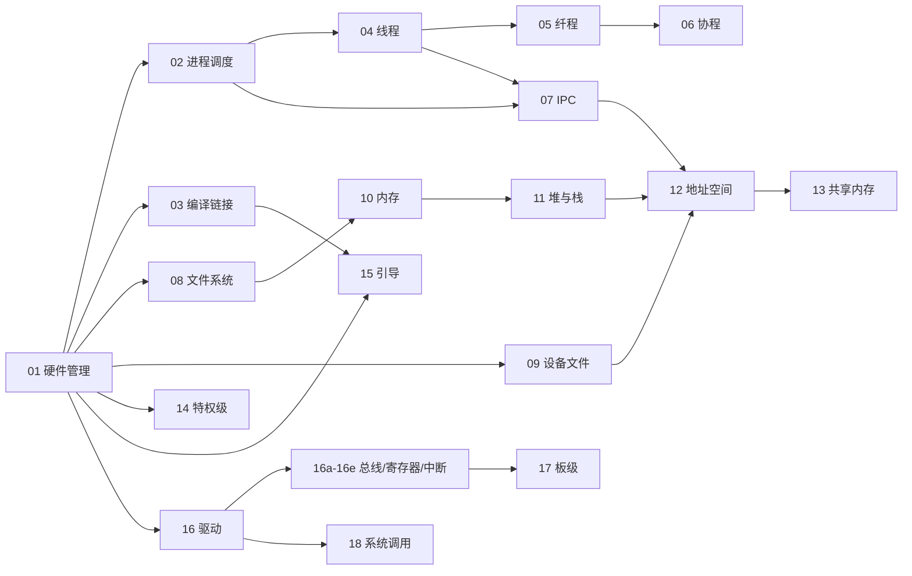
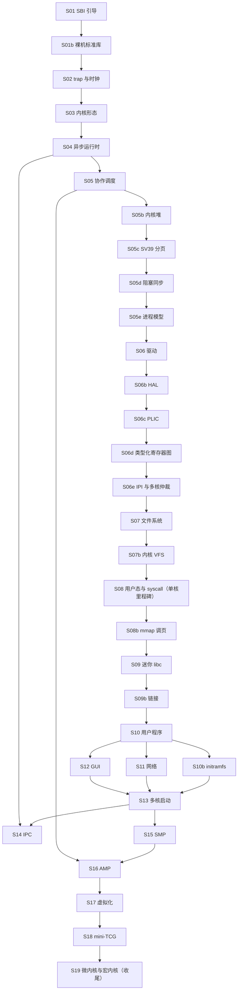

# AI4OSE OSLAB 课程路线书

本文面向学生，说明 AI4OSE OSLAB 三条赛道的定位、设计哲学、实验序列与学习顺序。它只回答「学什么、按什么顺序学」，是一份纵览全局的地图。AI4OSE OSLAB 是一套 RISC-V 操作系统实验课程，以三条互补赛道覆盖操作系统的核心子系统，共 70 个实验。

## 一、三轨总览与设计哲学

### 三轨定位

三条赛道是同一批操作系统主题的三种互补视角。

| 赛道 | 性质 | 教学目标 | 数量 |
| :-- | :-- | :-- | :-: |
| 不正经 improper | 心智模型 | 用最小、可亲手玩的软件或硬件模型，对每个子系统建立感性的心智模型 | 32 |
| 正经 proper | 工程落地 | 在 qemu-virt 真内核上，沿引导到多核、虚拟化、微内核的节奏一路搭建 | 32 |
| 形态 forms | 架构科普 | 五大内核形态（宏、微、外、库、框）加混合内核的结构权衡，引真实开源实例 | 6 |

推荐学习顺序为 不正经 - 正经 - 形态：先用直觉建立子系统的心智模型，再亲手把它们工程落地成真内核，最后回看「内核还能长成什么样」。

### 母题

贯穿全课的母题有三句。

- 软件能做的，硬件也能做：同一段逻辑用 C、Rust、Verilog、BSV 同构实现，看清「软件 if-else」与「硬件组合逻辑」本是一回事。
- 硬件能做的，通用处理器也能模拟：一颗 CPU 不过是取指、译码、执行的循环，软件即可把它运行起来。
- 寄存器、驱动、总线、中断本是同一套「地址 + 位 + 握手」：跨多种语言把同一硬件布局逐位转写，统一硬件侧与软件驱动侧的理解。

### 从心智模型到工程落地

同一主题常在两轨各出现一次：不正经轨用最朴素的模型给出直觉（块设备就是数组，MMU 就是一张软件页表，特权级就是几根线），正经轨再把同一思想落到 qemu-virt 真硬件上工程实现。学生由直觉心智模型逐步逼近工业现实，例如地址空间（improper 12 软件 MMU 到 proper S05c 真 SV39）、中断（improper 16c 至 16e 到 proper S06c 与 S06e）、文件系统（improper 08 到 proper S07）。

### 变体与思考题

实验变体分两轴：软件 {C, Rust} 与硬件 {Verilog, BSV}，另加 essay 思考题。并非每题四变体齐全；凡涉及软硬同构的题目，四种实现跑同一场景、产生一致的输出序列，硬件变体的 testbench 充当参考驱动。essay 承载必要但难以运行的内容，如概念思辨与硬件描述片段。

判题以程序运行的输出为依据。必修采用「多选一」：通过的变体数达到要求即算必修达成，require=1 表示任一变体通过即可。超出必修的每条变体计入辅助分，辅助分按软件、硬件等轴分级，鼓励多语言、跨软硬轴都做；缺少工具链的变体记为不可用，不计惩罚。

### 设计原则：最小、留白、可扩展

简化的是学生负担，不是功能完整性。每题只实现当下用得到的部分（如 S08 仅 `sys_write` 与 `sys_exit` 而非数百个系统调用），复杂且与本题无关的部件（trap 入口汇编、上下文切换、设备树解析等）已经给定，核心逻辑留作练习。每个实验的「引申」节指出如何把最小版扩展为完整版，学生可凭兴趣自行扩成完整 OS。ISA 基准为 RV64GC。

## 二、三轨实验序列

每条赛道按 `info.toml` 的顺序列出全部实验，每行给出该实验讲授的操作系统主题。

### 不正经 improper · 心智模型（32）

- `01` 硬件管理：VLAN Tag 的插入、剥离、过滤；同一处理逻辑的四语言同构实现，对比软件 if-else 与硬件组合逻辑。
- `02` 进程调度：就绪结构与选择策略的解耦，从 FIFO 暖身到约束调度再到优先队列。
- `03` 编译链接：手写链接脚本与段地址布局，用自定义段串接 A 到 B 到 C 执行，辨析 ELF 与纯二进制。
- `03b` 动态链接模拟：纯软件建模 `ld.so`，对比静态各塞一份库与动态按符号名共享、运行时回填 GOT。
- `04` 线程：进程作为资源容器（PCB）与线程作为执行身份（TCB）的拆分，上下文即一组寄存器。
- `05` 纤程（有栈协程）：手写上下文切换，搭出 spawn 与 yield 及调度器，理解用户态绿色线程的开销来源。
- `06` 无栈协程：把顺序代码转写为由 poll 推进的状态机，理解 async 与 await 的本质。
- `07` IPC：共享状态加原子操作，完成位握手、自旋锁、计数信号量与进程间编排。
- `08` 文件系统：从裸块设备到 mkfs、inode、目录项与分区，文件与目录皆为块设备上的字节约定。
- `09` 设备文件：一切皆文件，把硬件副作用包装成读写接口。
- `09b` VFS：让多种文件系统长成同一张 open、read、write 的脸，按挂载表把路径路由到对应文件系统。
- `10` 内存管理：分层缓存视角下的内存系统，速度、swap 缺页换入换出与平坦大内存三种取向。
- `11` 堆与栈：栈指针的伸缩与分配器的记账，对向生长与碰撞检测，注册全局分配器。
- `12` 地址空间：手写软件 MMU 做稀疏映射与两级页表，理解虚拟内存的间接转换与 SV39 思辨。
- `13` 共享内存：同一份物理字节的多重映射，统一进程间共享与设备 MMIO 环模型。
- `14` 特权级：M、S、U 三态抽象为触发器与比较器，提权须经受控陷入、开功能即置使能位。
- `15` 引导入门：在主程序之前运行的前置握手程序，先置位后开工，链接顺序决定执行先后。
- `16` 驱动入门：MMIO 读写、设备树 compatible 匹配、可插拔驱动注册与平台总线、`/dev` 设备节点。
- `16a` 总线与缓存：总线仲裁即地址区间译码，突发握手摊薄开销，MMIO 的可缓存性反例。
- `16b` 寄存器建模：同一张寄存器表在多语言中的逐位转写，从裸指针到类型化寄存器库。
- `16c` 核内中断：每 hart 自有的 CLINT 时钟中断与软件中断、IPI 模型。
- `16d` 核外中断：PLIC 式外设中断路由，priority、enable、threshold 到 claim、complete 握手。
- `16e` 中断聚合：CLINT 与 PLIC 合流加多核 claim 仲裁，保证一个外设中断只被一个 hart 处理。
- `17` 板级入门（BSP）：以设备树作为固件与内核之间的稳定接口，同一内核喂不同 dtb 跑遍多块板。
- `18` 系统调用：从硬件中断向量表查表跳转，到 trap 上下文保存、syscall ABI 分发与陷入返回。
- `19` ISA 模拟器：手写软件 RV64 CPU 的取指、译码、执行循环，配差分对拍逐指令比对。
- `20` signal：进程信号机制建模，handler 表、pending 位集、mask 与忙完后的补投递。
- `21` TCP：纯软件状态机走三次握手、四次挥手与序号推进，在不可靠数据报上造出可靠连接。
- `22` namespace：以换视图（PID、mount 等）加 cgroup 配额理解容器隔离。
- `23` epoll：select 全表扫描与 epoll 就绪链表、边沿触发的对比，单线程管理大量连接。
- `24` 发行版与 rootfs：从内核到一棵 FHS 根文件系统（init、busybox、cpio），开机进入 shell。
- `25` 组件化内核：把分配器、调度器、控制台等做成统一接口的组件，用特性开关按需组装。

### 正经 proper · 工程落地（32）

- `S01` SBI 引导：qemu-virt 上从 SBI ecall 到 S 态内核的最小引导链（putchar、timer、shutdown）。
- `S01b` 裸机最小标准库：在 no_std 裸机上搭出 core 与 alloc 子集，或 newlib 雏形，作为运行时底座。
- `S02` trap 与时钟：上下文保存的 trap 框架，用 CLINT 时钟中断驱动抢占。
- `S03` 内核形态：在真内核里体验 unikernel、exokernel、RTOS 三种最小形态与 RTOS SDK。
- `S04` 异步运行时：Future 与 poll 及最小 executor，基于时钟中断的 waker。
- `S05` 协作调度：可插拔 `Scheduler` 接口与 FIFO、RR、优先级、异步多种实现。
- `S05b` 内核堆：free-list 内核堆分配器，让 Box 与 Vec 在内核态可用。
- `S05c` SV39 真分页：真实 satp 与三级页表遍历、`sfence.vma` 的地址空间。
- `S05d` 阻塞同步：mutex、信号量、condvar 的真阻塞与唤醒，接入调度器。
- `S05e` 进程模型：fork 与写时复制、exec 加载 ELF、wait 回收，完整的 Unix 进程生命周期。
- `S06` 驱动：裸机 NS16550 UART 驱动加 dtb、fdt 解析与驱动表匹配。
- `S06b` HAL：仿 AM 的 TRM、IOE、CTE 抽象层，把架构相关代码收敛为统一接口。
- `S06c` PLIC 外部中断：真 PLIC 的 priority、enable、threshold 到 claim、complete 外部中断路径。
- `S06d` 类型化寄存器图：用 tock-registers 为 NS16550 与 PLIC 建寄存器图，补齐平台总线生命周期。
- `S06e` IPI 与多核仲裁：真 CLINT 软件中断、IPI 与多核 PLIC claim 竞争，运行于多核。
- `S07` 文件系统：RAM 盘上的 inode 与目录项文件系统。
- `S07b` 内核 VFS：vtable、vnode 形式的内核 VFS 层，多文件系统共存。
- `S08` 用户态与 syscall：trap、syscall ABI 与用户内核态切换，首个跑起用户程序的单核里程碑。
- `S08b` mmap 与按需调页：mmap 区与缺页 trap 的按需调页。
- `S09` 迷你 libc：crt0、syscall 封装、malloc、printf 的最小 libc。
- `S09b` 链接：真实工具链上的静态与动态链接（链接脚本、重定位、`ld.so`）。
- `S10` 用户程序：在自研 OS 与 libc 上写排序算法、模板引擎与 MD 转 ANSI 的 TUI 组件。
- `S10b` cpio initramfs：cpio 打包 initramfs，内核挂载后执行 `/init`。
- `S11` 网络：virtio-net 驱动与 ARP、IP、UDP 简易栈、socket 系统调用子集。
- `S12` GUI：软件 framebuffer 与 html、css 子集的转译绘制。
- `S13` 多核启动：多 hart 启动（HSM）、多跳板与多槽位交换，槽位置于直接映射区。
- `S14` IPC：管道、共享内存、信号的同步 IPC 与消息队列、无锁环的异步通信。
- `S15` SMP：从全局大锁到 per-cpu 与细粒度锁，用读写锁优化读多写少。
- `S16` AMP 大小核：大小核拓扑识别与任务亲和、迁移调度。
- `S17` 虚拟化：RISC-V H 扩展的 HS、VS、VU 与两阶段地址转换、trap-and-emulate 的简易 type1 VMM。
- `S18` mini-TCG：解析 guest 指令生成 host 指令执行，区分 type1、type2、1.5 与模拟器。
- `S19` 微内核与宏内核：宏内核与微内核双形态对比，以可插拔驱动系统收尾。

### 形态 forms · 架构科普（6）

- `F1` 宏内核（monolithic）：文件系统、调度、驱动、内存同处一个地址空间，以直接函数调用协作；性能与脆弱的权衡。
- `F2` 微内核（microkernel）：内核只保留 IPC、调度、能力，服务移到用户态；以故障隔离与最小可信基换取过内核的开销。
- `F3` 外核（exokernel）：内核只安全多路复用裸资源（块、页、时间片），抽象交给 libOS。
- `F4` 库内核与 unikernel：OS 例程作为普通库直接链接进应用，一镜像即一应用加所需 OS。
- `F5` 框内核（framekernel）：以 Asterinas 为原型，最小可信框架加用 unsafe 包成的安全 API，隔离来自类型系统而非 MMU。
- `F6` 混合内核（hybrid）：以 Windows NT、macOS XNU 为例，性能关键服务留在内核、需隔离的走消息。

## 三、依赖图与学习顺序

每条赛道的实验 id 统一采用两位数加可选字母后缀（如 `03b`、`16a`、`S05c`），目录的默认字典序排序即等于推荐的学习顺序。下面的依赖图进一步标出非线性的前后置关系。

### 不正经赛道依赖图

`01` 是软硬同构与判题约定的共同前置。执行流抽象沿 `02 进程 → 04 线程 → 05 纤程 → 06 协程` 一线推进，并联 `07 IPC`；存储与内存沿 `08 文件 → 10 内存 → 11 堆栈 → 12 地址空间 → 13 共享内存`；设备沿 `16 驱动 → 16a 至 16e 总线与寄存器与中断 → 17 板级`。

`19` 至 `25` 作为进一步的心智模型，按列出的顺序续在上图之后：`19` ISA 模拟器与 `20` signal 承接指令执行与中断的认识，`21` TCP、`22` namespace、`23` epoll 承接文件与进程的认识，`24` rootfs 承接文件系统与引导，`25` 组件化内核把分配器、调度器、驱动等组件收束为可组装的形态。

### 正经赛道推进次序

正经赛道在引导之上按依赖顺序逐步加功能。下图箭头表示推荐的推进次序与主要前置关系。`S08` 是单核 OS 的集成里程碑，`S08` 至 `S12` 合成一个相对完整的单核系统（内核、驱动、文件系统、网络、libc、用户态、GUI），`S13` 起进入多核到虚拟化再到微宏内核收尾。其中 `S11` 网络与 `S12` GUI 仅依赖单核栈，可与相邻阶段并行；`S14` IPC 还接 `S04` 异步运行时，`S16` AMP 还接 `S05` 调度器。

### 形态赛道

形态赛道的六个实验是相互独立的架构科普，可在完成前两轨之后通读，从结构权衡的角度回看「内核还能长成什么样」，与正经赛道 `S03` 内核形态、`S19` 微宏内核对比相互呼应。
